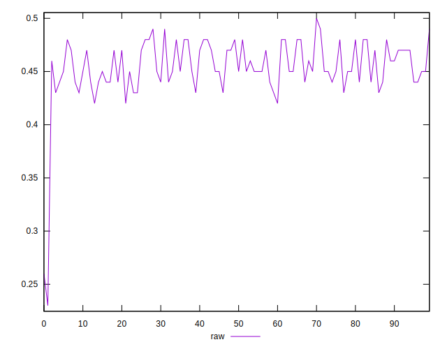
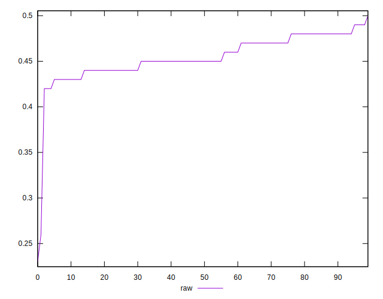
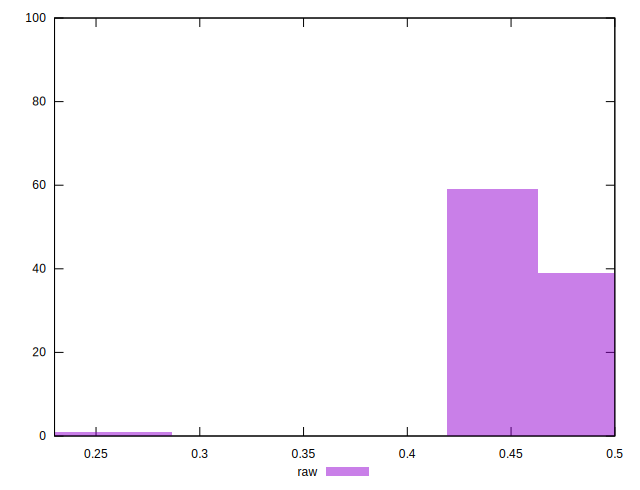

# //meta/score/samples/pages

[→ Parent](../..)


## Raw


```yaml
p90min: 0.42
p90max: 0.49
p90range: 0.07
p90mean: 0.45627659574468055
median: 0.45
p90stdev: 0.017923243114185406
mad: 0.019999999999999962
stdevBySn: 0.023851999999999957
lfitCenter: 0.454152451554475
lfitStdev: 0.01863024426302975
mfitCenter: 0.454152451554475
mfitStdev: 0.02334954853999149
mfitConfidence: 0.002334954853999149
p90skewness: 0.057567739127544475
p90eccentricity: 0.9999999999999982
p90discretization: 11.75
outlandishness: 0.9848190732080928

```

