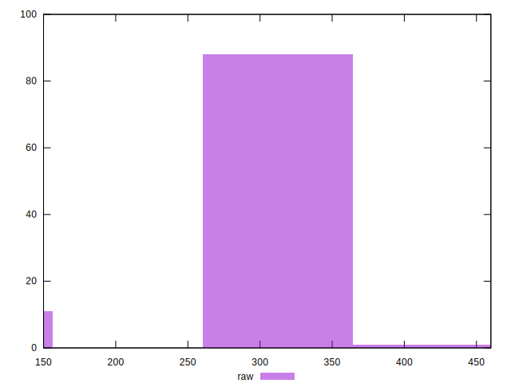
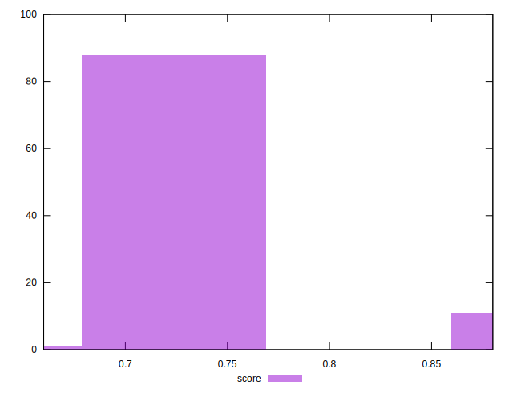
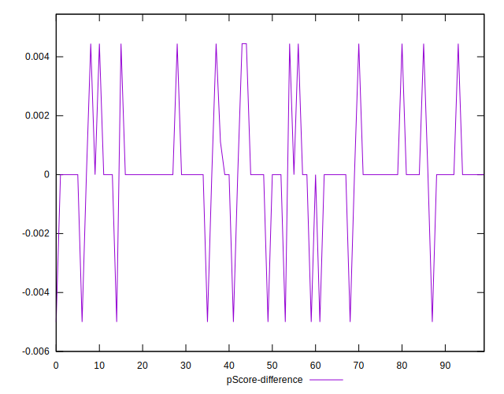

# //offscreen-images/samples/pages+cached+noadtech

[→ Parent](../..)


## Raw


```yaml
p90min: 150
p90max: 310
p90range: 160
p90mean: 288.40425531914894
median: 300
p90stdev: 42.333608988336515
mad: 0
stdevBySn: 0
lfitCenter: 292.666437529611
lfitStdev: 21.010414859085085
mfitCenter: 292.666437529611
mfitStdev: 26.332650000252023
mfitConfidence: 2.6332650000252023
p90skewness: -2.9421608173390634
p90eccentricity: 1.000000000000001
p90discretization: 31.333333333333332
outlandishness: 0.9861493647817319

```


## Score


```yaml
p90min: 0.74
p90max: 0.88
p90range: 0.14
p90mean: 0.7598936170212767
median: 0.75
p90stdev: 0.036771134633518
mad: 0
stdevBySn: 0
lfitCenter: 0.7564842739664841
lfitStdev: 0.018190099160825375
mfitCenter: 0.7564842739664841
mfitStdev: 0.022797908460373485
mfitConfidence: 0.0022797908460373485
p90skewness: 2.931711189805812
p90eccentricity: 0.9999999999999983
p90discretization: 31.333333333333332
outlandishness: 1.0058155144140573

```


## Raw Estimate


## Score Estimate


## P Score


```yaml
p90min: 0.7444444444444445
p90max: 0.875
p90range: 0.13055555555555554
p90mean: 0.7599881796690309
median: 0.75
p90stdev: 0.03512314434582817
mad: 0
stdevBySn: 0
lfitCenter: 0.7565222026194881
lfitStdev: 0.017448165929275616
mfitCenter: 0.7565222026194881
mfitStdev: 0.021868033051392316
mfitConfidence: 0.0021868033051392318
p90skewness: 2.9597065670542544
p90eccentricity: 0.9999999999999979
p90discretization: 31.333333333333332
outlandishness: 1.005667857605955

```


## Score Difference


```yaml
p90min: 0
p90max: 0
p90range: 0
p90mean: 0
median: 0
p90stdev: 0
mad: 0
stdevBySn: 0
lfitCenter: 0
lfitStdev: 0
mfitCenter: 0
mfitStdev: 0
mfitConfidence: 0
p90skewness: .nan
p90eccentricity: .nan
p90discretization: 94
outlandishness: .nan

```


## P Score Difference


```yaml
p90min: -0.0050000000000000044
p90max: 0.004444444444444473
p90range: 0.009444444444444478
p90mean: 0.00005910165484633785
median: 0
p90stdev: 0.0020588085006269185
mad: 0
stdevBySn: 0
lfitCenter: 0.00003130967620967385
lfitStdev: 0.0008086982113400221
mfitCenter: 0.00003130967620967385
mfitStdev: 0.0010135529021140879
mfitConfidence: 0.00010135529021140879
p90skewness: -0.2333003333115322
p90eccentricity: 0.9999999999999982
p90discretization: 23.5
outlandishness: 0.43296400000002955

```

