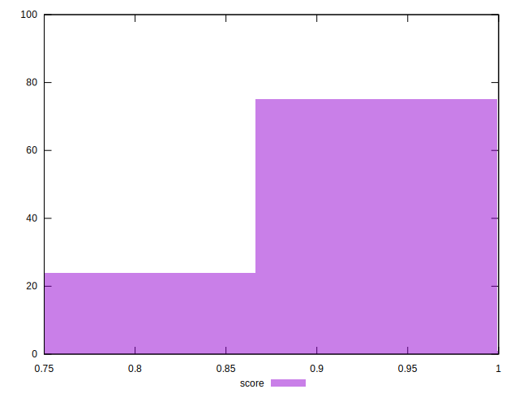
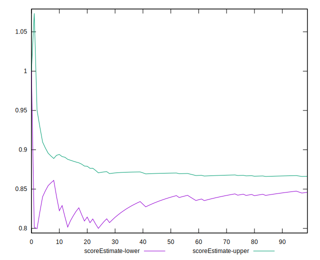

# //offscreen-images/samples/pages

[→ Parent](../..)


## Raw


```yaml
p90min: 150
p90max: 300
p90range: 150
p90mean: 183.51063829787233
median: 150
p90stdev: 62.47905941633586
mad: 0
stdevBySn: 0
lfitCenter: 172.72465606005505
lfitStdev: 49.81726049636741
mfitCenter: 172.72465606005505
mfitStdev: 62.43667692525271
mfitConfidence: 6.243667692525271
p90skewness: 1.3281045550208694
p90eccentricity: 1.0000000000000004
p90discretization: 47
outlandishness: 1.0108116748582232

```


## Score


```yaml
p90min: 0.75
p90max: 0.88
p90range: 0.13
p90mean: 0.8509574468085105
median: 0.88
p90stdev: 0.05414851816082438
mad: 0
stdevBySn: 0
lfitCenter: 0.8602587620677602
lfitStdev: 0.043156744282917624
mfitCenter: 0.8602587620677602
mfitStdev: 0.05408895778471716
mfitConfidence: 0.005408895778471716
p90skewness: -1.3281045550208737
p90eccentricity: 1.0000000000000022
p90discretization: 47
outlandishness: 0.9977509846563047

```


## Raw Estimate


## Score Estimate


## P Score


```yaml
p90min: 0.75
p90max: 0.875
p90range: 0.125
p90mean: 0.8470744680851063
median: 0.875
p90stdev: 0.05206588284694649
mad: 0
stdevBySn: 0
lfitCenter: 0.8560627866166214
lfitStdev: 0.0415143837469723
mfitCenter: 0.8560627866166214
mfitStdev: 0.05203056410437658
mfitConfidence: 0.005203056410437658
p90skewness: -1.3281045550208699
p90eccentricity: 1.0000000000000022
p90discretization: 47
outlandishness: 0.9980543225332641

```


## Score Difference


```yaml
p90min: 0
p90max: 0
p90range: 0
p90mean: 0
median: 0
p90stdev: 0
mad: 0
stdevBySn: 0
lfitCenter: 0
lfitStdev: 0
mfitCenter: 0
mfitStdev: 0
mfitConfidence: 0
p90skewness: .nan
p90eccentricity: .nan
p90discretization: 94
outlandishness: .nan

```


## P Score Difference


```yaml
p90min: -0.0050000000000000044
p90max: 0
p90range: 0.0050000000000000044
p90mean: -0.0038297872340425565
median: -0.0050000000000000044
p90stdev: 0.0021169945470353624
mad: 0
stdevBySn: 0
lfitCenter: -0.004173630158435314
lfitStdev: 0.0017290531817163142
mfitCenter: -0.004173630158435314
mfitStdev: 0.002167046798995978
mfitConfidence: 0.0002167046798995978
p90skewness: 1.2562972690740186
p90eccentricity: 1.000000000000002
p90discretization: 47
outlandishness: 0.9587673611111113

```

