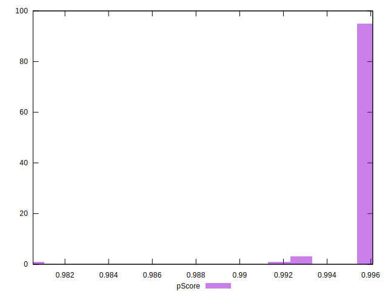

# //speed-index/samples/pages+cached+noadtech

[→ Parent](../..)


## Raw


```yaml
p90min: 1902.4739999999997
p90max: 2064.5838999999996
p90range: 162.10989999999993
p90mean: 1916.9673249999998
median: 1911.696
p90stdev: 22.82048876210398
mad: 5.10554999999988
stdevBySn: 7.453004624999849
lfitCenter: 1918.8778902775655
lfitStdev: 16.23868746637465
mfitCenter: 1918.8778902775655
mfitStdev: 20.352176593534594
mfitConfidence: 2.035217659353459
p90skewness: 5.579135208291796
p90eccentricity: 0.9999999999999997
p90discretization: 1
outlandishness: 1.0087529424654702

```


## Score


```yaml
p90min: 0.99
p90max: 1
p90range: 0.010000000000000009
p90mean: 0.9997872340425532
median: 1
p90stdev: 0.0014430489325798455
mad: 0
stdevBySn: 0
lfitCenter: 0.9997079653793631
lfitStdev: 0.0007140511940158246
mfitCenter: 0.9997079653793631
mfitStdev: 0.0008949304571275632
mfitConfidence: 0.00008949304571275631
p90skewness: -6.63488802697019
p90eccentricity: 1.0000000000000022
p90discretization: 47
outlandishness: 0.9992255171134153

```


## Raw Estimate


## Score Estimate


## P Score


```yaml
p90min: 0.9930705835994746
p90max: 0.9960430327732832
p90range: 0.0029724491738085668
p90mean: 0.9958139737229702
median: 0.995905778312949
p90stdev: 0.0004159605415532165
mad: 0.00007653492564807518
stdevBySn: 0.00011264368927364848
lfitCenter: 0.9957488549370886
lfitStdev: 0.00034720509461219043
mfitCenter: 0.9957488549370886
mfitStdev: 0.0004351570540632976
mfitConfidence: 0.00004351570540632976
p90skewness: -5.880080071998588
p90eccentricity: 1.0000000000000007
p90discretization: 1
outlandishness: 0.9995658467306052

```


## Score Difference


```yaml
p90min: 0
p90max: 0
p90range: 0
p90mean: 0
median: 0
p90stdev: 0
mad: 0
stdevBySn: 0
lfitCenter: 0
lfitStdev: 0
mfitCenter: 0
mfitStdev: 0
mfitConfidence: 0
p90skewness: .nan
p90eccentricity: .nan
p90discretization: 94
outlandishness: .nan

```


## P Score Difference


```yaml
p90min: -0.004380341132704912
p90max: 0.002202406508081456
p90range: 0.006582747640786368
p90mean: -0.003993569997545759
median: -0.004084669675753605
p90stdev: 0.000806953718553998
mad: 0.00007605597233978356
stdevBySn: 0.00011264368927364848
lfitCenter: -0.00395129205792715
lfitStdev: 0.00038060638157874047
mfitCenter: -0.00395129205792715
mfitStdev: 0.00047701935926513036
mfitConfidence: 0.00004770193592651304
p90skewness: 6.690943440634484
p90eccentricity: 1
p90discretization: 1
outlandishness: 0.9064656563664598

```

