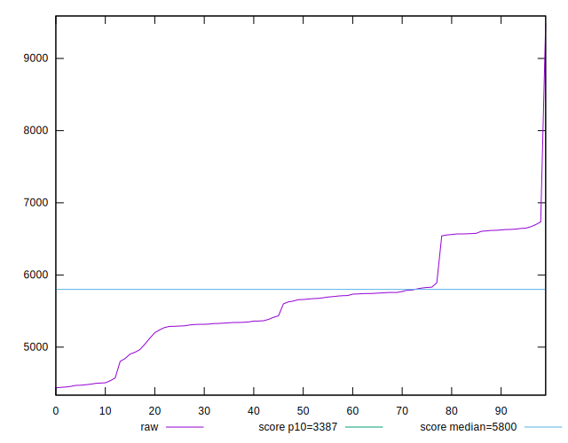
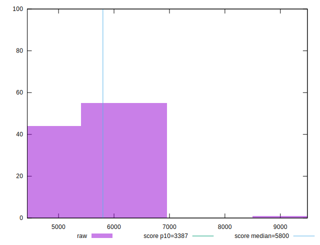
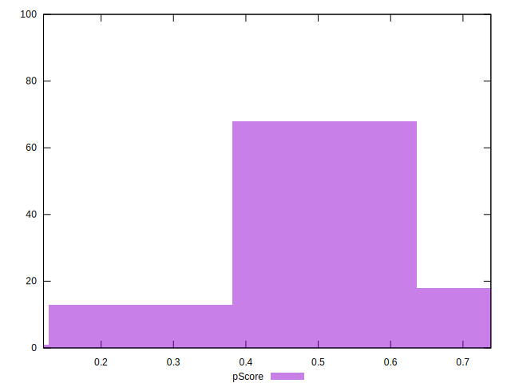

# //speed-index/samples/pages+cached

[→ Parent](../..)


## Raw


```yaml
p90min: 4455.964184059252
p90max: 6668.707150689571
p90range: 2212.7429666303187
p90mean: 5605.457156880687
median: 5658.606897538068
p90stdev: 627.9225056744067
mad: 348.665786219201
stdevBySn: 572.4732842302807
lfitCenter: 5609.447326127499
lfitStdev: 497.1573754008076
mfitCenter: 5609.447326127499
mfitStdev: 623.0943676874855
mfitConfidence: 62.30943676874855
p90skewness: 0.1118495494602954
p90eccentricity: 0.9999999999999997
p90discretization: 1
outlandishness: 1.0093475270160628

```


## Score


```yaml
p90min: 0.37
p90max: 0.74
p90range: 0.37
p90mean: 0.5369148936170214
median: 0.52
p90stdev: 0.10367734929531897
mad: 0.05999999999999994
stdevBySn: 0.09540799999999997
lfitCenter: 0.5360230117070778
lfitStdev: 0.08220869139013508
mfitCenter: 0.5360230117070778
mfitStdev: 0.10303331523313984
mfitConfidence: 0.010303331523313985
p90skewness: 0.059637397615086594
p90eccentricity: 1.0000000000000007
p90discretization: 3.9166666666666665
outlandishness: 0.9943650045270902

```


## Raw Estimate


## Score Estimate


## P Score


```yaml
p90min: 0.3697506595300932
p90max: 0.7350138787510276
p90range: 0.36526321922093447
p90mean: 0.5368914152739652
median: 0.5234441027270105
p90stdev: 0.10338284162154454
mad: 0.05984540612597927
stdevBySn: 0.09736763810217608
lfitCenter: 0.5359933569975958
lfitStdev: 0.08193436684879553
mfitCenter: 0.5359933569975958
mfitStdev: 0.10268950040692043
mfitConfidence: 0.010268950040692042
p90skewness: 0.06097498478403201
p90eccentricity: 1.0000000000000007
p90discretization: 1
outlandishness: 0.9939843303012561

```


## Score Difference


```yaml
p90min: 0
p90max: 1.1102230246251565e-16
p90range: 1.1102230246251565e-16
p90mean: 2.362176648138631e-18
median: 0
p90stdev: 1.6021061506108986e-17
mad: 0
stdevBySn: 0
lfitCenter: 2.7255820612844e-18
lfitStdev: 6.664295900958648e-18
mfitCenter: 2.7255820612844e-18
mfitStdev: 8.352456276329808e-18
mfitConfidence: 8.352456276329809e-19
p90skewness: 6.6348880269703665
p90eccentricity: 0.9999999999999994
p90discretization: 47
outlandishness: 5.522500000000001

```


## P Score Difference


```yaml
p90min: -0.004719907653996658
p90max: 0.004762135169677606
p90range: 0.009482042823674264
p90mean: -0.0001344093472540886
median: -0.0001853641892824165
p90stdev: 0.0028709894474748146
mad: 0.0027918876765313794
stdevBySn: 0.003462200417027205
lfitCenter: -0.00015633746778581027
lfitStdev: 0.0026568878743500747
mfitCenter: -0.00015633746778581027
mfitStdev: 0.0033299151375357793
mfitConfidence: 0.0003329915137535779
p90skewness: 0.07184395841304095
p90eccentricity: 0.9999999999999999
p90discretization: 1
outlandishness: 0.877409391041021

```

