# //total-blocking-time/samples/pages+cached+noadtech+nomedia

[→ Parent](../..)


## Raw


```yaml
p90min: 7.5
p90max: 36.5
p90range: 29
p90mean: 11.082780851063829
median: 9.5
p90stdev: 4.767676889850678
mad: 1.5
stdevBySn: 2.3852
lfitCenter: 12.481709881932312
lfitStdev: 6.297415998128633
mfitCenter: 12.481709881932312
mfitStdev: 7.892640506953328
mfitConfidence: 0.7892640506953328
p90skewness: 3.6433894922862837
p90eccentricity: 0.9999999999999992
p90discretization: 4.476190476190476
outlandishness: 1.881774769809052

```

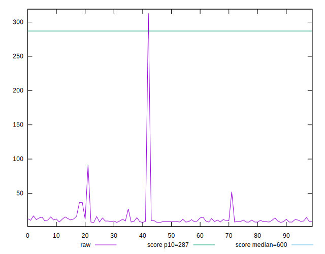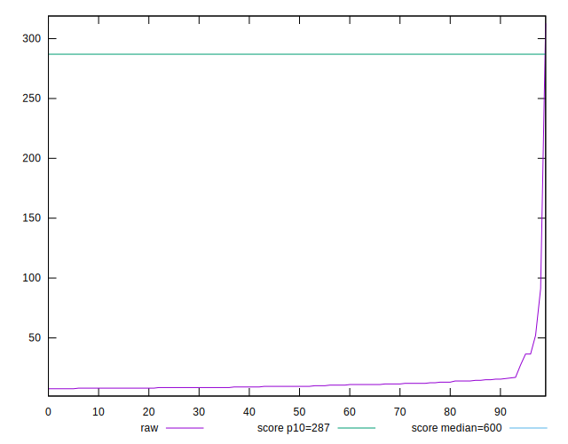
## Score


```yaml
p90min: 1
p90max: 1
p90range: 0
p90mean: 1
median: 1
p90stdev: 0
mad: 0
stdevBySn: 0
lfitCenter: 0.9993950318241687
lfitStdev: 0.0015093734740525054
mfitCenter: 0.9993950318241687
mfitStdev: 0.0018917191154225435
mfitConfidence: 0.00018917191154225435
p90skewness: .nan
p90eccentricity: .nan
p90discretization: 94
outlandishness: 0.9974016900000001

```

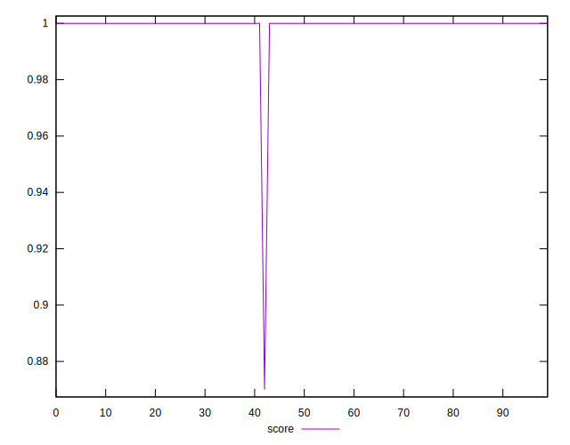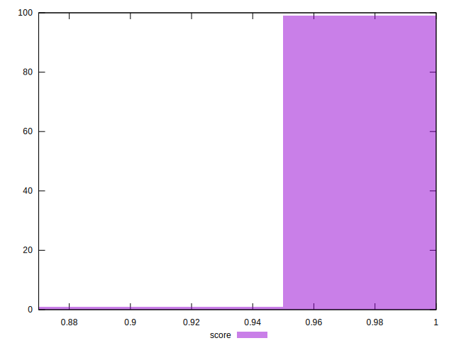
## Raw Estimate

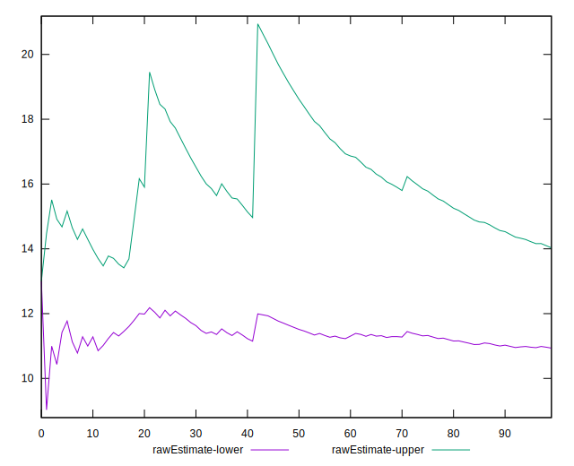
## Score Estimate

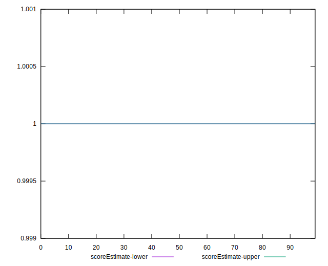
## P Score


```yaml
p90min: 0.9999994276013517
p90max: 0.9999999999999867
p90range: 5.723986349348564e-7
p90mean: 0.9999999873896062
median: 0.9999999999997063
p90stdev: 8.263415795795337e-8
mad: 2.745581539898012e-13
stdevBySn: 3.3432312473991033e-13
lfitCenter: 0.9993978000386533
lfitStdev: 0.0014960197573781276
mfitCenter: 0.9993978000386533
mfitStdev: 0.0018749827135119993
mfitConfidence: 0.00018749827135119995
p90skewness: -6.611390704002559
p90eccentricity: 0.9999999999999989
p90discretization: 4.476190476190476
outlandishness: 0.9974138905899352

```

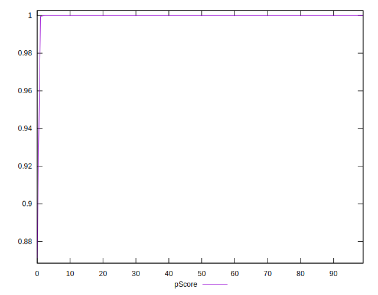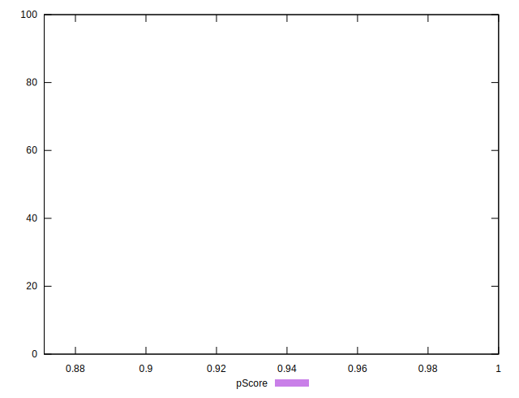
## Score Difference


```yaml
p90min: 0
p90max: 0
p90range: 0
p90mean: 0
median: 0
p90stdev: 0
mad: 0
stdevBySn: 0
lfitCenter: 0
lfitStdev: 0
mfitCenter: 0
mfitStdev: 0
mfitConfidence: 0
p90skewness: .nan
p90eccentricity: .nan
p90discretization: 94
outlandishness: .nan

```


## P Score Difference


```yaml
p90min: -5.723986482575327e-7
p90max: -1.3322676295501878e-14
p90range: 5.723986349348564e-7
p90mean: -6.5210464746732765e-9
median: -2.936539900133539e-13
p90stdev: 5.881639113891011e-8
mad: 2.745581539898012e-13
stdevBySn: 3.3432312473991033e-13
lfitCenter: 0.0000028349214262913016
lfitStdev: 0.000013352938547594789
mfitCenter: 0.0000028349214262913016
mfitStdev: 0.00001673542667324555
mfitConfidence: 0.000001673542667324555
p90skewness: -9.474744817201165
p90eccentricity: 0.9999999999999987
p90discretization: 4.476190476190476
outlandishness: 873778.9854140243

```

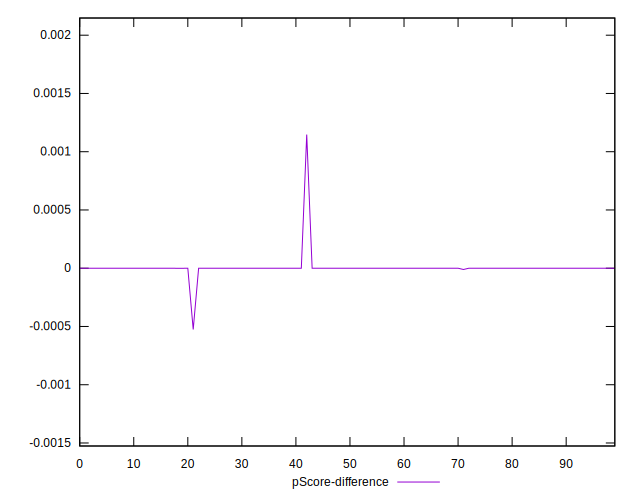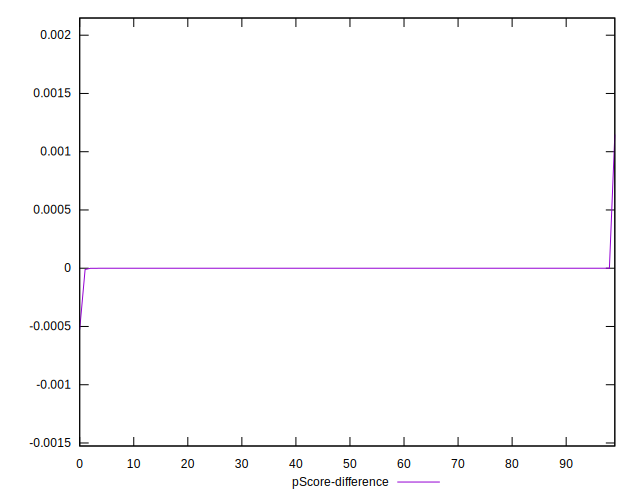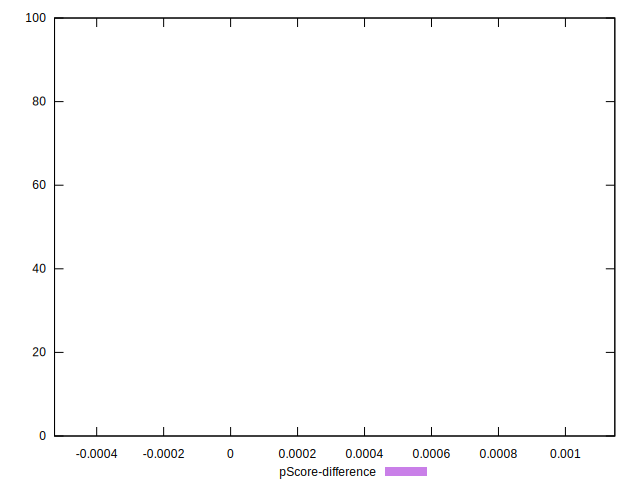