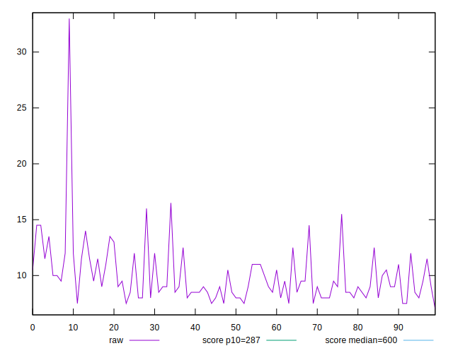
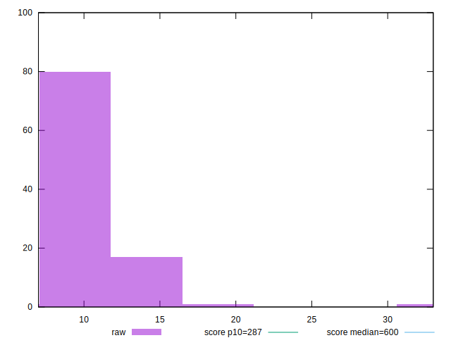
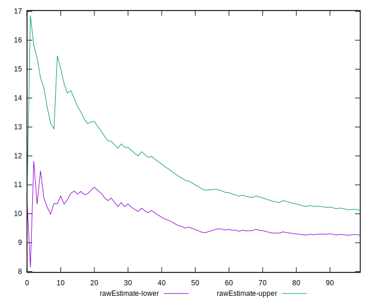
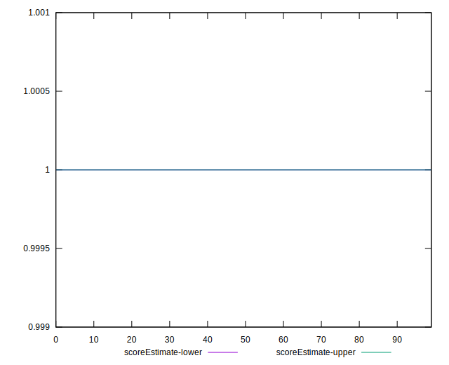
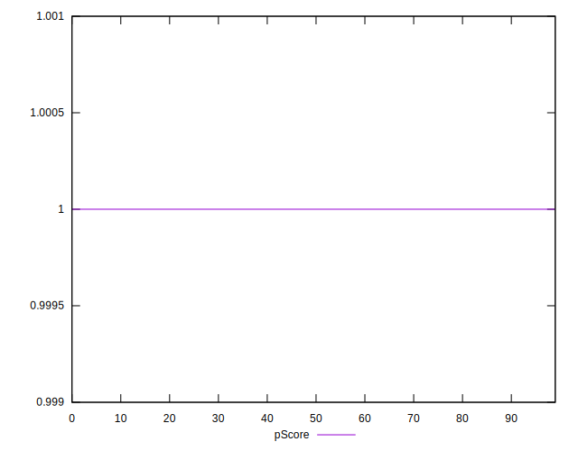
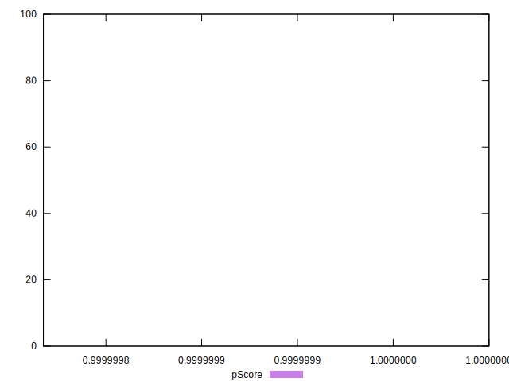
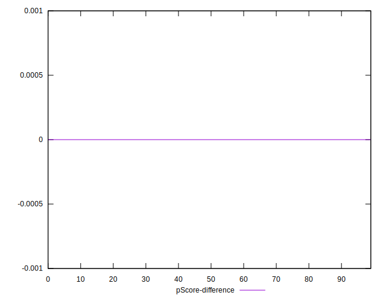

# //total-blocking-time/samples/pages+cached+noadtech

[→ Parent](../..)


## Raw


```yaml
p90min: 7.5
p90max: 15.5
p90range: 8
p90mean: 9.75
median: 9
p90stdev: 1.9126538319442605
mad: 1
stdevBySn: 1.7889000000000002
lfitCenter: 9.685273161733088
lfitStdev: 1.746005563456756
mfitCenter: 9.685273161733088
mfitStdev: 2.188293458713822
mfitConfidence: 0.2188293458713822
p90skewness: 1.051369093467796
p90eccentricity: 0.9999999999999991
p90discretization: 5.875
outlandishness: 1.060371860618015

```


## Score


```yaml
p90min: 1
p90max: 1
p90range: 0
p90mean: 1
median: 1
p90stdev: 0
mad: 0
stdevBySn: 0
lfitCenter: 1
lfitStdev: 0
mfitCenter: 1
mfitStdev: 0
mfitConfidence: 0
p90skewness: .nan
p90eccentricity: .nan
p90discretization: 94
outlandishness: 1

```


## Raw Estimate


## Score Estimate


## P Score


```yaml
p90min: 0.9999999998943788
p90max: 0.9999999999999867
p90range: 1.0560785579372123e-10
p90mean: 0.9999999999953827
median: 0.9999999999998532
p90stdev: 1.4261274259656776e-11
mad: 1.3344880755994382e-13
stdevBySn: 1.59151047895989e-13
lfitCenter: 0.9999999989130204
lfitStdev: 2.70108734874197e-9
mfitCenter: 0.9999999989130204
mfitStdev: 3.3853109637087978e-9
mfitConfidence: 3.385310963708798e-10
p90skewness: -4.867138963569039
p90eccentricity: 1.0000000004783869
p90discretization: 5.875
outlandishness: 0.9999999953403802

```


## Score Difference


```yaml
p90min: 0
p90max: 0
p90range: 0
p90mean: 0
median: 0
p90stdev: 0
mad: 0
stdevBySn: 0
lfitCenter: 0
lfitStdev: 0
mfitCenter: 0
mfitStdev: 0
mfitConfidence: 0
p90skewness: .nan
p90eccentricity: .nan
p90discretization: 94
outlandishness: .nan

```


## P Score Difference


```yaml
p90min: -1.0562117847001673e-10
p90max: -1.3322676295501878e-14
p90range: 1.0560785579372123e-10
p90mean: -4.617757712853358e-12
median: -1.467714838554457e-13
p90stdev: 1.4261274255931192e-11
mad: 1.3344880755994382e-13
stdevBySn: 1.59151047895989e-13
lfitCenter: -1.0869796531437344e-9
lfitStdev: 2.701087393090611e-9
mfitCenter: -1.0869796531437344e-9
mfitStdev: 3.3853110192915766e-9
mfitConfidence: 3.3853110192915766e-10
p90skewness: -4.867207540577921
p90eccentricity: 0.9999999999999999
p90discretization: 5.875
outlandishness: 255563.2568251926

```

