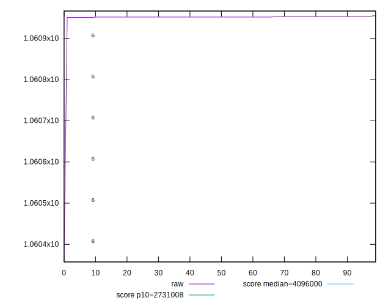
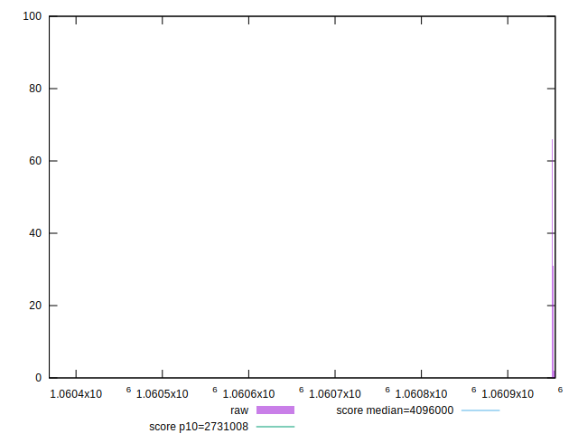
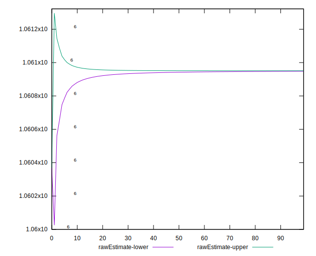

# //total-byte-weight/samples/pages+cached+noadtech

[→ Parent](../..)


## Raw


```yaml
p90min: 1060951
p90max: 1060953
p90range: 2
p90mean: 1060952.244680851
median: 1060952
p90stdev: 0.5777095311653393
mad: 0
stdevBySn: 0
lfitCenter: 1060949.5064422183
lfitStdev: 6.77151984110977
mfitCenter: 1060949.5064422183
mfitStdev: 8.486841556515106
mfitConfidence: 0.8486841556515106
p90skewness: -0.07755493445503102
p90eccentricity: 0.999999999999998
p90discretization: 31.333333333333332
outlandishness: 0.999989076482838

```


## Score


```yaml
p90min: 1
p90max: 1
p90range: 0
p90mean: 1
median: 1
p90stdev: 0
mad: 0
stdevBySn: 0
lfitCenter: 1
lfitStdev: 0
mfitCenter: 1
mfitStdev: 0
mfitConfidence: 0
p90skewness: .nan
p90eccentricity: .nan
p90discretization: 94
outlandishness: 1

```


## Raw Estimate


## Score Estimate


## P Score


```yaml
p90min: 0
p90max: 0
p90range: 0
p90mean: 0
median: 0
p90stdev: 0
mad: 0
stdevBySn: 0
lfitCenter: 0
lfitStdev: 0
mfitCenter: 0
mfitStdev: 0
mfitConfidence: 0
p90skewness: .nan
p90eccentricity: .nan
p90discretization: 94
outlandishness: .nan

```


## Score Difference


```yaml
p90min: -1
p90max: -1
p90range: 0
p90mean: -1
median: -1
p90stdev: 0
mad: 0
stdevBySn: 0
lfitCenter: -1
lfitStdev: 0
mfitCenter: -1
mfitStdev: 0
mfitConfidence: 0
p90skewness: .nan
p90eccentricity: .nan
p90discretization: 94
outlandishness: 1

```


## P Score Difference


```yaml
p90min: -1
p90max: -1
p90range: 0
p90mean: -1
median: -1
p90stdev: 0
mad: 0
stdevBySn: 0
lfitCenter: -1
lfitStdev: 0
mfitCenter: -1
mfitStdev: 0
mfitConfidence: 0
p90skewness: .nan
p90eccentricity: .nan
p90discretization: 94
outlandishness: 1

```

