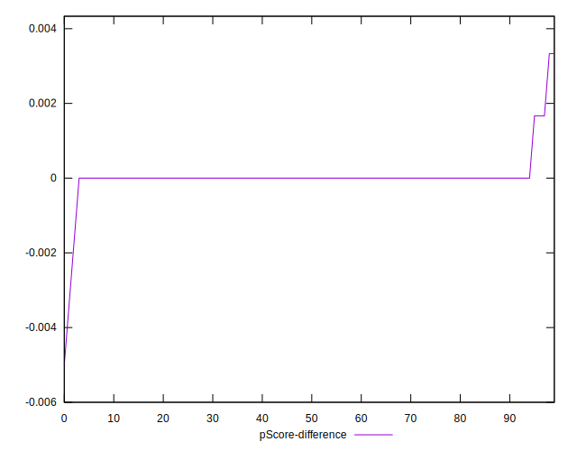

# //unminified-css/samples/pages

[→ Parent](../..)


## Raw


```yaml
p90min: 0
p90max: 130
p90range: 130
p90mean: 4.042553191489362
median: 0
p90stdev: 19.532795604303864
mad: 0
stdevBySn: 0
lfitCenter: 3.937230752219615
lfitStdev: 9.465080633898223
mfitCenter: 3.937230752219615
mfitStdev: 11.862719381232573
mfitConfidence: 1.1862719381232574
p90skewness: 5.240166078941414
p90eccentricity: 0.999999999999997
p90discretization: 15.666666666666666
outlandishness: 3.8189387811634345

```


## Score


```yaml
p90min: 0.89
p90max: 1
p90range: 0.10999999999999999
p90mean: 0.9965957446808511
median: 1
p90stdev: 0.016409208072050086
mad: 0
stdevBySn: 0
lfitCenter: 0.9967081043143284
lfitStdev: 0.007913698755323934
mfitCenter: 0.9967081043143284
mfitStdev: 0.00991835053848383
mfitConfidence: 0.000991835053848383
p90skewness: -5.238756766417092
p90eccentricity: 0.9999999999999978
p90discretization: 15.666666666666666
outlandishness: 0.9935969607275454

```


## Raw Estimate


## Score Estimate


## P Score


```yaml
p90min: 0.8916666666666666
p90max: 1
p90range: 0.10833333333333339
p90mean: 0.996631205673759
median: 1
p90stdev: 0.016277329670253197
mad: 0
stdevBySn: 0
lfitCenter: 0.9967189743731504
lfitStdev: 0.007887567194915122
mfitCenter: 0.9967189743731504
mfitStdev: 0.009885599484360397
mfitConfidence: 0.0009885599484360397
p90skewness: -5.240166078941398
p90eccentricity: 1.0000000000000029
p90discretization: 15.666666666666666
outlandishness: 0.9935595937711786

```


## Score Difference


```yaml
p90min: 0
p90max: 0
p90range: 0
p90mean: 0
median: 0
p90stdev: 0
mad: 0
stdevBySn: 0
lfitCenter: 0
lfitStdev: 0
mfitCenter: 0
mfitStdev: 0
mfitConfidence: 0
p90skewness: .nan
p90eccentricity: .nan
p90discretization: 94
outlandishness: .nan

```


## P Score Difference


```yaml
p90min: 0
p90max: 0.0016666666666665941
p90range: 0.0016666666666665941
p90mean: 0.00003546099290779987
median: 0
p90stdev: 0.00024050815542996372
mad: 0
stdevBySn: 0
lfitCenter: 0.000009265966495354804
lfitStdev: 0.0001413924651954242
mfitCenter: 0.000009265966495354804
mfitStdev: 0.0001772091757176304
mfitConfidence: 0.00001772091757176304
p90skewness: 6.634888026970368
p90eccentricity: 0.9999999999999982
p90discretization: 47
outlandishness: 0.22089999999994112

```

