# //unused-css-rules/samples/pages+cached+noadtech+nomedia

[→ Parent](../..)


## Raw


```yaml
p90min: 0
p90max: 150
p90range: 150
p90mean: 134.04255319148936
median: 150
p90stdev: 46.249074721881186
mad: 0
stdevBySn: 0
lfitCenter: 139.97590711991032
lfitStdev: 25.080324979165812
mfitCenter: 139.97590711991032
mfitStdev: 31.433525896485342
mfitConfidence: 3.143352589648534
p90skewness: -2.553242569566715
p90eccentricity: 1.000000000000001
p90discretization: 47
outlandishness: 0.9697560090702947

```

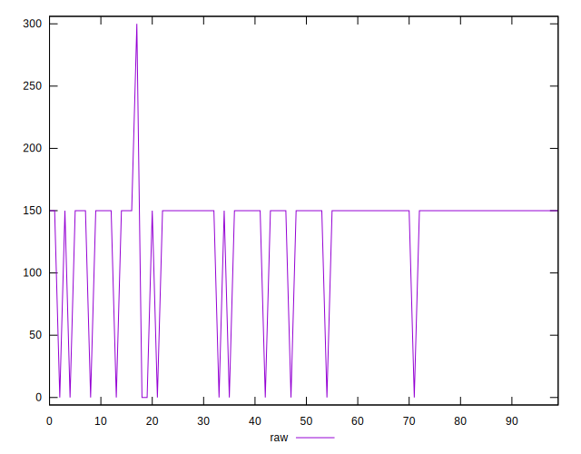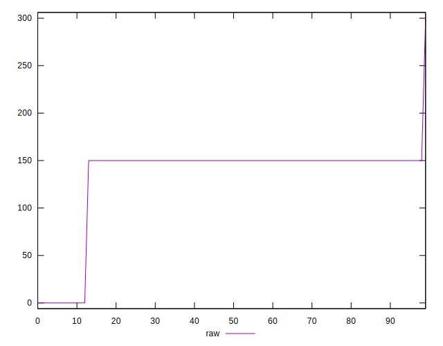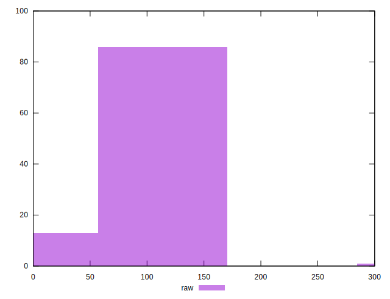
## Score


```yaml
p90min: 0.88
p90max: 1
p90range: 0.12
p90mean: 0.8927659574468082
median: 0.88
p90stdev: 0.036999259777504935
mad: 0
stdevBySn: 0
lfitCenter: 0.8879727382905463
lfitStdev: 0.02007259812070558
mfitCenter: 0.8879727382905463
mfitStdev: 0.025157271022647164
mfitConfidence: 0.0025157271022647164
p90skewness: 2.553242569566724
p90eccentricity: 0.9999999999999972
p90discretization: 47
outlandishness: 1.003439558857407

```

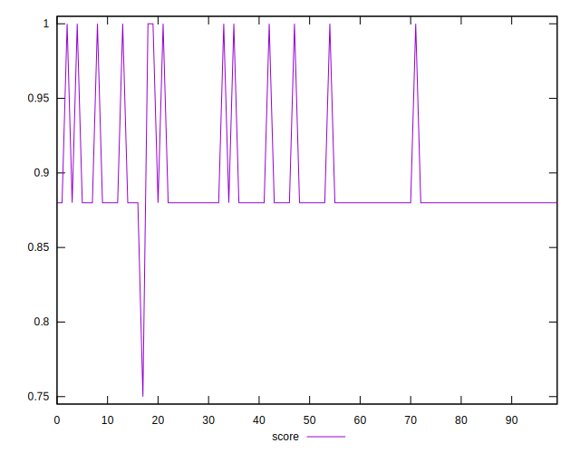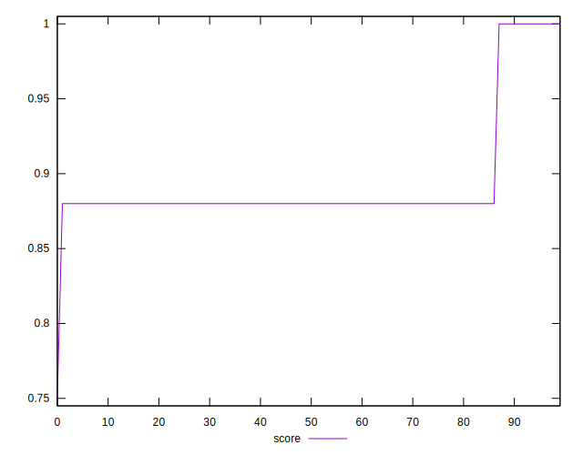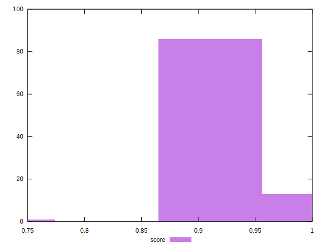
## Raw Estimate

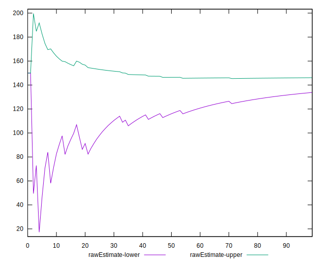
## Score Estimate

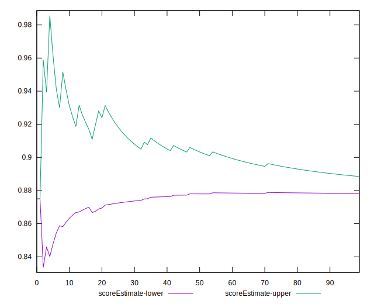
## P Score


```yaml
p90min: 0.875
p90max: 1
p90range: 0.125
p90mean: 0.8882978723404256
median: 0.875
p90stdev: 0.03854089560156764
mad: 0
stdevBySn: 0
lfitCenter: 0.8833534107334083
lfitStdev: 0.0209002708159718
mfitCenter: 0.8833534107334083
mfitStdev: 0.026194604913738147
mfitConfidence: 0.0026194604913738146
p90skewness: 2.5532425695667147
p90eccentricity: 1.000000000000001
p90discretization: 47
outlandishness: 1.0038360070278605

```

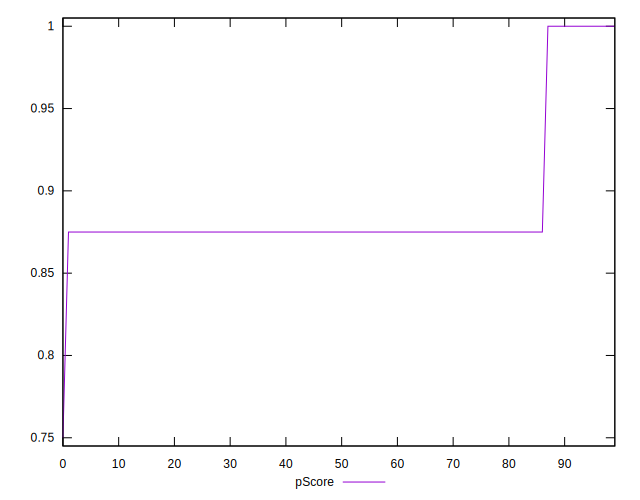
## Score Difference


```yaml
p90min: 0
p90max: 0
p90range: 0
p90mean: 0
median: 0
p90stdev: 0
mad: 0
stdevBySn: 0
lfitCenter: 0
lfitStdev: 0
mfitCenter: 0
mfitStdev: 0
mfitConfidence: 0
p90skewness: .nan
p90eccentricity: .nan
p90discretization: 94
outlandishness: .nan

```


## P Score Difference


```yaml
p90min: -0.0050000000000000044
p90max: 0
p90range: 0.0050000000000000044
p90mean: -0.004414893617021281
median: -0.0050000000000000044
p90stdev: 0.0016072281840146952
mad: 0
stdevBySn: 0
lfitCenter: -0.004609399091947108
lfitStdev: 0.0009026044925059002
mfitCenter: -0.004609399091947108
mfitStdev: 0.0011312469720004361
mfitConfidence: 0.00011312469720004361
p90skewness: 2.3828522123573896
p90eccentricity: 1.000000000000003
p90discretization: 47
outlandishness: 0.9486290608215993

```

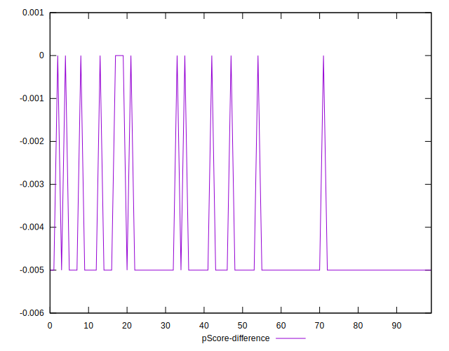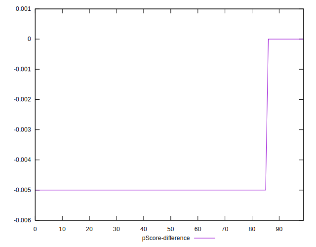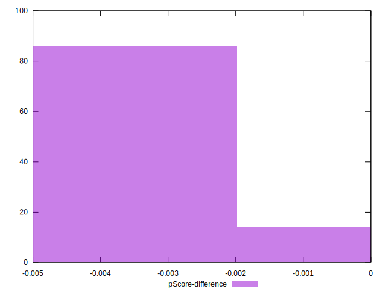