# //unused-css-rules/samples/pages+cached

[→ Parent](../..)


## Raw


```yaml
p90min: 0
p90max: 150
p90range: 150
p90mean: 64.7872340425532
median: 0
p90stdev: 73.58203879191586
mad: 0
stdevBySn: 0
lfitCenter: 58.914191943475544
lfitStdev: 87.56534222558217
mfitCenter: 58.914191943475544
mfitStdev: 109.74688146062404
mfitConfidence: 10.974688146062404
p90skewness: 0.28495511836807697
p90eccentricity: 0.9999999999999994
p90discretization: 18.8
outlandishness: 1.0221243201997405

```

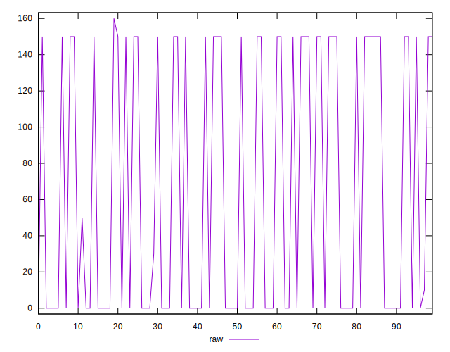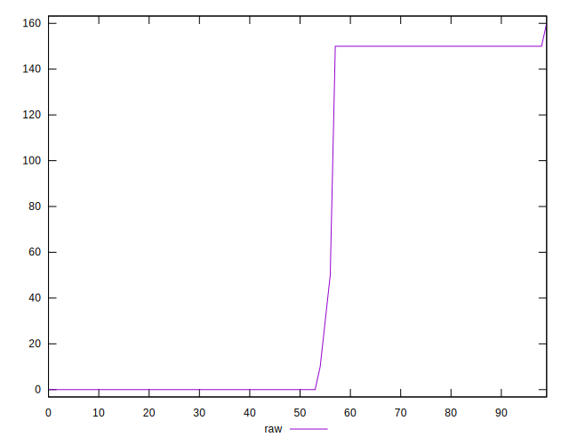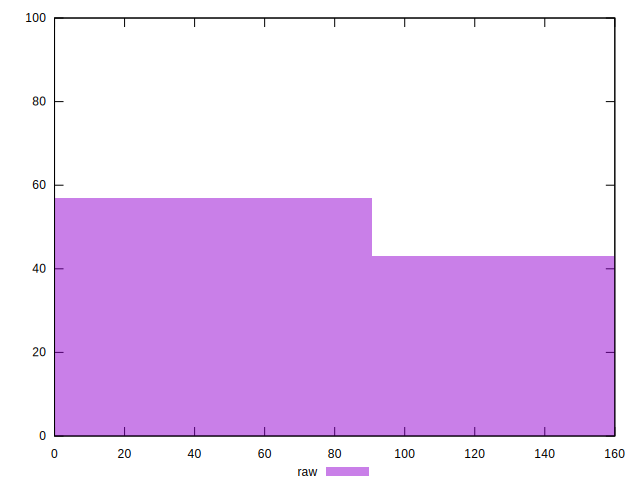
## Score


```yaml
p90min: 0.88
p90max: 1
p90range: 0.12
p90mean: 0.9481914893617017
median: 1
p90stdev: 0.058871709890586474
mad: 0
stdevBySn: 0
lfitCenter: 0.9528903545276431
lfitStdev: 0.07009644474281622
mfitCenter: 0.9528903545276431
mfitStdev: 0.08785286526012763
mfitConfidence: 0.008785286526012763
p90skewness: -0.28596747579328025
p90eccentricity: 0.9999999999999999
p90discretization: 18.8
outlandishness: 0.9987527732942934

```

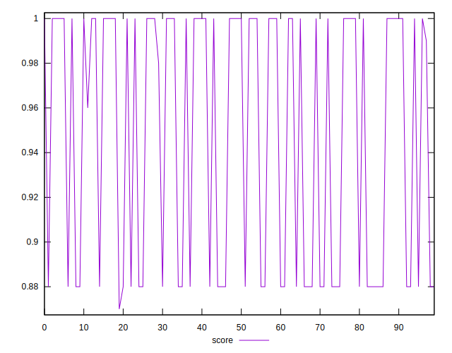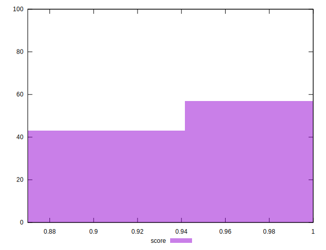
## Raw Estimate

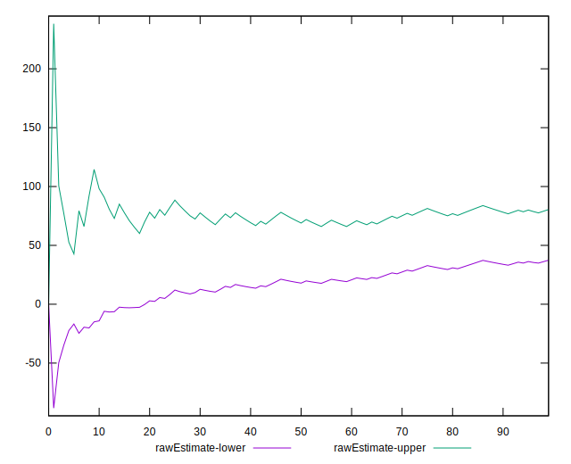
## Score Estimate

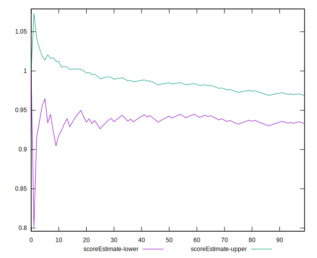
## P Score


```yaml
p90min: 0.875
p90max: 1
p90range: 0.125
p90mean: 0.9460106382978724
median: 1
p90stdev: 0.06131836565992991
mad: 0
stdevBySn: 0
lfitCenter: 0.950904840047104
lfitStdev: 0.07297111852131839
mfitCenter: 0.950904840047104
mfitStdev: 0.09145573455051993
mfitConfidence: 0.009145573455051993
p90skewness: -0.28495511836807735
p90eccentricity: 0.9999999999999982
p90discretization: 18.8
outlandishness: 0.9987446543649626

```

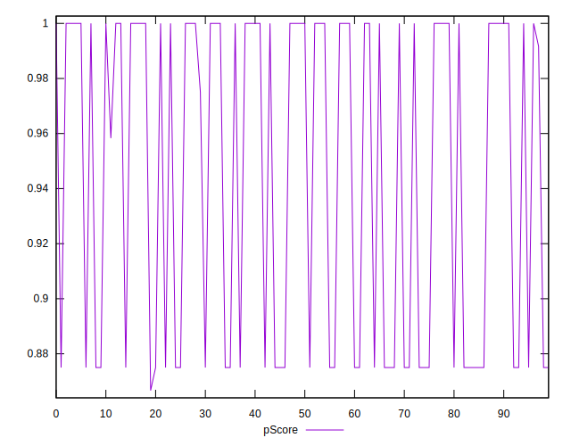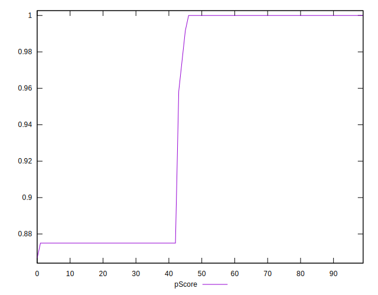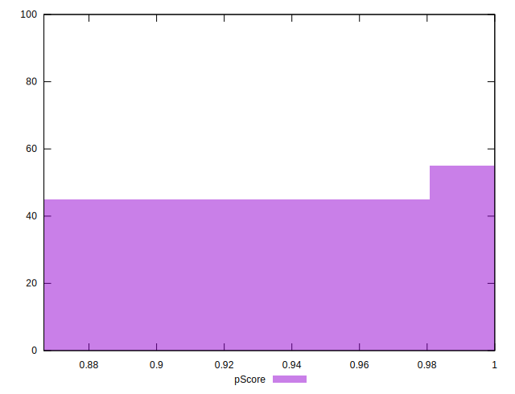
## Score Difference


```yaml
p90min: 0
p90max: 0
p90range: 0
p90mean: 0
median: 0
p90stdev: 0
mad: 0
stdevBySn: 0
lfitCenter: 0
lfitStdev: 0
mfitCenter: 0
mfitStdev: 0
mfitConfidence: 0
p90skewness: .nan
p90eccentricity: .nan
p90discretization: 94
outlandishness: .nan

```

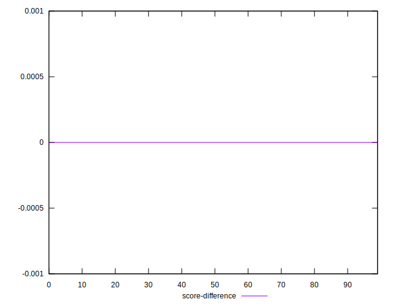
## P Score Difference


```yaml
p90min: -0.0050000000000000044
p90max: 0
p90range: 0.0050000000000000044
p90mean: -0.002180851063829788
median: 0
p90stdev: 0.0024555937462961497
mad: 0
stdevBySn: 0
lfitCenter: -0.0019855199062866176
lfitStdev: 0.0029465130449081553
mfitCenter: -0.0019855199062866176
mfitStdev: 0.003692906458683892
mfitConfidence: 0.0003692906458683892
p90skewness: -0.2573885367933486
p90eccentricity: 1.0000000000000002
p90discretization: 23.5
outlandishness: 1.002277718289378

```

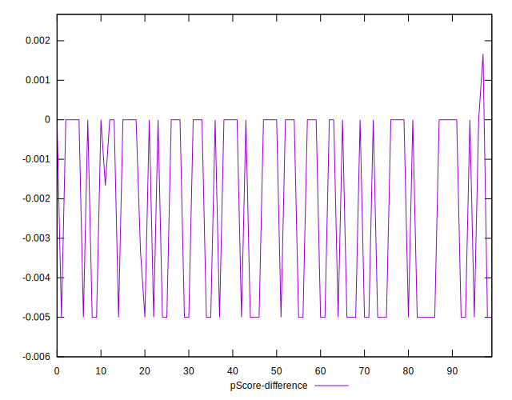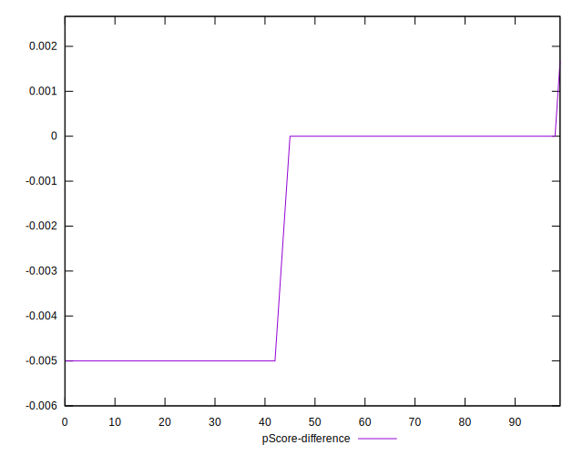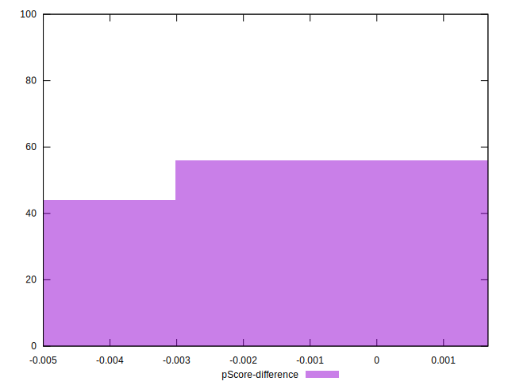