# //unused-javascript/samples/pages+cached+noadtech

[→ Parent](../..)


## Raw


```yaml
p90min: 2100
p90max: 2280
p90range: 180
p90mean: 2127.659574468085
median: 2100
p90stdev: 52.72218500127139
mad: 0
stdevBySn: 0
lfitCenter: 2117.9743395666874
lfitStdev: 38.16065637293504
mfitCenter: 2117.9743395666874
mfitStdev: 47.82729016956417
mfitConfidence: 4.782729016956417
p90skewness: 1.9975838765417584
p90eccentricity: 0.9999999999999979
p90discretization: 11.75
outlandishness: 0.9994740691690002

```

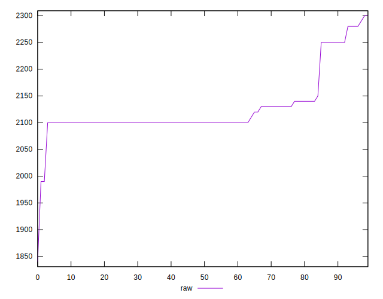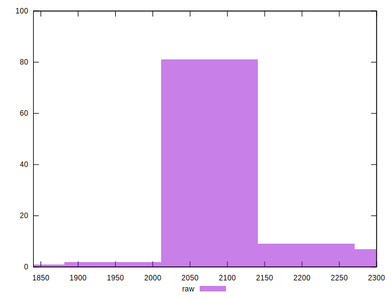
## Score


```yaml
p90min: 0.32
p90max: 0.34
p90range: 0.020000000000000018
p90mean: 0.3374468085106382
median: 0.34
p90stdev: 0.00667420729419495
mad: 0
stdevBySn: 0
lfitCenter: 0.3385374197786737
lfitStdev: 0.003947366673179527
mfitCenter: 0.3385374197786737
mfitStdev: 0.004947290461642129
mfitConfidence: 0.0004947290461642129
p90skewness: -2.2315184957216503
p90eccentricity: 0.9999999999999967
p90discretization: 47
outlandishness: 1.0003152833589635

```

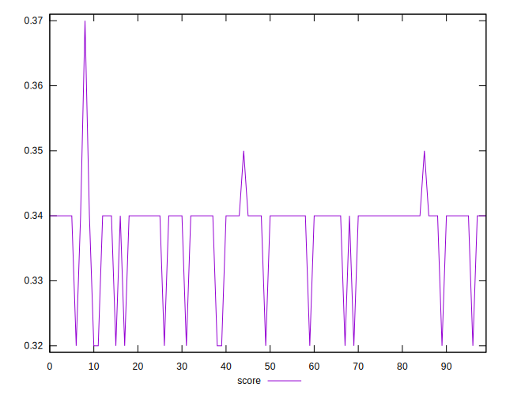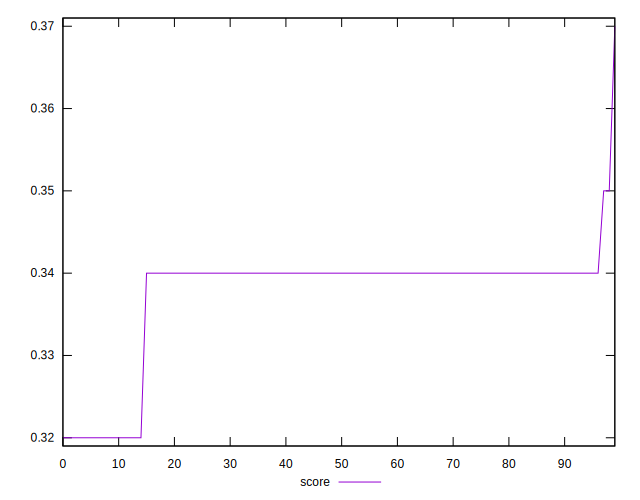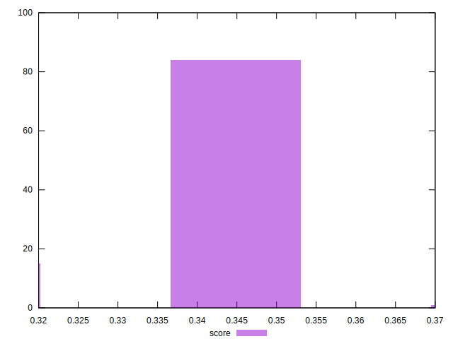
## Raw Estimate

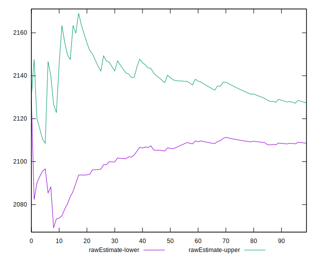
## Score Estimate

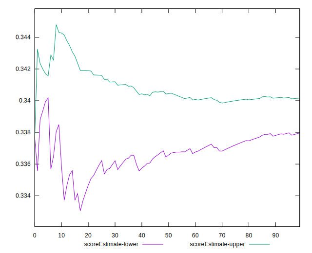
## P Score


```yaml
p90min: 0.32
p90max: 0.3411764705882353
p90range: 0.021176470588235297
p90mean: 0.3379224030037543
median: 0.3411764705882353
p90stdev: 0.006202610000149585
mad: 0
stdevBySn: 0
lfitCenter: 0.33906184240391907
lfitStdev: 0.004489488985051229
mfitCenter: 0.33906184240391907
mfitStdev: 0.005626740019948786
mfitConfidence: 0.0005626740019948786
p90skewness: -1.9975838765415597
p90eccentricity: 0.9999999999999991
p90discretization: 11.75
outlandishness: 1.0003896675824424

```

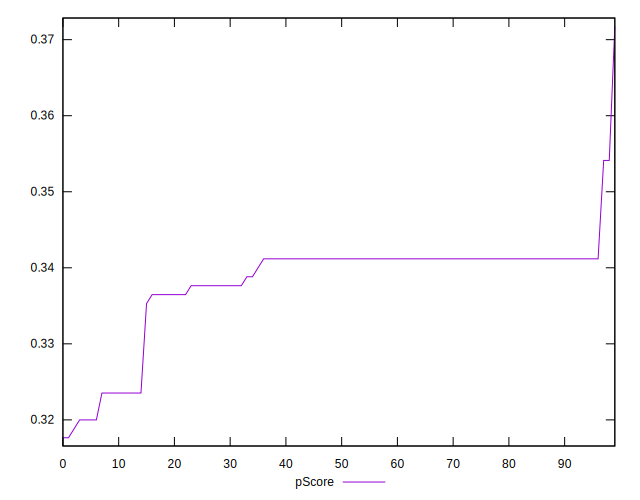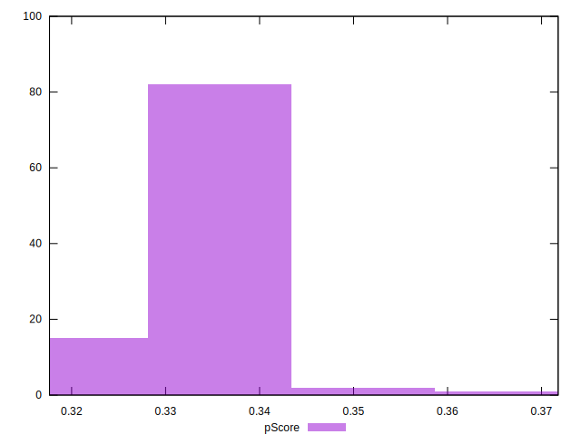
## Score Difference


```yaml
p90min: 0
p90max: 0
p90range: 0
p90mean: 0
median: 0
p90stdev: 0
mad: 0
stdevBySn: 0
lfitCenter: 5.235304226182962e-19
lfitStdev: 1.2999197837702497e-18
mfitCenter: 5.235304226182962e-19
mfitStdev: 1.6292078440147404e-18
mfitConfidence: 1.6292078440147404e-19
p90skewness: .nan
p90eccentricity: .nan
p90discretization: 94
outlandishness: .inf

```

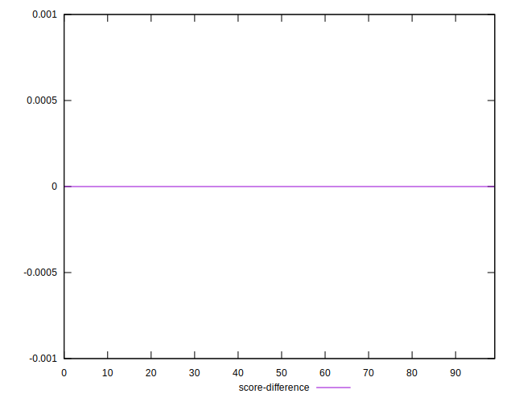
## P Score Difference


```yaml
p90min: -0.0035294117647059475
p90max: 0.0035294117647058365
p90range: 0.007058823529411784
p90mean: 0.0005193992490613055
median: 0.0011764705882352788
p90stdev: 0.0017328292945919025
mad: 0
stdevBySn: 0
lfitCenter: 0.0007102109286266252
lfitStdev: 0.001275095261950414
mfitCenter: 0.0007102109286266252
mfitStdev: 0.001598094919834536
mfitConfidence: 0.0001598094919834536
p90skewness: -0.8616472817819385
p90eccentricity: 1.0000000000000016
p90discretization: 10.444444444444445
outlandishness: 0.8835999999999957

```

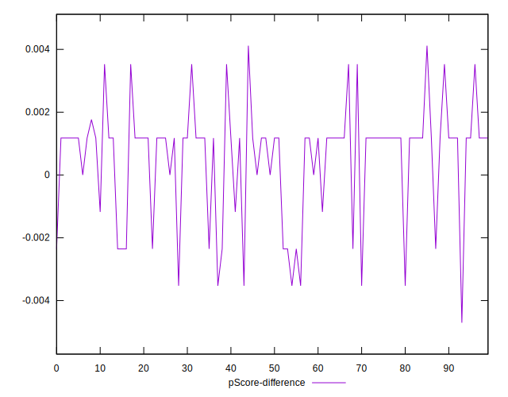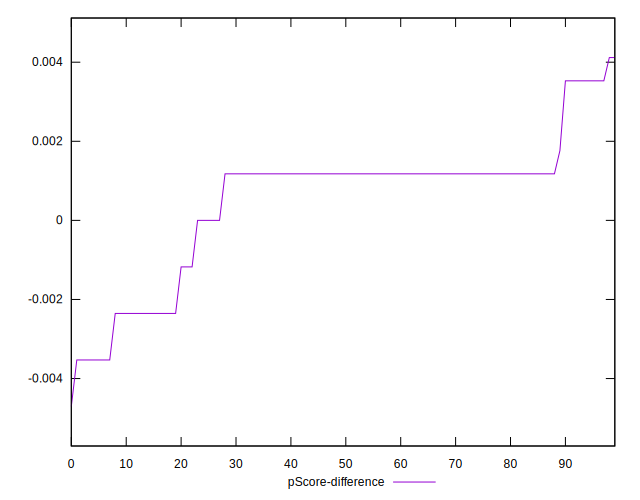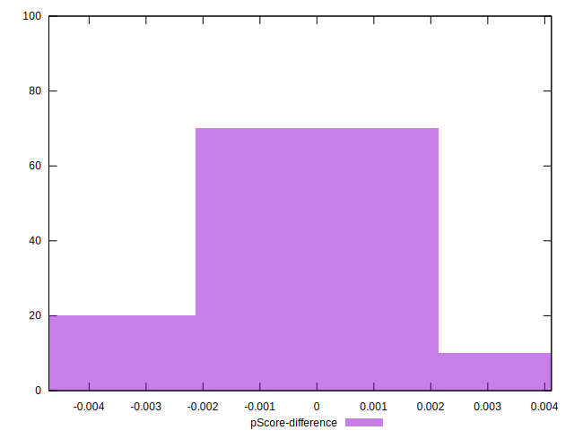