# //uses-http2/samples/pages+cached+noadtech

[→ Parent](../..)


## Raw


```yaml
p90min: 0
p90max: 150
p90range: 150
p90mean: 100.53191489361703
median: 150
p90stdev: 70.52036104463092
mad: 0
stdevBySn: 0
lfitCenter: 112.32729561521306
lfitStdev: 73.33543653642359
mfitCenter: 112.32729561521306
mfitStdev: 91.91233946978944
mfitConfidence: 9.191233946978944
p90skewness: -0.7241005155222721
p90eccentricity: 1.0000000000000007
p90discretization: 47
outlandishness: 1.0294196019148398

```

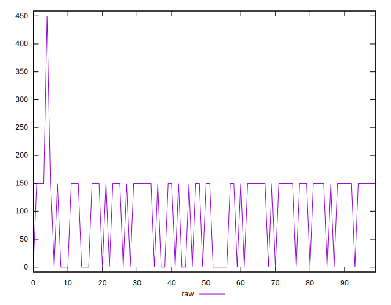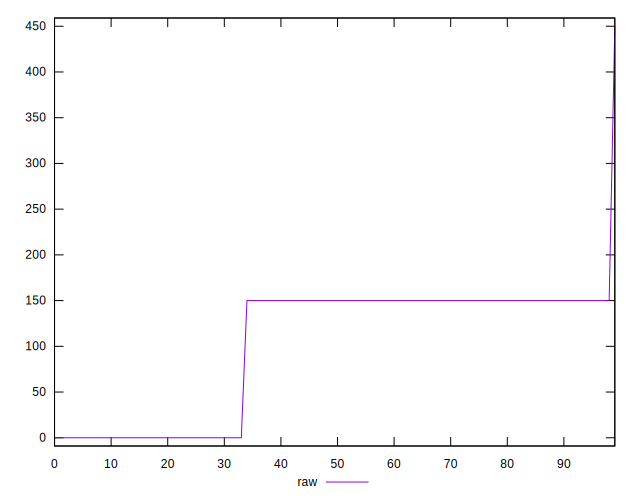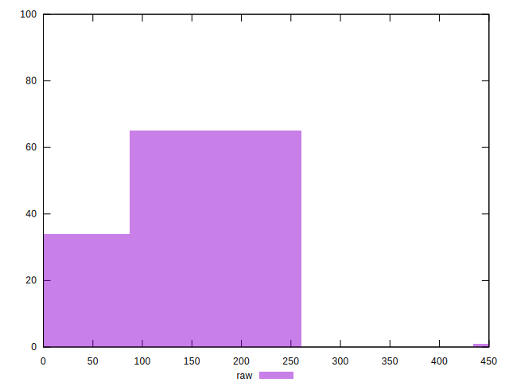
## Score


```yaml
p90min: 0.88
p90max: 1
p90range: 0.12
p90mean: 0.9195744680851059
median: 0.88
p90stdev: 0.056416288835704716
mad: 0
stdevBySn: 0
lfitCenter: 0.9102777715484064
lfitStdev: 0.05857720293612464
mfitCenter: 0.9102777715484064
mfitStdev: 0.07341563663811797
mfitConfidence: 0.007341563663811797
p90skewness: 0.7241005155222945
p90eccentricity: 1.0000000000000004
p90discretization: 47
outlandishness: 0.9980990070335232

```

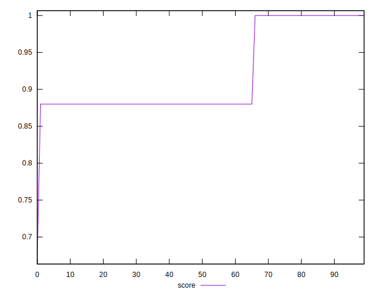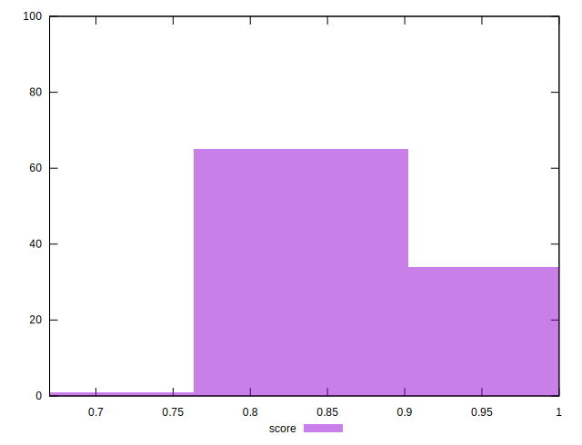
## Raw Estimate

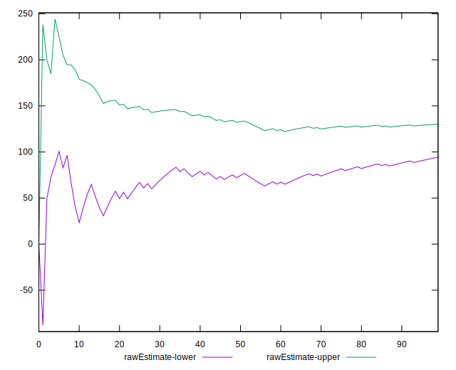
## Score Estimate

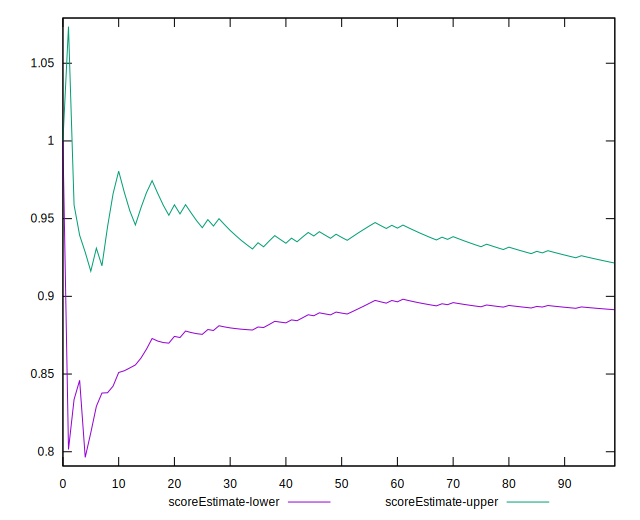
## P Score


```yaml
p90min: 0.875
p90max: 1
p90range: 0.125
p90mean: 0.9162234042553191
median: 0.875
p90stdev: 0.05876696753719243
mad: 0
stdevBySn: 0
lfitCenter: 0.9065878203770124
lfitStdev: 0.06098627170672202
mfitCenter: 0.9065878203770124
mfitStdev: 0.07643495658911112
mfitConfidence: 0.007643495658911112
p90skewness: 0.7241005155222741
p90eccentricity: 1.0000000000000004
p90discretization: 47
outlandishness: 0.9982397689964799

```

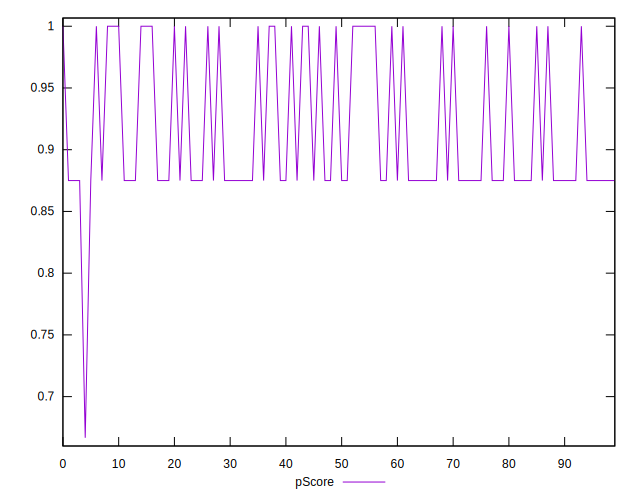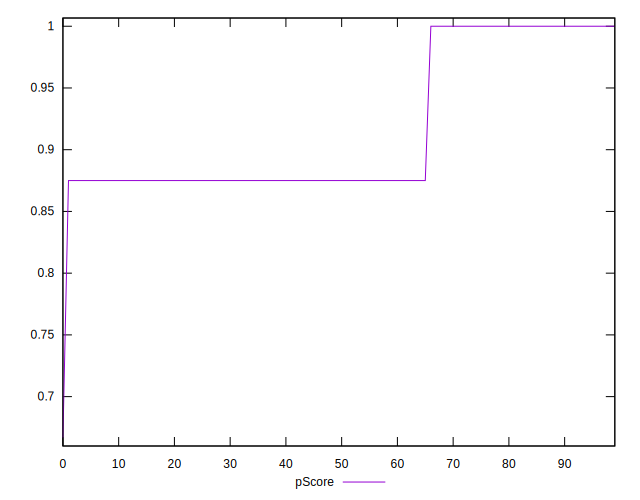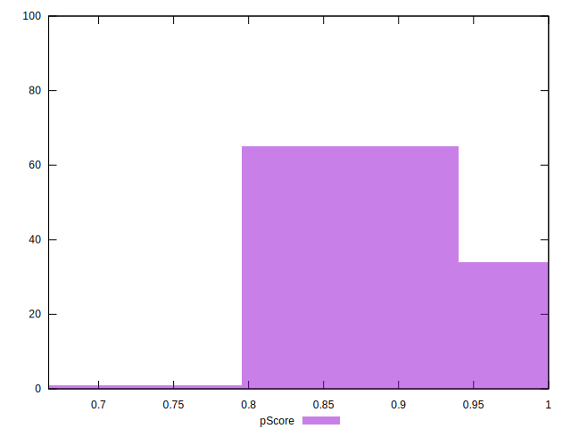
## Score Difference


```yaml
p90min: 0
p90max: 0
p90range: 0
p90mean: 0
median: 0
p90stdev: 0
mad: 0
stdevBySn: 0
lfitCenter: 0
lfitStdev: 0
mfitCenter: 0
mfitStdev: 0
mfitConfidence: 0
p90skewness: .nan
p90eccentricity: .nan
p90discretization: 94
outlandishness: .nan

```


## P Score Difference


```yaml
p90min: -0.0050000000000000044
p90max: 0
p90range: 0.0050000000000000044
p90mean: -0.003333333333333337
median: -0.0050000000000000044
p90stdev: 0.002344451727101504
mad: 0
stdevBySn: 0
lfitCenter: -0.0036774218637115365
lfitStdev: 0.002411386399071917
mfitCenter: -0.0036774218637115365
mfitStdev: 0.0030222246675282415
mfitConfidence: 0.00030222246675282416
p90skewness: 0.7108982656372304
p90eccentricity: 0.9999999999999999
p90discretization: 31.333333333333332
outlandishness: 0.970225

```

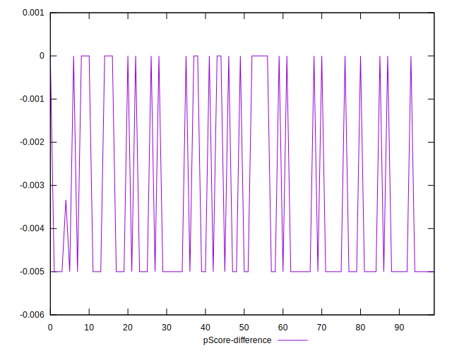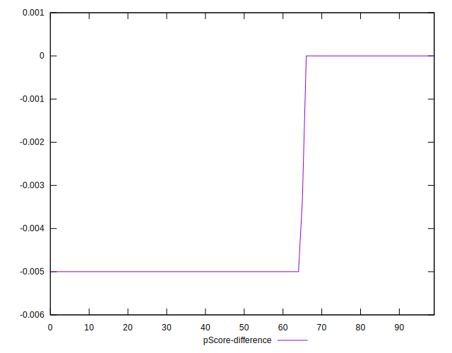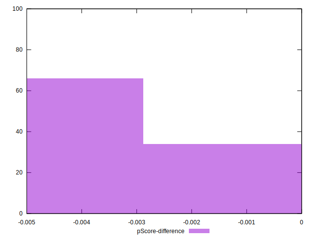