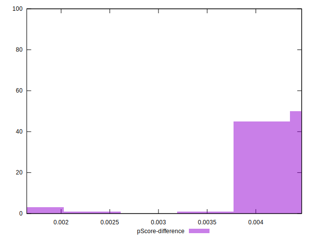

# //uses-rel-preload/samples/pages+cached+noadtech+nomedia+nocss

[→ Parent](../..)


## Raw


```yaml
p90min: 986
p90max: 1056
p90range: 70
p90mean: 1052.7978723404256
median: 1053
p90stdev: 6.9658433944834695
mad: 1
stdevBySn: 1.1926
lfitCenter: 1051.0470271545184
lfitStdev: 6.057297616280253
mfitCenter: 1051.0470271545184
mfitStdev: 7.591696744050609
mfitConfidence: 0.7591696744050609
p90skewness: -9.375531385212462
p90eccentricity: 0.9999999999999957
p90discretization: 15.666666666666666
outlandishness: 0.9918519978462235

```


## Score


```yaml
p90min: 0.46
p90max: 0.47
p90range: 0.009999999999999953
p90mean: 0.4601063829787241
median: 0.46
p90stdev: 0.00102592029372265
mad: 0
stdevBySn: 0
lfitCenter: 0.4603371143980313
lfitStdev: 0.000828648413403772
mfitCenter: 0.4603371143980313
mfitStdev: 0.0010385567724280466
mfitConfidence: 0.00010385567724280466
p90skewness: 9.539955591517986
p90eccentricity: 0.9999999999999994
p90discretization: 47
outlandishness: 1.0025820113682375

```


## Raw Estimate


## Score Estimate


## P Score


```yaml
p90min: 0.46399999999999997
p90max: 0.4722352941176471
p90range: 0.008235294117647118
p90mean: 0.46437672090112697
median: 0.4643529411764706
p90stdev: 0.0008195109875862927
mad: 0.00011764705882350013
stdevBySn: 0.00014030588235290625
lfitCenter: 0.4645827026877037
lfitStdev: 0.0007126232489741127
mfitCenter: 0.4645827026877037
mfitStdev: 0.0008931407934176753
mfitConfidence: 0.00008931407934176752
p90skewness: 9.375531385211838
p90eccentricity: 1.0000000000000007
p90discretization: 15.666666666666666
outlandishness: 1.0021788659660338

```


## Score Difference


```yaml
p90min: 0
p90max: 0
p90range: 0
p90mean: 0
median: 0
p90stdev: 0
mad: 0
stdevBySn: 0
lfitCenter: 2.583267684513104e-19
lfitStdev: 6.445158398659724e-19
mfitCenter: 2.583267684513104e-19
mfitStdev: 8.077808146406197e-19
mfitConfidence: 8.077808146406197e-20
p90skewness: .nan
p90eccentricity: .nan
p90discretization: 94
outlandishness: .inf

```


## P Score Difference


```yaml
p90min: 0.002235294117647113
p90max: 0.004470588235294115
p90range: 0.002235294117647002
p90mean: 0.004251564455569445
median: 0.004294117647058809
p90stdev: 0.0002356699525492637
mad: 0.000058823529411750064
stdevBySn: 0.00014030588235290625
lfitCenter: 0.004238272727575141
lfitStdev: 0.00014942915555936592
mfitCenter: 0.004238272727575141
mfitStdev: 0.00018728167337812116
mfitConfidence: 0.000018728167337812116
p90skewness: -6.788888968876517
p90eccentricity: 1.0000000000000016
p90discretization: 11.75
outlandishness: 0.9677068685776101

```

