# //uses-rel-preload/samples/pages+cached+noadtech

[→ Parent](../..)


## Raw


```yaml
p90min: 755
p90max: 762
p90range: 7
p90mean: 757.0851063829788
median: 757
p90stdev: 1.3888582059887318
mad: 1
stdevBySn: 1.1926
lfitCenter: 757.379400064812
lfitStdev: 1.7764430254921937
mfitCenter: 757.379400064812
mfitStdev: 2.226441160225226
mfitConfidence: 0.2226441160225226
p90skewness: 0.9436962411927916
p90eccentricity: 0.999999999999998
p90discretization: 13.428571428571429
outlandishness: 1.0022596568836408

```

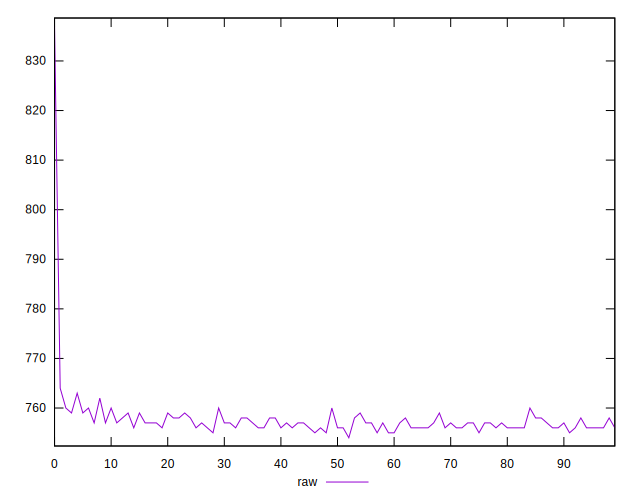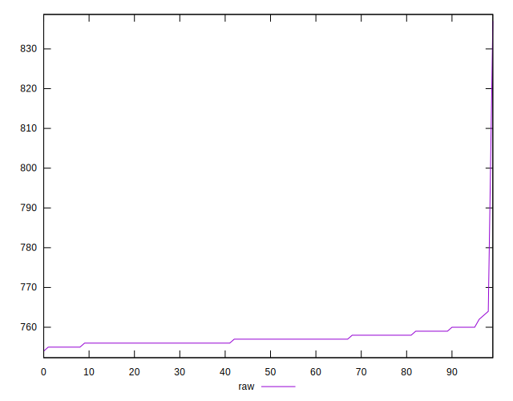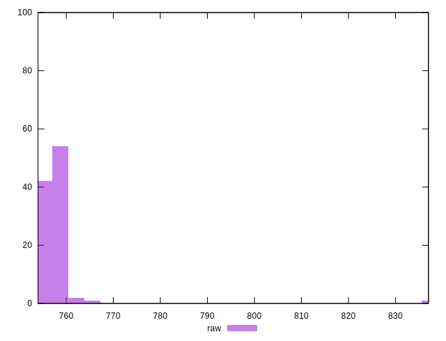
## Score


```yaml
p90min: 0.5
p90max: 0.5
p90range: 0
p90mean: 0.5
median: 0.5
p90stdev: 0
mad: 0
stdevBySn: 0
lfitCenter: 0.4999534639864745
lfitStdev: 0.00011610565185020858
mfitCenter: 0.4999534639864745
mfitStdev: 0.0001455168550325232
mfitConfidence: 0.00001455168550325232
p90skewness: .nan
p90eccentricity: .nan
p90discretization: 94
outlandishness: 0.99960004

```

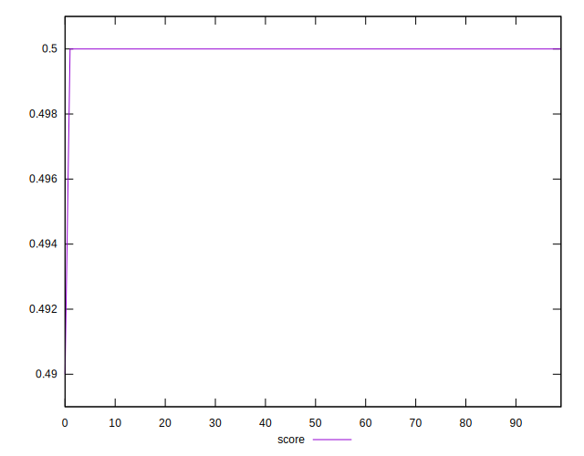
## Raw Estimate

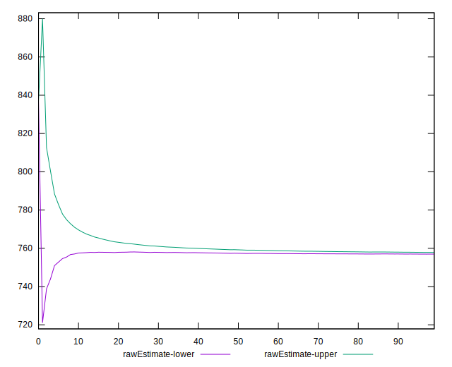
## Score Estimate

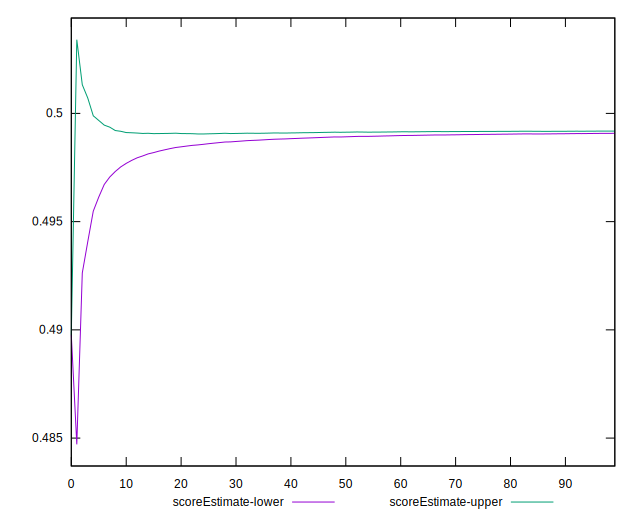
## P Score


```yaml
p90min: 0.49858823529411767
p90max: 0.49941176470588233
p90range: 0.0008235294117646674
p90mean: 0.4991664580725906
median: 0.4991764705882353
p90stdev: 0.00016339508305749574
mad: 0.00011764705882355564
stdevBySn: 0.00014030588235297247
lfitCenter: 0.49913183528649296
lfitStdev: 0.00020899329711655175
mfitCenter: 0.49913183528649296
mfitStdev: 0.00026193425414392245
mfitConfidence: 0.000026193425414392246
p90skewness: -0.9436962411858779
p90eccentricity: 1.0000000000000009
p90discretization: 13.428571428571429
outlandishness: 0.9995970659259804

```

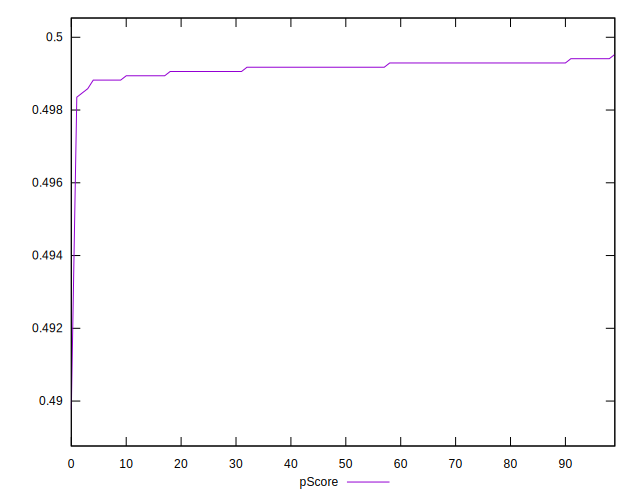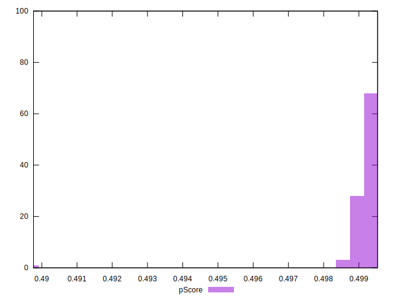
## Score Difference


```yaml
p90min: 0
p90max: 0
p90range: 0
p90mean: 0
median: 0
p90stdev: 0
mad: 0
stdevBySn: 0
lfitCenter: 0
lfitStdev: 0
mfitCenter: 0
mfitStdev: 0
mfitConfidence: 0
p90skewness: .nan
p90eccentricity: .nan
p90discretization: 94
outlandishness: .nan

```


## P Score Difference


```yaml
p90min: -0.0011764705882352788
p90max: -0.0005882352941176672
p90range: 0.0005882352941176117
p90mean: -0.0008247809762202767
median: -0.0008235294117647229
p90stdev: 0.00015396277733163274
mad: 0.00011764705882355564
stdevBySn: 0.00014030588235297247
lfitCenter: -0.0008188514062883966
lfitStdev: 0.0001295105132292258
mfitCenter: -0.0008188514062883966
mfitStdev: 0.00016231735732450545
mfitConfidence: 0.000016231735732450543
p90skewness: -0.6923251528812273
p90eccentricity: 0.9999999999999982
p90discretization: 15.666666666666666
outlandishness: 1.0227685107108064

```

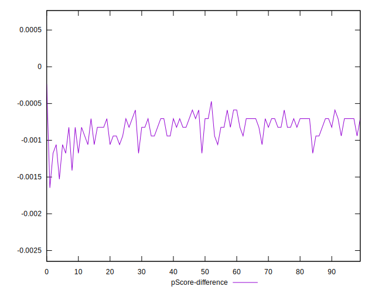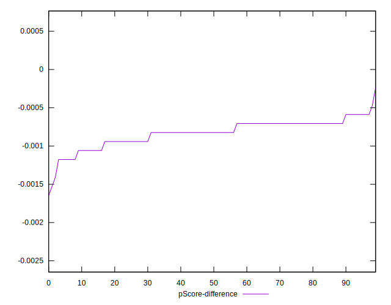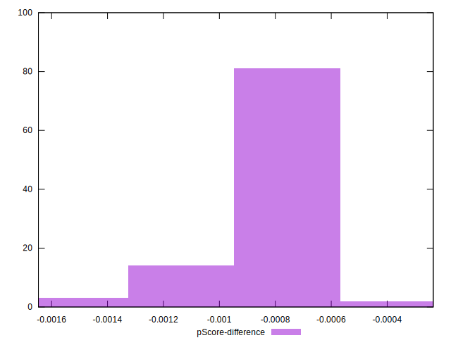