# //uses-text-compression/samples/pages+cached+noadtech+nomedia

[→ Parent](../..)


## Raw


```yaml
p90min: 2550
p90max: 2750
p90range: 200
p90mean: 2574.255319148936
median: 2550
p90stdev: 58.59143357802339
mad: 0
stdevBySn: 0
lfitCenter: 2565.1821704777567
lfitStdev: 35.21192963290994
mfitCenter: 2565.1821704777567
mfitStdev: 44.131609255491725
mfitConfidence: 4.413160925549173
p90skewness: 2.4126731430517676
p90eccentricity: 1.0000000000000022
p90discretization: 11.75
outlandishness: 1.0012781997408347

```

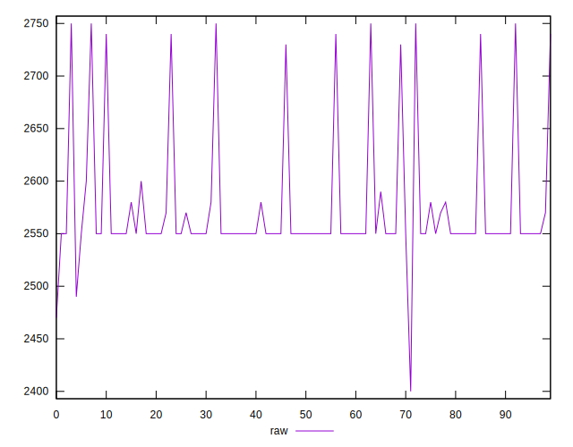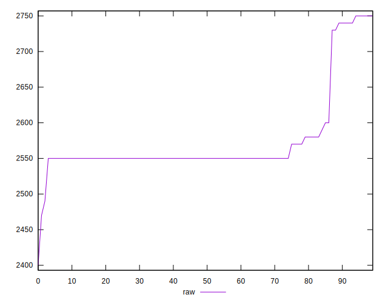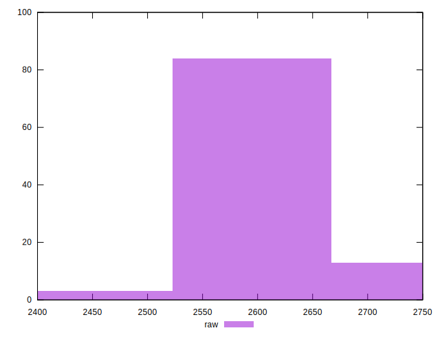
## Score


```yaml
p90min: 0.26
p90max: 0.29
p90range: 0.02999999999999997
p90mean: 0.286702127659574
median: 0.29
p90stdev: 0.0074930177246554435
mad: 0
stdevBySn: 0
lfitCenter: 0.28787316927606665
lfitStdev: 0.005112400289735845
mfitCenter: 0.28787316927606665
mfitStdev: 0.006407443565189236
mfitConfidence: 0.0006407443565189236
p90skewness: -2.2610180796147543
p90eccentricity: 1.000000000000004
p90discretization: 23.5
outlandishness: 0.9978935038224432

```

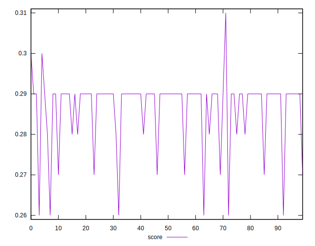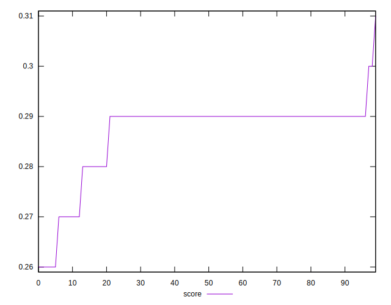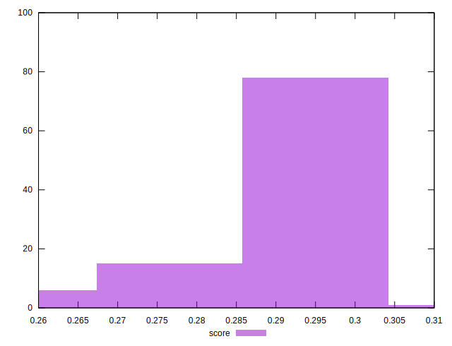
## Raw Estimate

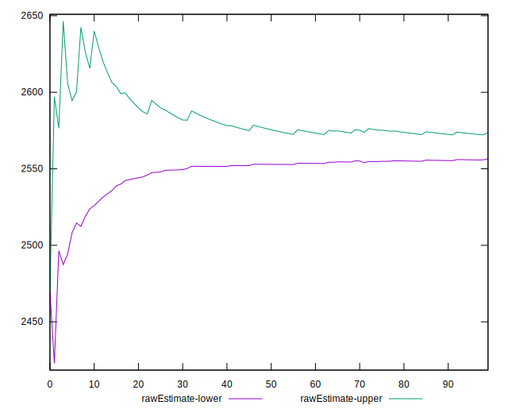
## Score Estimate

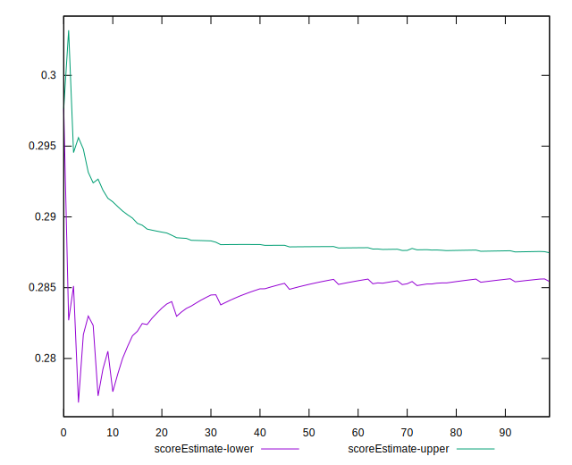
## P Score


```yaml
p90min: 0.2647058823529412
p90max: 0.28823529411764703
p90range: 0.023529411764705854
p90mean: 0.2853817271589491
median: 0.28823529411764703
p90stdev: 0.006893109832708632
mad: 0
stdevBySn: 0
lfitCenter: 0.2864491564143816
lfitStdev: 0.004142579956812863
mfitCenter: 0.2864491564143816
mfitStdev: 0.0051919540300577605
mfitConfidence: 0.0005191954030057761
p90skewness: -2.4126731430519186
p90eccentricity: 0.9999999999999989
p90discretization: 11.75
outlandishness: 0.9986444382968791

```

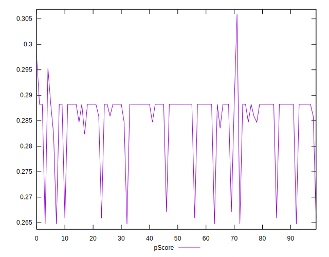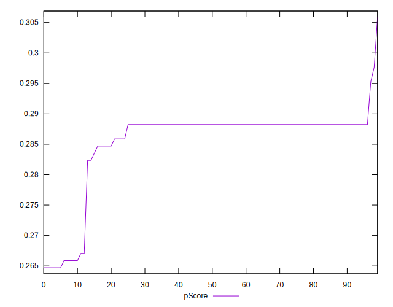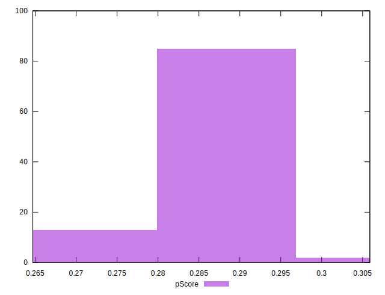
## Score Difference


```yaml
p90min: 0
p90max: 0
p90range: 0
p90mean: 0
median: 0
p90stdev: 0
mad: 0
stdevBySn: 0
lfitCenter: 0
lfitStdev: 0
mfitCenter: 0
mfitStdev: 0
mfitConfidence: 0
p90skewness: .nan
p90eccentricity: .nan
p90discretization: 94
outlandishness: .nan

```


## P Score Difference


```yaml
p90min: -0.004117647058823559
p90max: 0.004705882352941171
p90range: 0.00882352941176473
p90mean: -0.0013016270337922482
median: -0.001764705882352946
p90stdev: 0.0021241596775559133
mad: 0
stdevBySn: 0
lfitCenter: -0.0014572704091948645
lfitStdev: 0.001111129747030876
mfitCenter: -0.0014572704091948645
mfitStdev: 0.0013925946217468801
mfitConfidence: 0.000139259462174688
p90skewness: 1.9414385666078604
p90eccentricity: 0.9999999999999983
p90discretization: 10.444444444444445
outlandishness: 0.8666893860946757

```

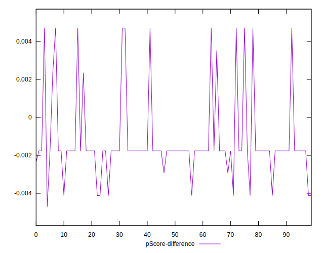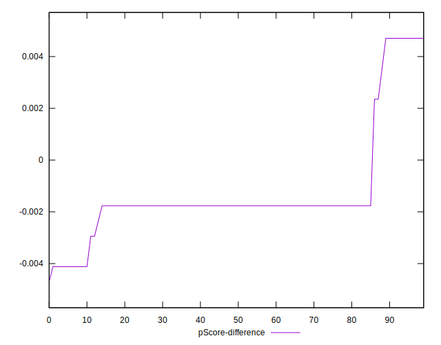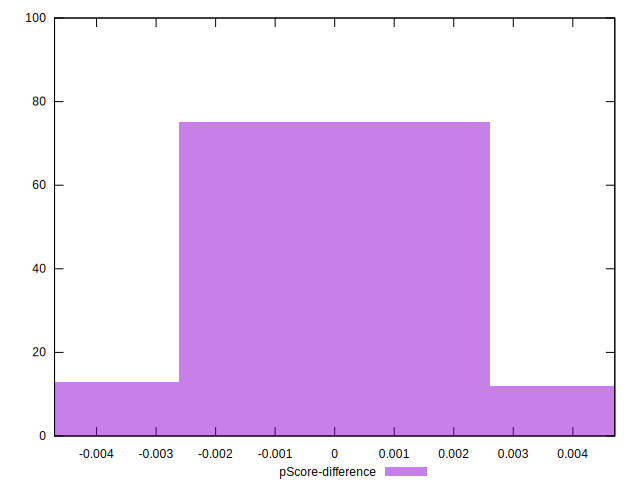