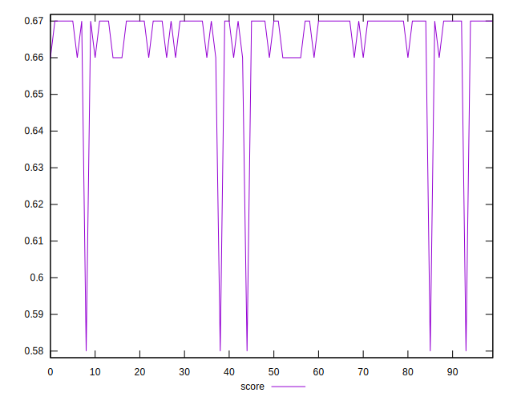
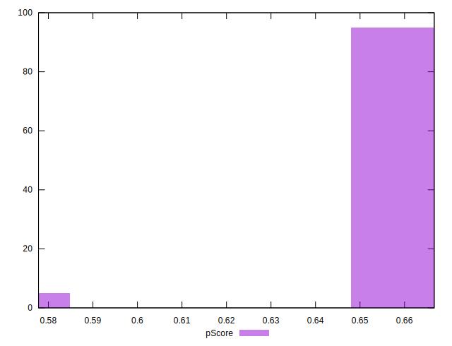

# //uses-webp-images/samples/pages+cached+noadtech

[→ Parent](../..)


## Raw


```yaml
p90min: 450
p90max: 610
p90range: 160
p90mean: 455.9574468085106
median: 450
p90stdev: 23.124047947563483
mad: 0
stdevBySn: 0
lfitCenter: 455.72789293822007
lfitStdev: 11.420954916267563
mfitCenter: 455.72789293822007
mfitStdev: 14.314044272604502
mfitConfidence: 1.4314044272604503
p90skewness: 6.278733985590541
p90eccentricity: 0.9999999999999967
p90discretization: 31.333333333333332
outlandishness: 1.0195816337644685

```


## Score


```yaml
p90min: 0.58
p90max: 0.67
p90range: 0.09000000000000008
p90mean: 0.6655319148936176
median: 0.67
p90stdev: 0.013338236611623394
mad: 0
stdevBySn: 0
lfitCenter: 0.6659905973115597
lfitStdev: 0.00799442444887419
mfitCenter: 0.6659905973115597
mfitStdev: 0.01001952519155677
mfitConfidence: 0.001001952519155677
p90skewness: -5.601391467591707
p90eccentricity: 1.000000000000001
p90discretization: 31.333333333333332
outlandishness: 0.9927051682456448

```


## Raw Estimate


## Score Estimate


## P Score


```yaml
p90min: 0.5777777777777777
p90max: 0.6666666666666666
p90range: 0.0888888888888889
p90mean: 0.6633569739952712
median: 0.6666666666666666
p90stdev: 0.012846693304201913
mad: 0
stdevBySn: 0
lfitCenter: 0.663484503923211
lfitStdev: 0.006344974953481997
mfitCenter: 0.663484503923211
mfitStdev: 0.007952246818113634
mfitConfidence: 0.0007952246818113634
p90skewness: -6.278733985590426
p90eccentricity: 1.0000000000000016
p90discretization: 31.333333333333332
outlandishness: 0.9925726454207441

```


## Score Difference


```yaml
p90min: 0
p90max: 0
p90range: 0
p90mean: 0
median: 0
p90stdev: 0
mad: 0
stdevBySn: 0
lfitCenter: 0
lfitStdev: 0
mfitCenter: 0
mfitStdev: 0
mfitConfidence: 0
p90skewness: .nan
p90eccentricity: .nan
p90discretization: 94
outlandishness: .nan

```


## P Score Difference


```yaml
p90min: -0.0033333333333334103
p90max: 0.0011111111111110628
p90range: 0.004444444444444473
p90mean: -0.0022813238770686252
median: -0.0033333333333334103
p90stdev: 0.0018362647334123933
mad: 0
stdevBySn: 0
lfitCenter: -0.0025855607684292813
lfitStdev: 0.0014909979714190845
mfitCenter: -0.0025855607684292813
mfitStdev: 0.0018686888381686249
mfitConfidence: 0.0001868688838168625
p90skewness: 1.272677301384219
p90eccentricity: 1.0000000000000007
p90discretization: 31.333333333333332
outlandishness: 0.9393928320223375

```

