# //uses-webp-images/samples/pages

[→ Parent](../..)


## Raw


```yaml
p90min: 300
p90max: 460
p90range: 160
p90mean: 400.531914893617
median: 450
p90stdev: 69.07237988002605
mad: 0
stdevBySn: 0
lfitCenter: 411.38190376111083
lfitStdev: 71.18867888737262
mfitCenter: 411.38190376111083
mfitStdev: 89.22177775613632
mfitConfidence: 8.922177775613632
p90skewness: -0.6927260989248066
p90eccentricity: 0.9999999999999994
p90discretization: 10.444444444444445
outlandishness: 1.0013390934112159

```

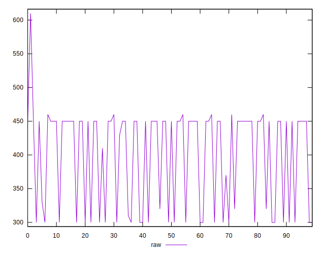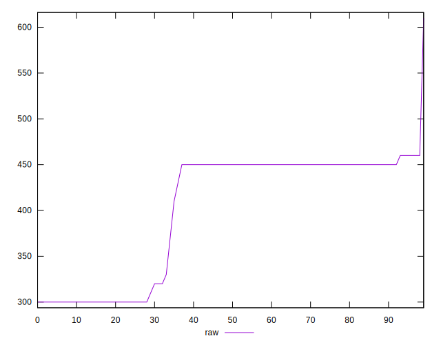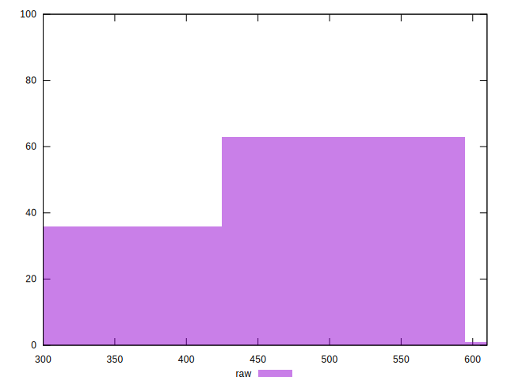
## Score


```yaml
p90min: 0.66
p90max: 0.75
p90range: 0.08999999999999997
p90mean: 0.6960638297872347
median: 0.67
p90stdev: 0.036936347925839746
mad: 0
stdevBySn: 0
lfitCenter: 0.6902995120266123
lfitStdev: 0.03787964041946384
mfitCenter: 0.6902995120266123
mfitStdev: 0.047475088901913126
mfitConfidence: 0.004747508890191312
p90skewness: 0.6918306667718133
p90eccentricity: 0.9999999999999992
p90discretization: 11.75
outlandishness: 0.9992420816134711

```

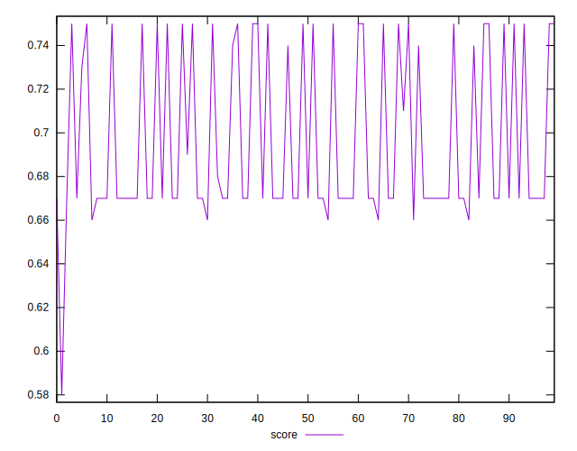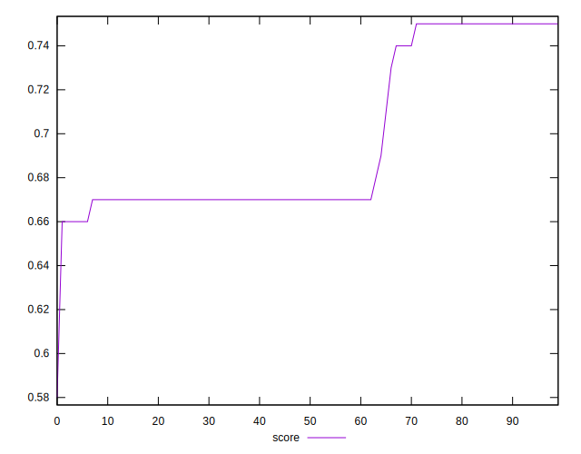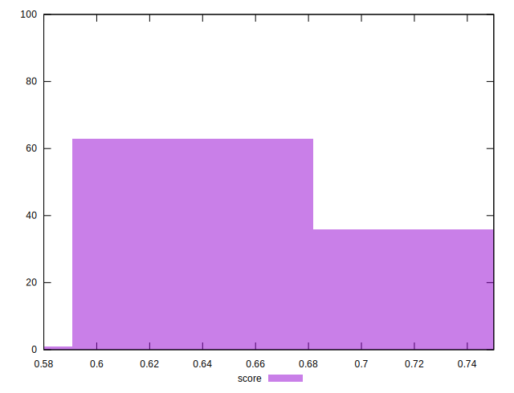
## Raw Estimate

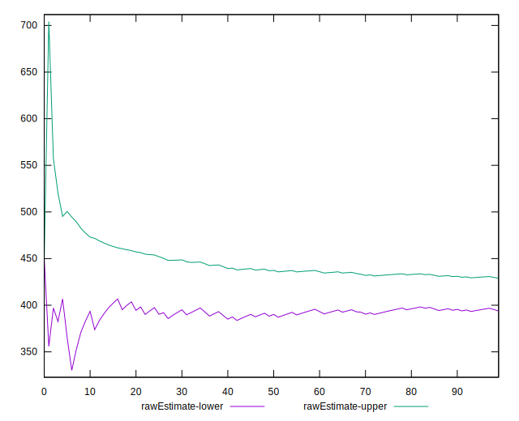
## Score Estimate

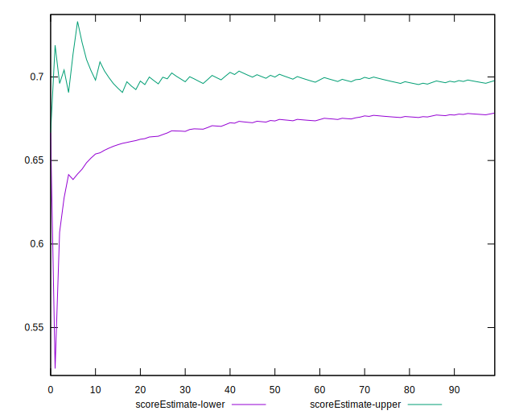
## P Score


```yaml
p90min: 0.6611111111111111
p90max: 0.75
p90range: 0.0888888888888889
p90mean: 0.6941489361702121
median: 0.6666666666666666
p90stdev: 0.03837354437779231
mad: 0
stdevBySn: 0
lfitCenter: 0.6881211645771612
lfitStdev: 0.03954926604854067
mfitCenter: 0.6881211645771612
mfitStdev: 0.04956765430896504
mfitConfidence: 0.0049567654308965035
p90skewness: 0.6927260989248364
p90eccentricity: 0.9999999999999978
p90discretization: 10.444444444444445
outlandishness: 0.999570927261785

```

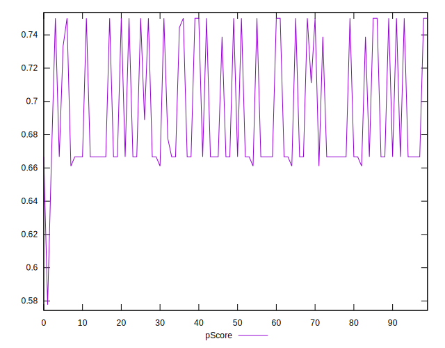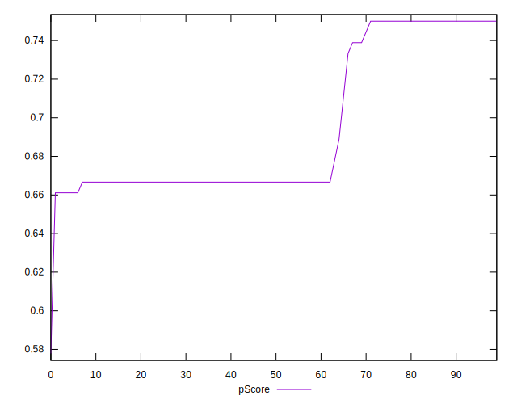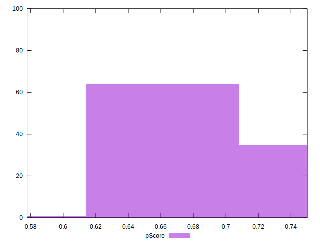
## Score Difference


```yaml
p90min: 0
p90max: 0
p90range: 0
p90mean: 0
median: 0
p90stdev: 0
mad: 0
stdevBySn: 0
lfitCenter: 5.166535369026208e-19
lfitStdev: 1.2890316797319448e-18
mfitCenter: 5.166535369026208e-19
mfitStdev: 1.6155616292812394e-18
mfitConfidence: 1.6155616292812395e-19
p90skewness: .nan
p90eccentricity: .nan
p90discretization: 94
outlandishness: .inf

```

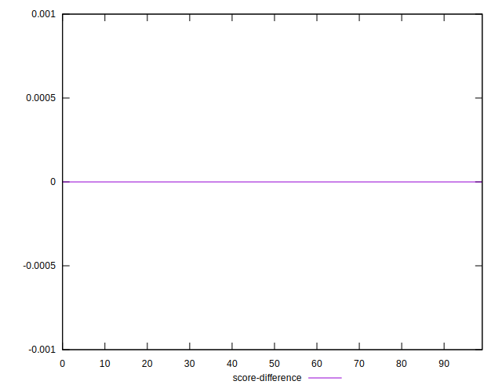
## P Score Difference


```yaml
p90min: -0.0033333333333334103
p90max: 0.0011111111111110628
p90range: 0.004444444444444473
p90mean: -0.0019030732860520541
median: -0.0033333333333334103
p90stdev: 0.0016969072163828646
mad: 0
stdevBySn: 0
lfitCenter: -0.0020578908314794657
lfitStdev: 0.0019355745359805737
mfitCenter: -0.0020578908314794657
mfitStdev: 0.002425882932213369
mfitConfidence: 0.00024258829322133688
p90skewness: 0.4594777042939716
p90eccentricity: 0.9999999999999997
p90discretization: 18.8
outlandishness: 0.8946104857065714

```

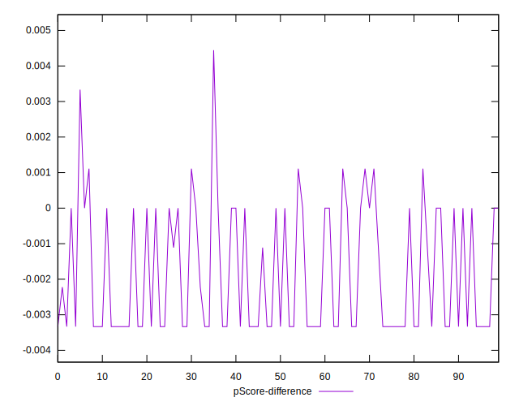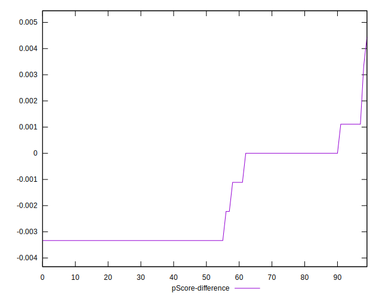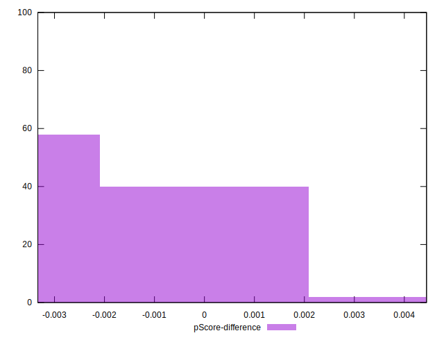