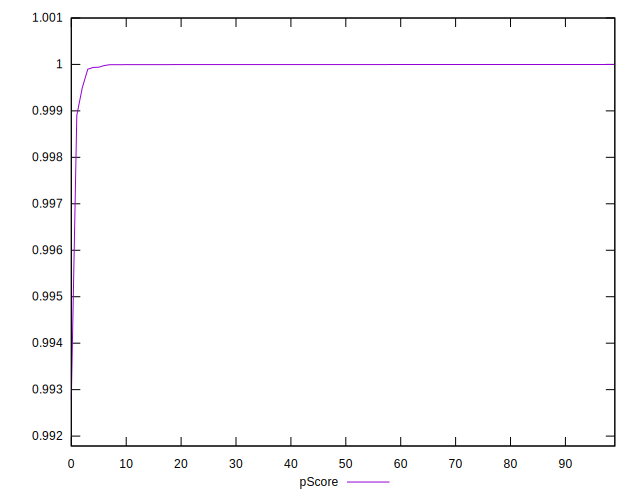

# //bootup-time/samples/pages+cached+noadtech+nomedia

[→ Parent](../..)


## Raw


```yaml
p90min: 89.51600000000002
p90max: 191.156
p90range: 101.63999999999999
p90mean: 102.66604255319149
median: 100.354
p90stdev: 15.829202743270143
mad: 4.653999999999996
stdevBySn: 7.255778400000004
lfitCenter: 104.9906883638403
lfitStdev: 13.504716908306838
mfitCenter: 104.9906883638403
mfitStdev: 16.925652638655944
mfitConfidence: 1.6925652638655944
p90skewness: 3.8596333580593205
p90eccentricity: 1.0000000000000002
p90discretization: 1
outlandishness: 1.151213125327032

```


## Score


```yaml
p90min: 1
p90max: 1
p90range: 0
p90mean: 1
median: 1
p90stdev: 0
mad: 0
stdevBySn: 0
lfitCenter: 0.9999534639864746
lfitStdev: 0.00011610565185013966
mfitCenter: 0.9999534639864746
mfitStdev: 0.00014551685503243686
mfitConfidence: 0.000014551685503243686
p90skewness: .nan
p90eccentricity: .nan
p90discretization: 94
outlandishness: 0.9998000100000003

```


## Raw Estimate


## Score Estimate


## P Score


```yaml
p90min: 0.9998963047365461
p90max: 0.9999985498385066
p90range: 0.0001022451019604409
p90mean: 0.9999944892800389
median: 0.9999970779519076
p90stdev: 0.000013512595801251031
mad: 8.67310972818558e-7
stdevBySn: 0.000001305134786844664
lfitCenter: 0.9999546095023601
lfitStdev: 0.00010299199622863511
mfitCenter: 0.9999546095023601
mfitStdev: 0.00012908132503358018
mfitConfidence: 0.000012908132503358018
p90skewness: -5.693740226540853
p90eccentricity: 1
p90discretization: 1
outlandishness: 0.9998243556348868

```


## Score Difference


```yaml
p90min: 0
p90max: 0
p90range: 0
p90mean: 0
median: 0
p90stdev: 0
mad: 0
stdevBySn: 0
lfitCenter: 0
lfitStdev: 0
mfitCenter: 0
mfitStdev: 0
mfitConfidence: 0
p90skewness: .nan
p90eccentricity: .nan
p90discretization: 94
outlandishness: .nan

```


## P Score Difference


```yaml
p90min: -0.00006477205790744733
p90max: -0.0000014481474146510465
p90range: 0.00006332391049279629
p90mean: -0.000004422984684009652
median: -0.0000028798217565628725
p90stdev: 0.000008889729417402237
mad: 8.563454597099174e-7
stdevBySn: 0.000001305134786844664
lfitCenter: 0.0000013961956964387609
lfitStdev: 0.000032493474114120334
mfitCenter: 0.0000013961956964387609
mfitStdev: 0.000040724530518701017
mfitConfidence: 0.0000040724530518701015
p90skewness: -6.031174125340211
p90eccentricity: 1.0000000000000002
p90discretization: 1
outlandishness: 2.269881734951293

```

