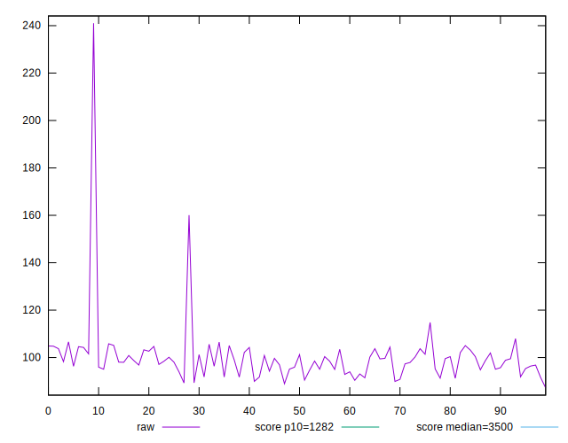
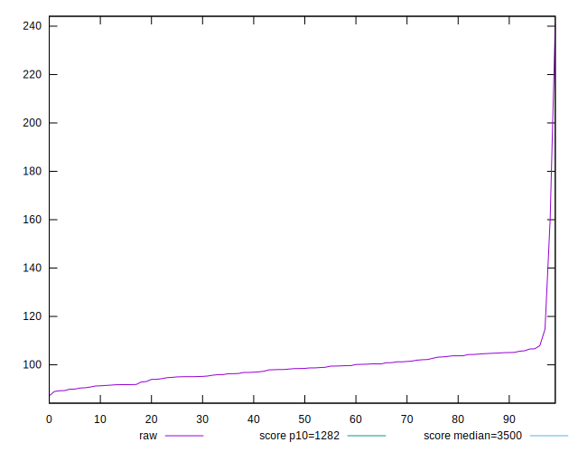

# //bootup-time/samples/pages+cached+noadtech

[→ Parent](../..)


## Raw


```yaml
p90min: 89.344
p90max: 107.98000000000002
p90range: 18.636000000000024
p90mean: 98.38527659574468
median: 98.49600000000001
p90stdev: 4.733531818493067
mad: 3.6839999999999904
stdevBySn: 5.450181999999993
lfitCenter: 99.31451009030869
lfitStdev: 5.276884338567825
mfitCenter: 99.31451009030869
mfitStdev: 6.613593749160687
mfitConfidence: 0.6613593749160687
p90skewness: -0.06010973797497009
p90eccentricity: 0.9999999999999996
p90discretization: 1
outlandishness: 1.0392097037452248

```


## Score


```yaml
p90min: 1
p90max: 1
p90range: 0
p90mean: 1
median: 1
p90stdev: 0
mad: 0
stdevBySn: 0
lfitCenter: 1
lfitStdev: 0
mfitCenter: 1
mfitStdev: 0
mfitConfidence: 0
p90skewness: .nan
p90eccentricity: .nan
p90discretization: 94
outlandishness: 1

```


## Raw Estimate


## Score Estimate


## P Score


```yaml
p90min: 0.9999954709082937
p90max: 0.9999985670866796
p90range: 0.0000030961783858973746
p90mean: 0.9999973207559575
median: 0.9999973906118104
p90stdev: 7.669798811545453e-7
mad: 6.072167516579796e-7
stdevBySn: 8.84178352103271e-7
lfitCenter: 0.9999956827994511
lfitStdev: 0.000004155235870649687
mfitCenter: 0.9999956827994511
mfitStdev: 0.00000520781586580606
mfitConfidence: 5.20781586580606e-7
p90skewness: -0.29765999501862234
p90eccentricity: 1.0000000000000004
p90discretization: 1.0217391304347827
outlandishness: 0.9999928837141888

```


## Score Difference


```yaml
p90min: 0
p90max: 0
p90range: 0
p90mean: 0
median: 0
p90stdev: 0
mad: 0
stdevBySn: 0
lfitCenter: 0
lfitStdev: 0
mfitCenter: 0
mfitStdev: 0
mfitConfidence: 0
p90skewness: .nan
p90eccentricity: .nan
p90discretization: 94
outlandishness: .nan

```


## P Score Difference


```yaml
p90min: -0.000004529091706340083
p90max: -0.000001432913320442708
p90range: 0.0000030961783858973746
p90mean: -0.000002679244042672117
median: -0.0000026093881896338544
p90stdev: 7.669798811545453e-7
mad: 6.072167516579796e-7
stdevBySn: 8.84178352103271e-7
lfitCenter: -0.0000043172005489023194
lfitStdev: 0.000004155235870601587
mfitCenter: -0.0000043172005489023194
mfitStdev: 0.000005207815865745775
mfitConfidence: 5.207815865745775e-7
p90skewness: -0.29765999483383143
p90eccentricity: 0.9999999999999997
p90discretization: 1.0217391304347827
outlandishness: 5.419764061950824

```

