# //bootup-time/samples/pages+cached

[→ Parent](../..)


## Raw


```yaml
p90min: 626.1280000000004
p90max: 991.9320000000002
p90range: 365.80399999999986
p90mean: 683.3588510638298
median: 670.6720000000005
p90stdev: 57.71191073385359
mad: 30.629999999999995
stdevBySn: 44.534069199999884
lfitCenter: 682.8702563454583
lfitStdev: 48.17865385424114
mfitCenter: 682.8702563454583
mfitStdev: 60.38298805311027
mfitConfidence: 6.038298805311027
p90skewness: 2.2640450908363507
p90eccentricity: 0.9999999999999999
p90discretization: 1
outlandishness: 1.0355628719299321

```

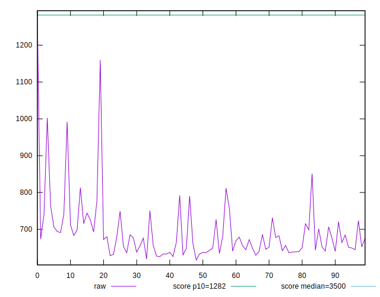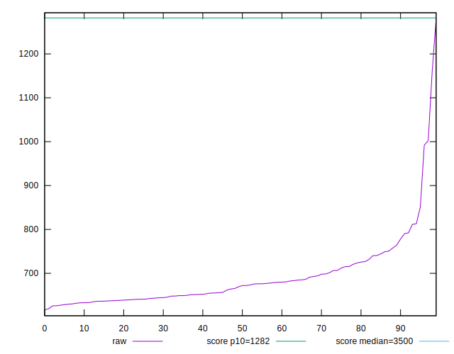
## Score


```yaml
p90min: 0.95
p90max: 0.99
p90range: 0.040000000000000036
p90mean: 0.9806382978723408
median: 0.98
p90stdev: 0.006325986700986604
mad: 0
stdevBySn: 0
lfitCenter: 0.9797886826847617
lfitStdev: 0.0037620328488942784
mfitCenter: 0.9797886826847617
mfitStdev: 0.004715008959308949
mfitConfidence: 0.00047150089593089487
p90skewness: -1.3122826548490447
p90eccentricity: 0.9999999999999994
p90discretization: 18.8
outlandishness: 0.996865120738567

```

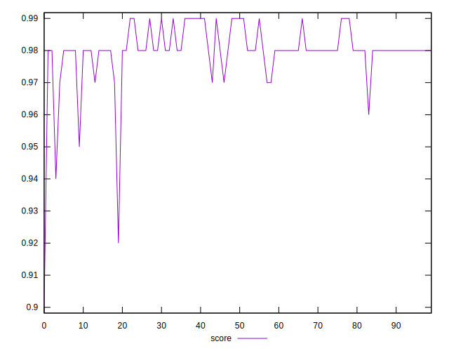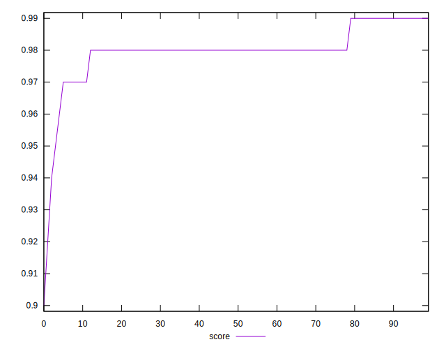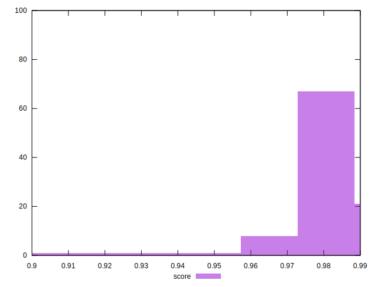
## Raw Estimate

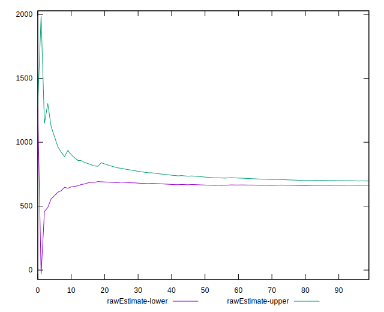
## Score Estimate

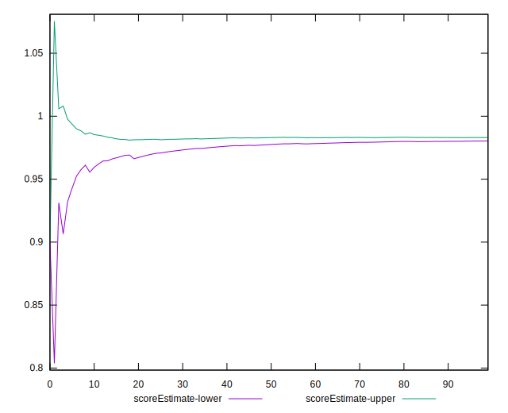
## P Score


```yaml
p90min: 0.946178352872144
p90max: 0.9859529793648053
p90range: 0.03977462649266128
p90mean: 0.9811038465644528
median: 0.9824962256007896
p90stdev: 0.005665031456823679
mad: 0.002444935280679572
stdevBySn: 0.003599630567847357
lfitCenter: 0.9809848965533995
lfitStdev: 0.004805013948840463
mfitCenter: 0.9809848965533995
mfitStdev: 0.006022191918139716
mfitConfidence: 0.0006022191918139716
p90skewness: -3.0961814772708713
p90eccentricity: 0.9999999999999999
p90discretization: 1
outlandishness: 0.9967004589251319

```

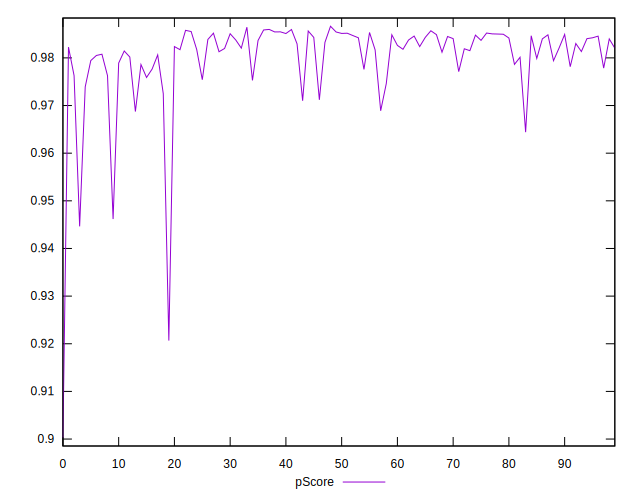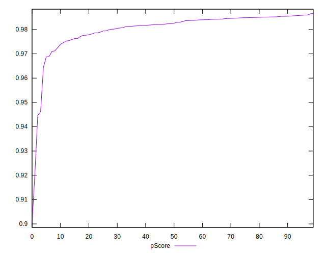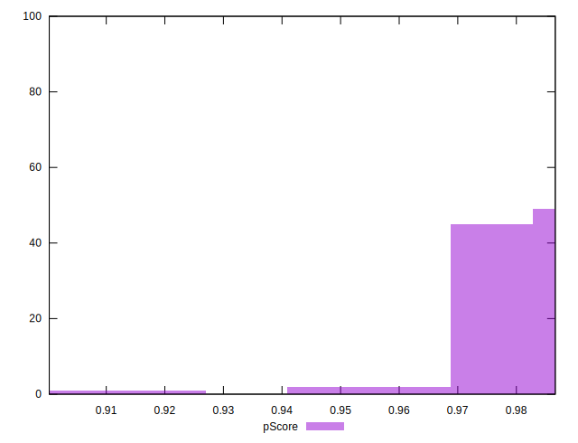
## Score Difference


```yaml
p90min: 0
p90max: 0
p90range: 0
p90mean: 0
median: 0
p90stdev: 0
mad: 0
stdevBySn: 0
lfitCenter: 1.0470608452365924e-18
lfitStdev: 2.5998395675404994e-18
mfitCenter: 1.0470608452365924e-18
mfitStdev: 3.2584156880294808e-18
mfitConfidence: 3.258415688029481e-19
p90skewness: .nan
p90eccentricity: .nan
p90discretization: 94
outlandishness: .inf

```

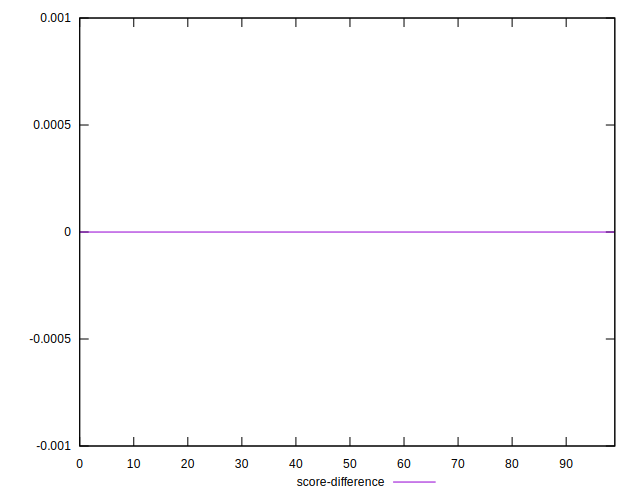
## P Score Difference


```yaml
p90min: -0.0048891338676106955
p90max: 0.004849004083023245
p90range: 0.00973813795063394
p90mean: 0.00040976741928930245
median: 0.0012418249974043283
p90stdev: 0.0033476478764407677
mad: 0.0029493406008171408
stdevBySn: 0.003996126841767193
lfitCenter: 0.0005634531676361688
lfitStdev: 0.0030438767847744126
mfitCenter: 0.0005634531676361688
mfitStdev: 0.00381493381044297
mfitConfidence: 0.00038149338104429703
p90skewness: -0.3035950194307325
p90eccentricity: 1
p90discretization: 1
outlandishness: 0.8777902328530643

```

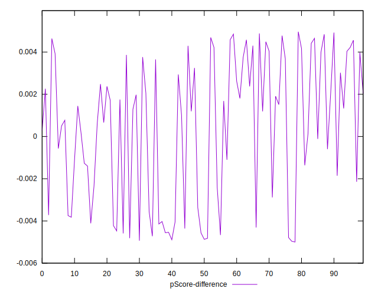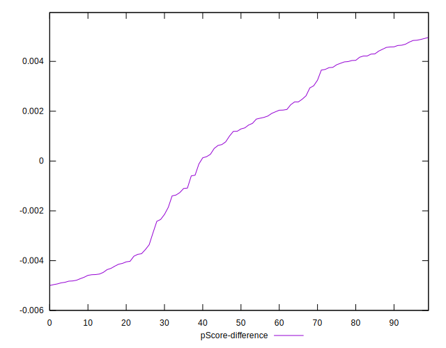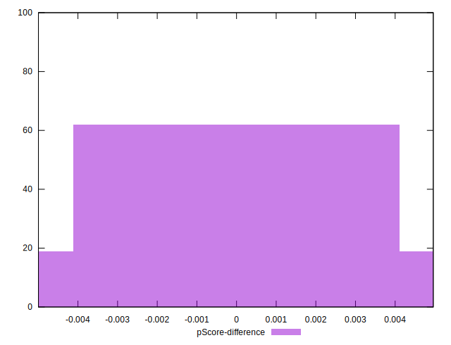