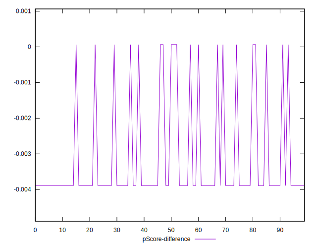

# //cumulative-layout-shift/samples/pages+cached+noadtech+nomedia+nocss

[→ Parent](../..)


## Raw


```yaml
p90min: 0.6958385416666666
p90max: 3.864670138888889
p90range: 3.1688315972222227
p90mean: 1.268925107121747
median: 0.6958385416666666
p90stdev: 1.2196665958582795
mad: 0
stdevBySn: 0
lfitCenter: 1.083089755008959
lfitStdev: 0.8520698079520912
mfitCenter: 1.083089755008959
mfitStdev: 1.0679111373606367
mfitConfidence: 0.10679111373606368
p90skewness: 1.6583699784683552
p90eccentricity: 1.0000000000000016
p90discretization: 47
outlandishness: 1.0979263483863428

```


## Score


```yaml
p90min: 0
p90max: 0.08
p90range: 0.08
p90mean: 0.06553191489361707
median: 0.08
p90stdev: 0.030791578749149864
mad: 0
stdevBySn: 0
lfitCenter: 0.07022349527991946
lfitStdev: 0.021511267653327136
mfitCenter: 0.07022349527991946
mfitStdev: 0.026960375888621203
mfitConfidence: 0.00269603758886212
p90skewness: -1.6583699784683477
p90eccentricity: 1.0000000000000002
p90discretization: 47
outlandishness: 0.9537932197672457

```


## Raw Estimate


## Score Estimate


## P Score


```yaml
p90min: 0.00006417586681428666
p90max: 0.07611248195409825
p90range: 0.07604830608728397
p90mean: 0.062359064895759625
median: 0.07611248195409825
p90stdev: 0.029270592570325736
mad: 0
stdevBySn: 0
lfitCenter: 0.06681889916139248
lfitStdev: 0.020448693335321403
mfitCenter: 0.06681889916139248
mfitStdev: 0.025628636472576186
mfitConfidence: 0.0025628636472576185
p90skewness: -1.6583699784683357
p90eccentricity: 0.999999999999998
p90discretization: 47
outlandishness: 0.9538402109514164

```


## Score Difference


```yaml
p90min: 0
p90max: 0
p90range: 0
p90mean: 0
median: 0
p90stdev: 0
mad: 0
stdevBySn: 0
lfitCenter: 0
lfitStdev: 0
mfitCenter: 0
mfitStdev: 0
mfitConfidence: 0
p90skewness: .nan
p90eccentricity: .nan
p90discretization: 94
outlandishness: .nan

```


## P Score Difference


```yaml
p90min: -0.003887518045901747
p90max: 0.00006417586681428666
p90range: 0.003951693912716034
p90mean: -0.0031728499978573646
median: -0.003887518045901747
p90stdev: 0.0015209861788241488
mad: 0
stdevBySn: 0
lfitCenter: -0.0034045961185269757
lfitStdev: 0.001062574318005725
mfitCenter: -0.0034045961185269757
mfitStdev: 0.001331739416045004
mfitConfidence: 0.0001331739416045004
p90skewness: 1.6583699784683583
p90eccentricity: 1
p90discretization: 47
outlandishness: 0.9528698918858508

```

