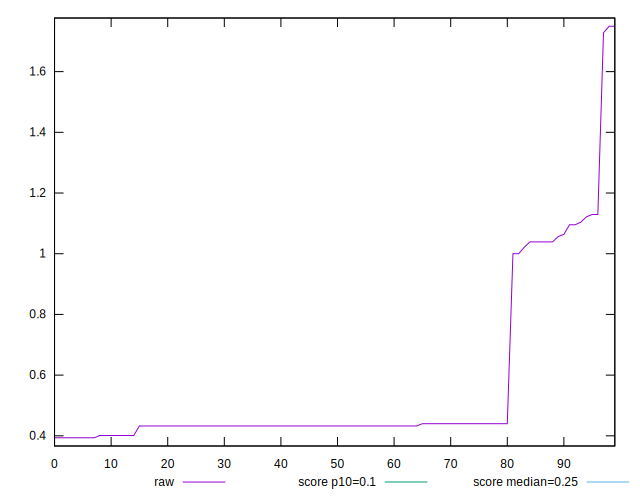
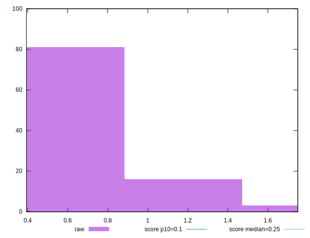
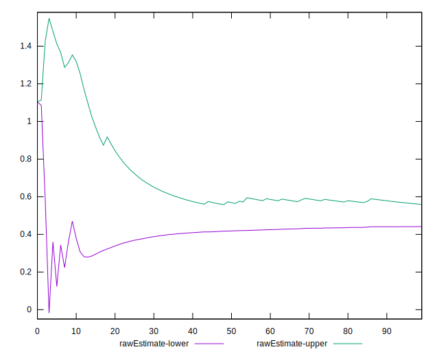
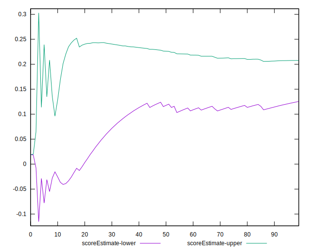
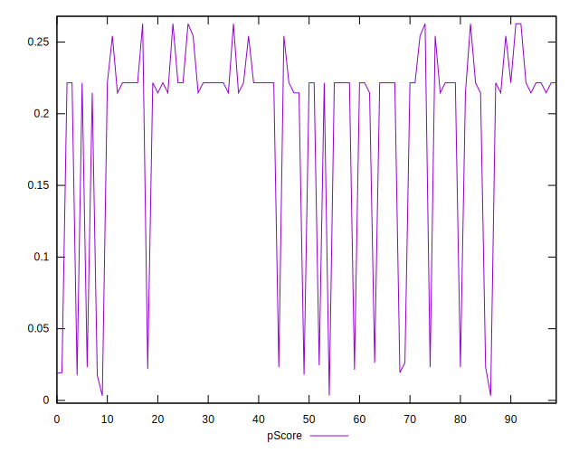
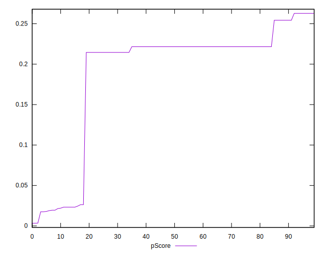
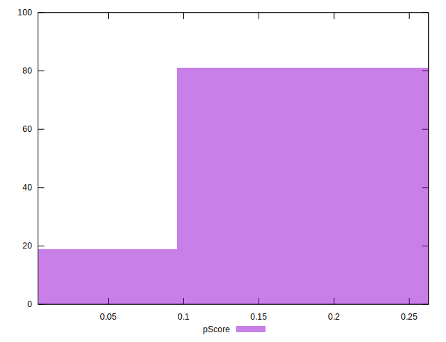
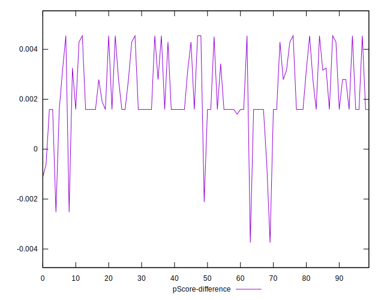

# //cumulative-layout-shift/samples/pages+cached+noadtech

[→ Parent](../..)


## Raw


```yaml
p90min: 0.39359130859374997
p90max: 1.1292220058441163
p90range: 0.7356306972503663
p90mean: 0.5367675823658071
median: 0.43256591796875
p90stdev: 0.23940708412700637
mad: 0.0037316389083862367
stdevBySn: 0.006675528843212139
lfitCenter: 0.5120716595239301
lfitStdev: 0.18102294307483097
mfitCenter: 0.5120716595239301
mfitStdev: 0.22687861396243958
mfitConfidence: 0.022687861396243958
p90skewness: 1.7654879075602907
p90eccentricity: 0.9999999999999984
p90discretization: 7.230769230769231
outlandishness: 1.1222875671837749

```


## Score


```yaml
p90min: 0.02
p90max: 0.26
p90range: 0.24000000000000002
p90mean: 0.18882978723404267
median: 0.22
p90stdev: 0.07696167024687531
mad: 0.0050000000000000044
stdevBySn: 0.008944500000000008
lfitCenter: 0.19837539243670677
lfitStdev: 0.051454497439714426
mfitCenter: 0.19837539243670677
mfitStdev: 0.06448864913454952
mfitConfidence: 0.006448864913454952
p90skewness: -1.640936966900597
p90eccentricity: 1.0000000000000007
p90discretization: 15.666666666666666
outlandishness: 0.9629635111763536

```


## Raw Estimate


## Score Estimate


## P Score


```yaml
p90min: 0.017477123090291147
p90max: 0.26278877104710546
p90range: 0.24531164795681432
p90mean: 0.19098777120238303
median: 0.22159060454387491
p90stdev: 0.07776001250156629
mad: 0.003523964346927977
stdevBySn: 0.0063040198202194584
lfitCenter: 0.200517984746206
lfitStdev: 0.05182146653876494
mfitCenter: 0.200517984746206
mfitStdev: 0.06494857669481026
mfitConfidence: 0.006494857669481026
p90skewness: -1.6396513914598276
p90eccentricity: 1.000000000000001
p90discretization: 7.230769230769231
outlandishness: 0.9639278192329382

```


## Score Difference


```yaml
p90min: 0
p90max: 0
p90range: 0
p90mean: 0
median: 0
p90stdev: 0
mad: 0
stdevBySn: 0
lfitCenter: 0
lfitStdev: 0
mfitCenter: 0
mfitStdev: 0
mfitConfidence: 0
p90skewness: .nan
p90eccentricity: .nan
p90discretization: 94
outlandishness: .nan

```


## P Score Difference


```yaml
p90min: -0.0025228769097088537
p90max: 0.004542675850018968
p90range: 0.007065552759727822
p90mean: 0.0023141395525779953
median: 0.0015906045438749128
p90stdev: 0.00147417349218574
mad: 0.00009478287974099518
stdevBySn: 0.0001695570935686663
lfitCenter: 0.0021446766368759503
lfitStdev: 0.0012834863962386221
mfitCenter: 0.0021446766368759503
mfitStdev: 0.0016086116470766425
mfitConfidence: 0.00016086116470766425
p90skewness: -0.3154843913486744
p90eccentricity: 1.000000000000001
p90discretization: 6.714285714285714
outlandishness: 0.9132285876919665

```

