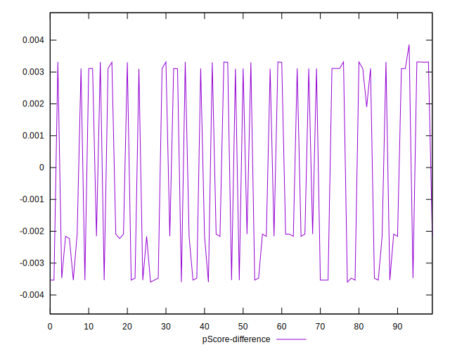

# //cumulative-layout-shift/samples/pages

[→ Parent](../..)


## Raw


```yaml
p90min: 1.121230978012085
p90max: 1.7690829467773437
p90range: 0.6478519687652586
p90mean: 1.399245226799174
median: 1.1487898769378664
p90stdev: 0.30523499519327063
mad: 0.02755889892578134
stdevBySn: 0.03286674285888683
lfitCenter: 1.3749231564825108
lfitStdev: 0.36208681845712004
mfitCenter: 1.3749231564825108
mfitStdev: 0.453808528964541
mfitConfidence: 0.0453808528964541
p90skewness: 0.302097417801521
p90eccentricity: 1.0000000000000002
p90discretization: 5.529411764705882
outlandishness: 1.0069546120502546

```


## Score


```yaml
p90min: 0
p90max: 0.02
p90range: 0.02
p90mean: 0.011489361702127665
median: 0.02
p90stdev: 0.009888468117976378
mad: 0
stdevBySn: 0
lfitCenter: 0.012339754785667833
lfitStdev: 0.011847020519227057
mfitCenter: 0.012339754785667833
mfitStdev: 0.014848038316754816
mfitConfidence: 0.0014848038316754816
p90skewness: -0.3012320380383567
p90eccentricity: 1.0000000000000027
p90discretization: 47
outlandishness: 0.9845049382716049

```


## Raw Estimate


## Score Estimate


## P Score


```yaml
p90min: 0.0031022719549900213
p90max: 0.01791041875881938
p90range: 0.014808146803829358
p90mean: 0.011189642038334337
median: 0.0164657762960162
p90stdev: 0.00687563391841936
mad: 0.0014446424628031806
stdevBySn: 0.0017228806011390734
lfitCenter: 0.011658692855187
lfitStdev: 0.008081000660925366
mfitCenter: 0.011658692855187
mfitStdev: 0.01012803238218492
mfitConfidence: 0.0010128032382184919
p90skewness: -0.28421473099486505
p90eccentricity: 0.9999999999999994
p90discretization: 7.230769230769231
outlandishness: 0.9905508673921621

```


## Score Difference


```yaml
p90min: 0
p90max: 0
p90range: 0
p90mean: 0
median: 0
p90stdev: 0
mad: 0
stdevBySn: 0
lfitCenter: 0
lfitStdev: 0
mfitCenter: 0
mfitStdev: 0
mfitConfidence: 0
p90skewness: .nan
p90eccentricity: .nan
p90discretization: 94
outlandishness: .nan

```


## P Score Difference


```yaml
p90min: -0.0035967520083595543
p90max: 0.0033156671300033635
p90range: 0.006912419138362918
p90mean: -0.00027700583398066755
median: -0.0020895812411806207
p90stdev: 0.0030120289502623973
mad: 0.0014446424628031806
stdevBySn: 0.0017228806011390734
lfitCenter: -0.0004130336113073601
lfitStdev: 0.0034038279921457556
mfitCenter: -0.0004130336113073601
mfitStdev: 0.004266065747839206
mfitConfidence: 0.0004266065747839206
p90skewness: 0.21704725728891433
p90eccentricity: 1.0000000000000002
p90discretization: 7.230769230769231
outlandishness: 0.9038318594569043

```

