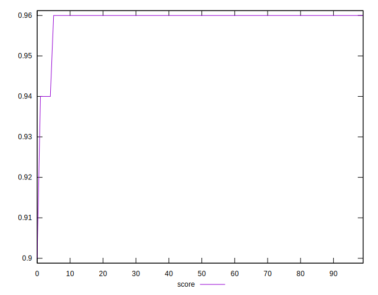
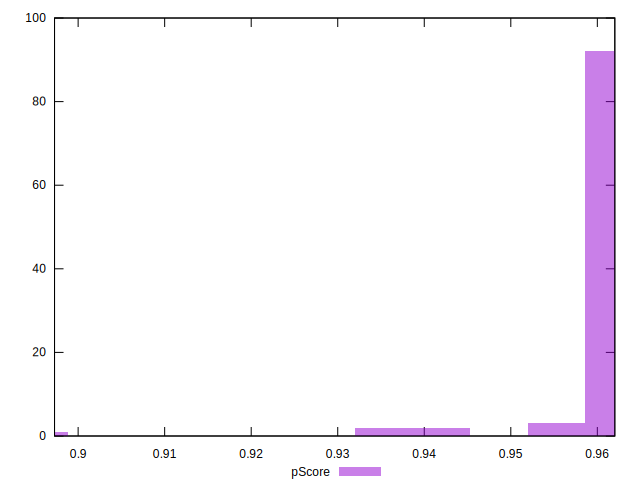
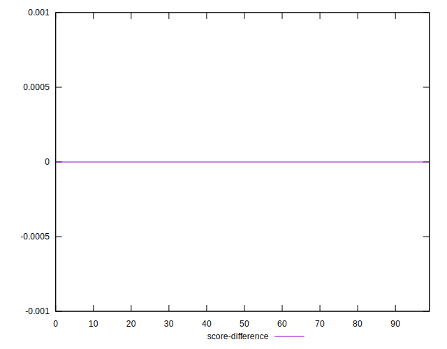

# //first-contentful-paint/samples/pages+cached+noadtech

[→ Parent](../..)


## Raw


```yaml
p90min: 1902.4739999999997
p90max: 2064.5838999999996
p90range: 162.10989999999993
p90mean: 1916.9673249999998
median: 1911.696
p90stdev: 22.82048876210398
mad: 5.10554999999988
stdevBySn: 7.453004624999849
lfitCenter: 1918.4746755249387
lfitStdev: 15.439645131918939
mfitCenter: 1918.4746755249387
mfitStdev: 19.35072553843997
mfitConfidence: 1.935072553843997
p90skewness: 5.579135208291796
p90eccentricity: 0.9999999999999997
p90discretization: 1
outlandishness: 1.007845211406352

```


## Score


```yaml
p90min: 0.94
p90max: 0.96
p90range: 0.020000000000000018
p90mean: 0.959574468085105
median: 0.96
p90stdev: 0.002886097865159691
mad: 0
stdevBySn: 0
lfitCenter: 0.9593228587316756
lfitStdev: 0.0016556719546131156
mfitCenter: 0.9593228587316756
mfitStdev: 0.002075077069561436
mfitConfidence: 0.00020750770695614359
p90skewness: -6.6348880269691755
p90eccentricity: 0.999999999999994
p90discretization: 47
outlandishness: 0.9979699891544285

```


## Raw Estimate


## Score Estimate


## P Score


```yaml
p90min: 0.9424690547496314
p90max: 0.961693604420532
p90range: 0.019224549670900593
p90mean: 0.960118701726019
median: 0.9607252384259701
p90stdev: 0.002695966104898107
mad: 0.0005387552889047909
stdevBySn: 0.000788045290795857
lfitCenter: 0.9598742536561399
lfitStdev: 0.0018995273915334654
mfitCenter: 0.9598742536561399
mfitStdev: 0.0023807045364224936
mfitConfidence: 0.00023807045364224936
p90skewness: -5.764927611445453
p90eccentricity: 1.0000000000000002
p90discretization: 1
outlandishness: 0.9978684090828959

```


## Score Difference


```yaml
p90min: 0
p90max: 1.1102230246251565e-16
p90range: 1.1102230246251565e-16
p90mean: 1.1810883240693154e-18
median: 0
p90stdev: 1.139000331521095e-17
mad: 0
stdevBySn: 0
lfitCenter: 2.1510305028010703e-18
lfitStdev: 5.2873683940481196e-18
mfitCenter: 2.1510305028010703e-18
mfitStdev: 6.626733564123762e-18
mfitConfidence: 6.626733564123762e-19
p90skewness: 9.539955591519906
p90eccentricity: 0.9999999999999999
p90discretization: 47
outlandishness: 14.137600000000003

```


## P Score Difference


```yaml
p90min: -0.001974253748550314
p90max: 0.0018339994449412256
p90range: 0.00380825319349154
p90mean: 0.0005292256184180055
median: 0.0007601870032336033
p90stdev: 0.000813808398470978
mad: 0.0005218137337655859
stdevBySn: 0.000788045290795857
lfitCenter: 0.0005765999993748379
lfitStdev: 0.0007050122965716135
mfitCenter: 0.0005765999993748379
mfitStdev: 0.0008836018791635892
mfitConfidence: 0.00008836018791635892
p90skewness: -0.8720452777187585
p90eccentricity: 1.0000000000000004
p90discretization: 1
outlandishness: 0.8743653897119732

```

