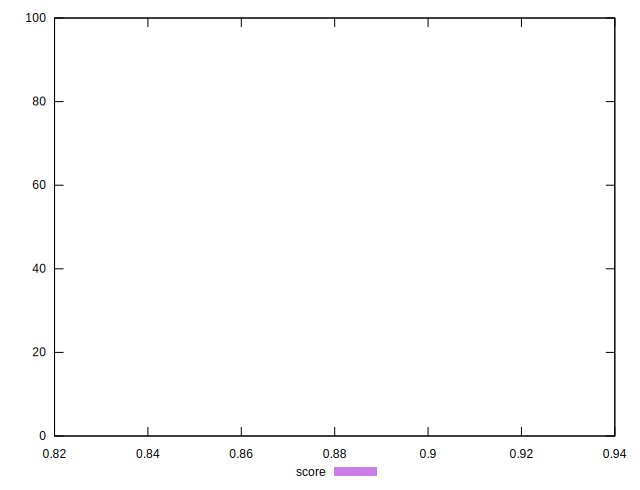
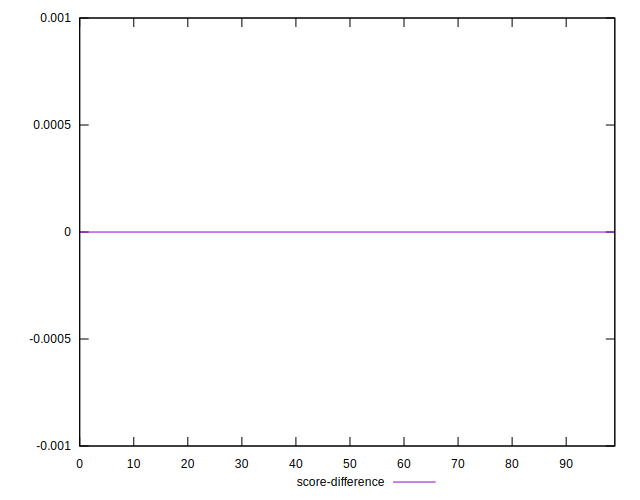
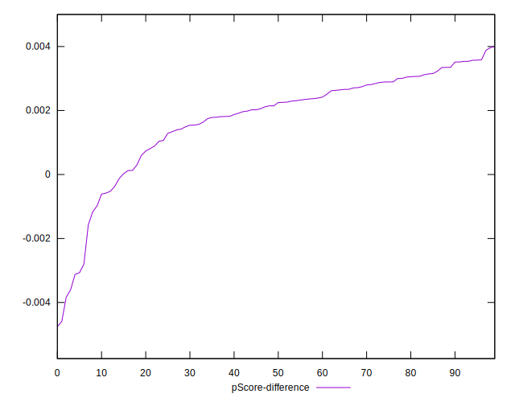

# //first-contentful-paint/samples/pages+cached

[→ Parent](../..)


## Raw


```yaml
p90min: 2056.13
p90max: 2115.9205
p90range: 59.790500000000065
p90mean: 2070.342460106383
median: 2067.002
p90stdev: 12.666749792740534
mad: 6.225299999999834
stdevBySn: 9.16334210000025
lfitCenter: 2072.5017779558925
lfitStdev: 14.899676561993704
mfitCenter: 2072.5017779558925
mfitStdev: 18.673975295365665
mfitConfidence: 1.8673975295365666
p90skewness: 1.6185553240983899
p90eccentricity: 1
p90discretization: 1
outlandishness: 1.0071657793162165

```


## Score


```yaml
p90min: 0.94
p90max: 0.94
p90range: 0
p90mean: 0.9399999999999988
median: 0.94
p90stdev: 1.1102230246251565e-15
mad: 0
stdevBySn: 0
lfitCenter: 0.9393937929945708
lfitStdev: 0.0015052047509988115
mfitCenter: 0.9393937929945708
mfitStdev: 0.0018864943958795386
mfitConfidence: 0.00018864943958795386
p90skewness: 1
p90eccentricity: 1
p90discretization: 94
outlandishness: 0.9972359551833405

```


## Raw Estimate


## Score Estimate


## P Score


```yaml
p90min: 0.9354071650267592
p90max: 0.9435872351870305
p90range: 0.008180070160271224
p90mean: 0.9416859097558744
median: 0.9421468838086503
p90stdev: 0.0017209299359131998
mad: 0.0008308010124858378
stdevBySn: 0.0012239839814671399
lfitCenter: 0.9412433993006981
lfitStdev: 0.0023297192968601606
mfitCenter: 0.9412433993006981
mfitStdev: 0.0029198701336696636
mfitConfidence: 0.00029198701336696634
p90skewness: -1.6660451183950624
p90eccentricity: 1.0000000000000002
p90discretization: 1
outlandishness: 0.997171848842642

```


## Score Difference


```yaml
p90min: 1.1102230246251565e-16
p90max: 1.1102230246251565e-16
p90range: 0
p90mean: 1.1102230246251565e-16
median: 1.1102230246251565e-16
p90stdev: 0
mad: 0
stdevBySn: 0
lfitCenter: 1.1050564892561304e-16
lfitStdev: 1.2890316797319411e-18
mfitCenter: 1.1050564892561304e-16
mfitStdev: 1.6155616292812348e-18
mfitConfidence: 1.6155616292812347e-19
p90skewness: .nan
p90eccentricity: .nan
p90discretization: 94
outlandishness: 0.9801

```


## P Score Difference


```yaml
p90min: -0.0035997876994230404
p90max: 0.003587235187030524
p90range: 0.007187022886453565
p90mean: 0.001773116780877683
median: 0.002198968156063963
p90stdev: 0.0015721451525510777
mad: 0.0008024142102381893
stdevBySn: 0.0012140026478286874
lfitCenter: 0.001873153548073819
lfitStdev: 0.0011763025055387573
mfitCenter: 0.001873153548073819
mfitStdev: 0.0014742765614348488
mfitConfidence: 0.00014742765614348486
p90skewness: -1.5127738482914763
p90eccentricity: 1
p90discretization: 1
outlandishness: 0.8694726050252037

```

