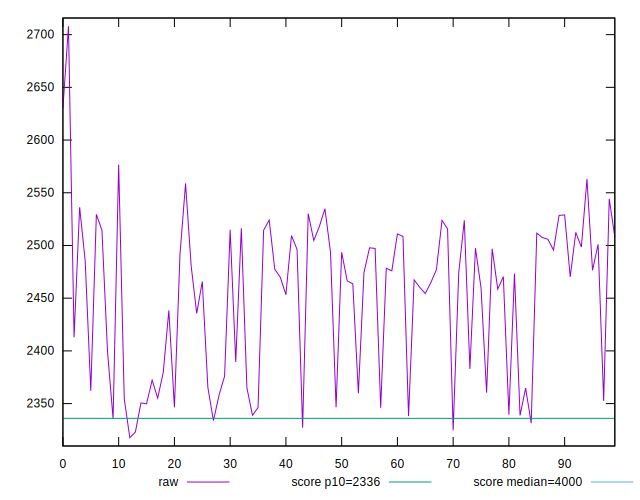
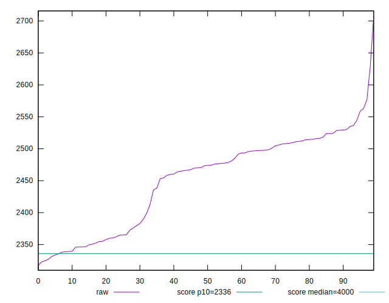
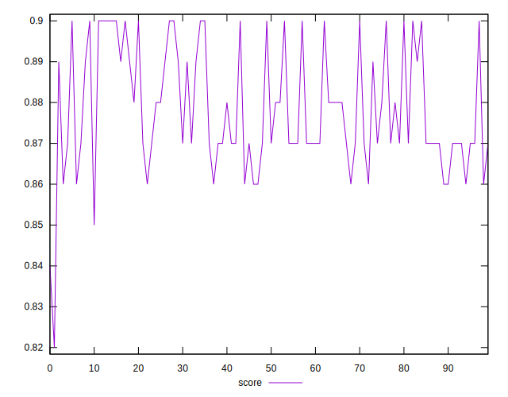
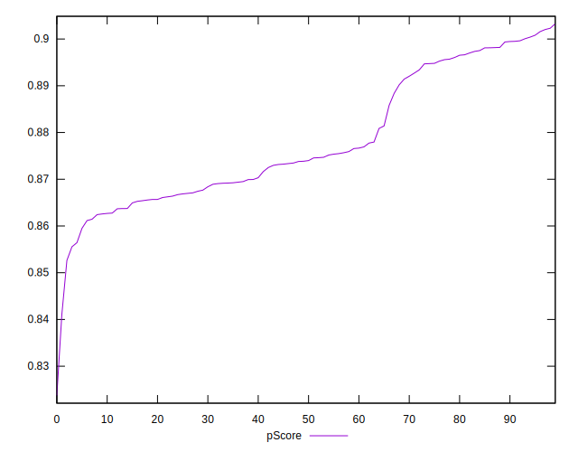
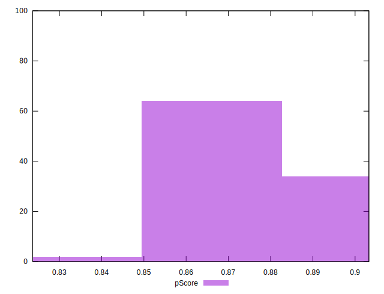
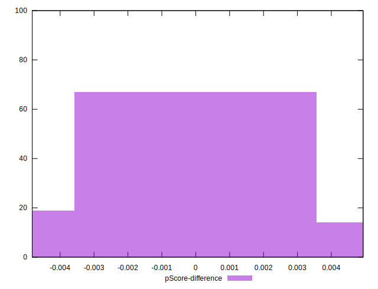

# //first-meaningful-paint/samples/pages

[→ Parent](../..)


## Raw


```yaml
p90min: 2327.1110000000003
p90max: 2563.0814999999993
p90range: 235.970499999999
p90mean: 2450.102731382978
median: 2473.6515
p90stdev: 69.90612464795119
mad: 43.54122499999994
stdevBySn: 69.03842139999975
lfitCenter: 2456.4403977004795
lfitStdev: 64.25333049016886
mfitCenter: 2456.4403977004795
mfitStdev: 80.52960755396603
mfitConfidence: 8.052960755396603
p90skewness: -0.4692498673558909
p90eccentricity: 1
p90discretization: 1
outlandishness: 1.0014665910525917

```


## Score


```yaml
p90min: 0.86
p90max: 0.9
p90range: 0.040000000000000036
p90mean: 0.8787234042553196
median: 0.87
p90stdev: 0.013932515356378655
mad: 0.010000000000000009
stdevBySn: 0.011926000000000011
lfitCenter: 0.877222917360798
lfitStdev: 0.013441266146717696
mfitCenter: 0.877222917360798
mfitStdev: 0.016846128902052816
mfitConfidence: 0.0016846128902052817
p90skewness: 0.417257941921453
p90eccentricity: 0.9999999999999988
p90discretization: 18.8
outlandishness: 0.9985816171109639

```


## Raw Estimate


## Score Estimate


## P Score


```yaml
p90min: 0.8555429640950813
p90max: 0.9015849002670775
p90range: 0.046041936171996145
p90mean: 0.8782283195323518
median: 0.8739219961649748
p90stdev: 0.01353760177214197
mad: 0.00881563573948635
stdevBySn: 0.01389959697753622
lfitCenter: 0.8770345908149584
lfitStdev: 0.012425844939207523
mfitCenter: 0.8770345908149584
mfitStdev: 0.015573487146069756
mfitConfidence: 0.0015573487146069757
p90skewness: 0.42939246329565023
p90eccentricity: 1.0000000000000002
p90discretization: 1
outlandishness: 0.9989897211786174

```


## Score Difference


```yaml
p90min: 0
p90max: 0
p90range: 0
p90mean: 0
median: 0
p90stdev: 0
mad: 0
stdevBySn: 0
lfitCenter: 5.166535369026208e-19
lfitStdev: 1.2890316797319448e-18
mfitCenter: 5.166535369026208e-19
mfitStdev: 1.6155616292812394e-18
mfitConfidence: 1.6155616292812395e-19
p90skewness: .nan
p90eccentricity: .nan
p90discretization: 94
outlandishness: .inf

```


## P Score Difference


```yaml
p90min: -0.004635656299952662
p90max: 0.00469562229953846
p90range: 0.009331278599491122
p90mean: -0.0003376087423459482
median: -0.0005177081106439996
p90stdev: 0.0029018901970239543
mad: 0.002886199209439777
stdevBySn: 0.0035036348882130424
lfitCenter: -0.0003748223381869634
lfitStdev: 0.002623421592456514
mfitCenter: -0.0003748223381869634
mfitStdev: 0.0032879713732729882
mfitConfidence: 0.0003287971373272988
p90skewness: 0.11625922592043068
p90eccentricity: 0.9999999999999994
p90discretization: 1
outlandishness: 0.8728747525952157

```

