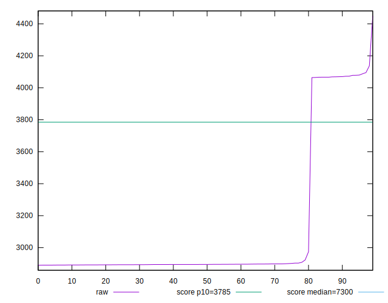
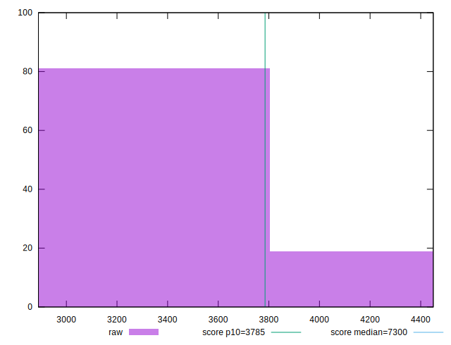
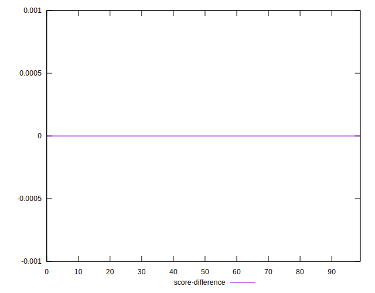
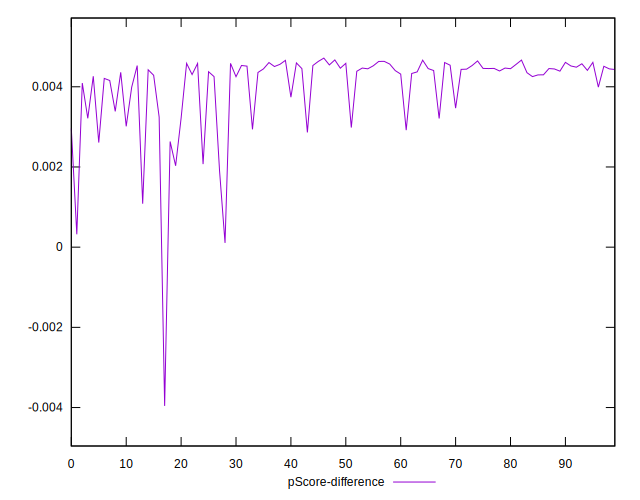

# //interactive/samples/pages+cached+noadtech+nomedia+nocss

[→ Parent](../..)


## Raw


```yaml
p90min: 2890.5406000000003
p90max: 4087.5065000000004
p90range: 1196.9659000000001
p90mean: 3096.203595744681
median: 2894.9312250000003
p90stdev: 441.57782498949757
mad: 2.7152750000000196
stdevBySn: 3.9555113274997225
lfitCenter: 3032.4724824766863
lfitStdev: 302.908942345244
mfitCenter: 3032.4724824766863
mfitStdev: 379.64006014259
mfitConfidence: 37.964006014259
p90skewness: 1.7535636873080163
p90eccentricity: 1
p90discretization: 1
outlandishness: 1.0180078095621945

```


## Score


```yaml
p90min: 0.87
p90max: 0.96
p90range: 0.08999999999999997
p90mean: 0.9446808510638284
median: 0.96
p90stdev: 0.03382376501997898
mad: 0
stdevBySn: 0
lfitCenter: 0.9495251416513316
lfitStdev: 0.02325494935576629
mfitCenter: 0.9495251416513316
mfitStdev: 0.029145756819465574
mfitConfidence: 0.0029145756819465574
p90skewness: -1.755029402924127
p90eccentricity: 1.000000000000003
p90discretization: 47
outlandishness: 0.9953882123255009

```


## Raw Estimate


## Score Estimate


## P Score


```yaml
p90min: 0.8710841964983169
p90max: 0.9646639716538379
p90range: 0.09357977515552096
p90mean: 0.9487657581631845
median: 0.9644327218098405
p90stdev: 0.034437070614620494
mad: 0.0001432899136186161
stdevBySn: 0.00020855242039560378
lfitCenter: 0.9536760561139846
lfitStdev: 0.023748089778182647
mfitCenter: 0.9536760561139846
mfitStdev: 0.02976381668318365
mfitConfidence: 0.0029763816683183652
p90skewness: -1.7544741072425374
p90eccentricity: 0.9999999999999996
p90discretization: 1
outlandishness: 0.9951738065420835

```


## Score Difference


```yaml
p90min: 0
p90max: 0
p90range: 0
p90mean: 0
median: 0
p90stdev: 0
mad: 0
stdevBySn: 0
lfitCenter: 5.166535369026208e-19
lfitStdev: 1.2890316797319448e-18
mfitCenter: 5.166535369026208e-19
mfitStdev: 1.6155616292812394e-18
mfitConfidence: 1.6155616292812395e-19
p90skewness: .nan
p90eccentricity: .nan
p90discretization: 94
outlandishness: .inf

```


## P Score Difference


```yaml
p90min: 0.001084196498316925
p90max: 0.004663971653837917
p90range: 0.0035797751555209922
p90mean: 0.004115249782691997
median: 0.004432721809840501
p90stdev: 0.0007239371964835414
mad: 0.0001432899136186161
stdevBySn: 0.00020855242039560378
lfitCenter: 0.004161561387321436
lfitStdev: 0.0005925306413230048
mfitCenter: 0.004161561387321436
mfitStdev: 0.0007426270303100047
mfitConfidence: 0.00007426270303100047
p90skewness: -2.0222652575814744
p90eccentricity: 0.9999999999999997
p90discretization: 1
outlandishness: 0.9323084603446973

```

