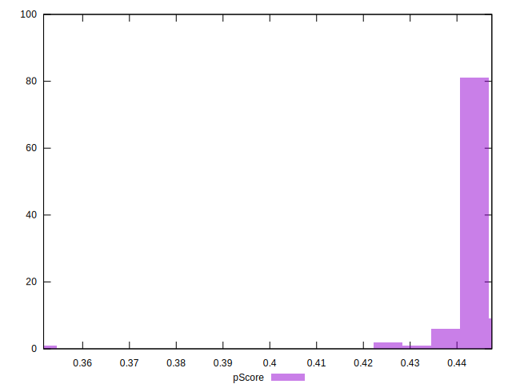
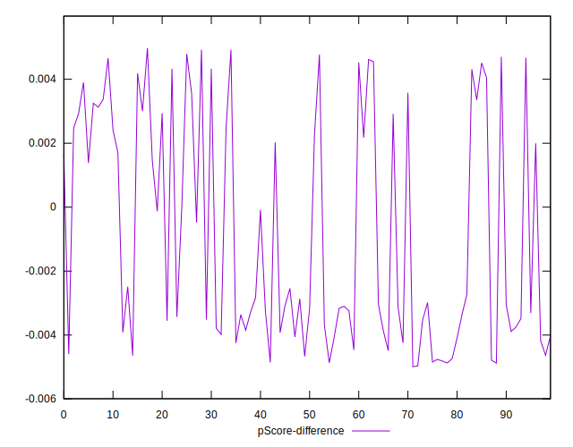
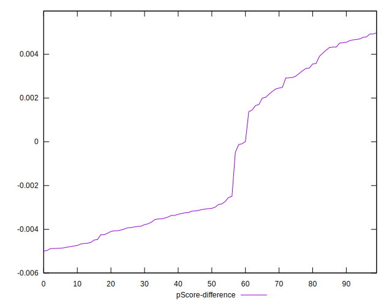

# //largest-contentful-paint/samples/pages+cached+noadtech+nomedia+nocss

[→ Parent](../..)


## Raw


```yaml
p90min: 4199.799299999999
p90max: 4257.521999999999
p90range: 57.72270000000026
p90mean: 4210.145563297873
median: 4207.5892
p90stdev: 9.824046912670333
mad: 5.2308499999999185
stdevBySn: 7.387754497499788
lfitCenter: 4211.565853237037
lfitStdev: 10.79376073457029
mfitCenter: 4211.565853237037
mfitStdev: 13.527972937050304
mfitConfidence: 1.3527972937050303
p90skewness: 2.118052839218875
p90eccentricity: 0.9999999999999994
p90discretization: 1
outlandishness: 1.002429663087061

```


## Score


```yaml
p90min: 0.43
p90max: 0.45
p90range: 0.020000000000000018
p90mean: 0.44542553191489376
median: 0.45
p90stdev: 0.005191009744151429
mad: 0
stdevBySn: 0
lfitCenter: 0.44519283225050393
lfitStdev: 0.007055989690824751
mfitCenter: 0.44519283225050393
mfitStdev: 0.008843371641161663
mfitConfidence: 0.0008843371641161663
p90skewness: -0.39858131119935397
p90eccentricity: 0.9999999999999999
p90discretization: 31.333333333333332
outlandishness: 0.9940571004147012

```


## Raw Estimate


## Score Estimate


## P Score


```yaml
p90min: 0.43245558043414856
p90max: 0.44713419246288194
p90range: 0.014678612028733384
p90mean: 0.44448651418072166
median: 0.445136808427253
p90stdev: 0.0025050010769744405
mad: 0.0013406671509607615
stdevBySn: 0.001892076484406318
lfitCenter: 0.4441557277124564
lfitStdev: 0.0026927621258045894
mfitCenter: 0.4441557277124564
mfitStdev: 0.003374876844094576
mfitConfidence: 0.00033748768440945763
p90skewness: -2.1006187885290073
p90eccentricity: 1.0000000000000002
p90discretization: 1
outlandishness: 0.9944524600196568

```


## Score Difference


```yaml
p90min: 0
p90max: 0
p90range: 0
p90mean: 0
median: 0
p90stdev: 0
mad: 0
stdevBySn: 0
lfitCenter: 2.583267684513104e-19
lfitStdev: 6.445158398659724e-19
mfitCenter: 2.583267684513104e-19
mfitStdev: 8.077808146406197e-19
mfitConfidence: 8.077808146406197e-20
p90skewness: .nan
p90eccentricity: .nan
p90discretization: 94
outlandishness: .inf

```


## P Score Difference


```yaml
p90min: -0.004874151794136972
p90max: 0.004794477030949318
p90range: 0.00966862882508629
p90mean: -0.0009020923747004472
median: -0.003046218109422155
p90stdev: 0.003537622372214962
mad: 0.0017828753506181905
stdevBySn: 0.002244009824655378
lfitCenter: -0.001204319367929404
lfitStdev: 0.003677073569327981
mfitCenter: -0.001204319367929404
mfitStdev: 0.004608528293025223
mfitConfidence: 0.00046085282930252225
p90skewness: 0.4283942841475432
p90eccentricity: 0.9999999999999994
p90discretization: 1
outlandishness: 0.8838855280094482

```

