# //largest-contentful-paint/samples/pages+cached+noadtech

[→ Parent](../..)


## Raw


```yaml
p90min: 7711.224500000002
p90max: 7914.270050000003
p90range: 203.04555000000073
p90mean: 7798.445462079129
median: 7788.94155
p90stdev: 52.720257946813184
mad: 35.352000000001226
stdevBySn: 62.709805687164575
lfitCenter: 7799.341677139563
lfitStdev: 49.97664860454106
mfitCenter: 7799.341677139563
mfitStdev: 62.63644029474773
mfitConfidence: 6.263644029474773
p90skewness: 0.5261914415875043
p90eccentricity: 0.9999999999999999
p90discretization: 1
outlandishness: 1.0019539683854515

```

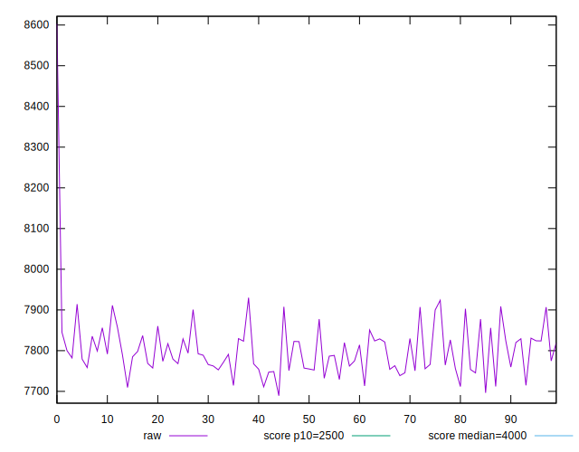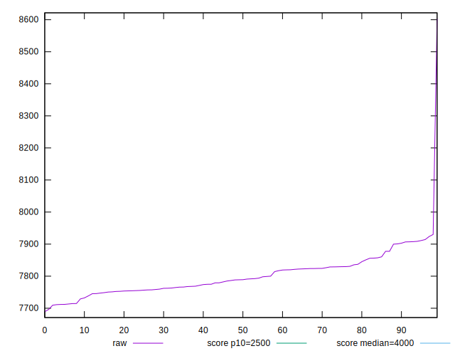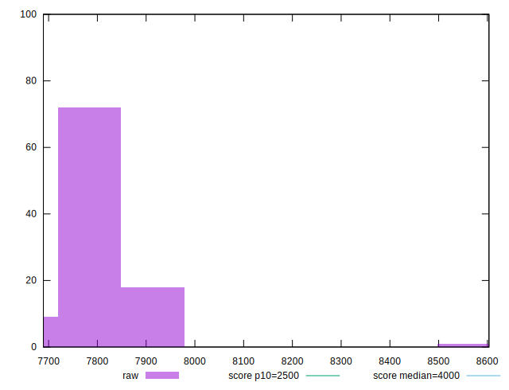
## Score


```yaml
p90min: 0.03
p90max: 0.04
p90range: 0.010000000000000002
p90mean: 0.03404255319148934
median: 0.03
p90stdev: 0.004907473444540768
mad: 0
stdevBySn: 0
lfitCenter: 0.033485093987146865
lfitStdev: 0.0057673098791516456
mfitCenter: 0.033485093987146865
mfitStdev: 0.00722825101309348
mfitConfidence: 0.000722825101309348
p90skewness: 0.390199486285878
p90eccentricity: 0.9999999999999988
p90discretization: 47
outlandishness: 0.9975015624999997

```

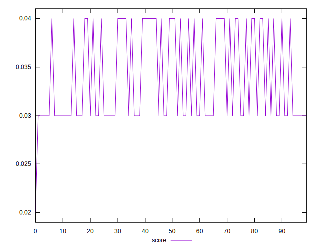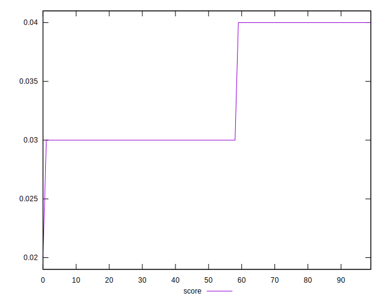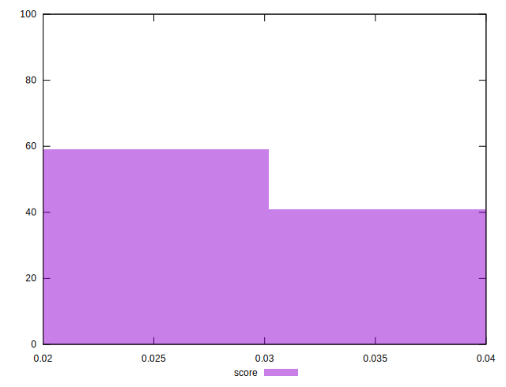
## Raw Estimate

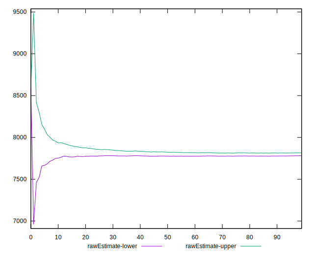
## Score Estimate

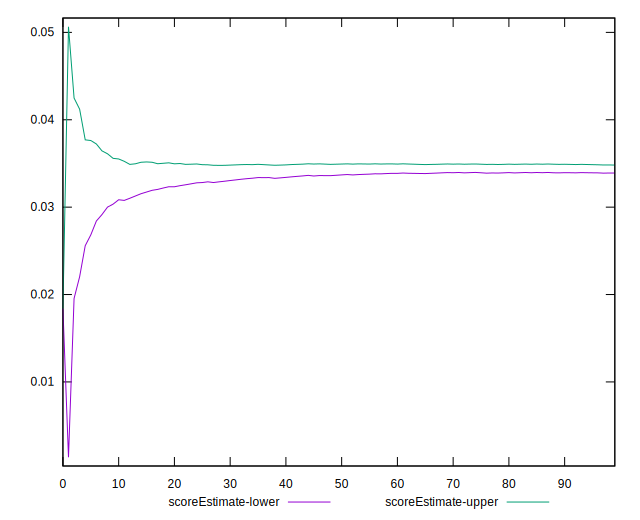
## P Score


```yaml
p90min: 0.03139914293625279
p90max: 0.03674714239178373
p90range: 0.0053479994555309385
p90mean: 0.034375837443369764
median: 0.03460150191186462
p90stdev: 0.001388932192321367
mad: 0.0009508713640140332
stdevBySn: 0.0016751077327171158
lfitCenter: 0.034370373413052706
lfitStdev: 0.001284227803444007
mfitCenter: 0.034370373413052706
mfitStdev: 0.0016095408632095939
mfitConfidence: 0.00016095408632095938
p90skewness: -0.4478165274373999
p90eccentricity: 1.0000000000000002
p90discretization: 1
outlandishness: 0.9916770506976621

```

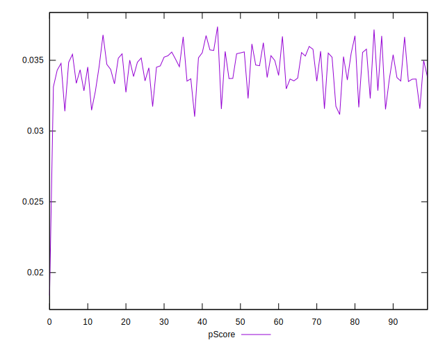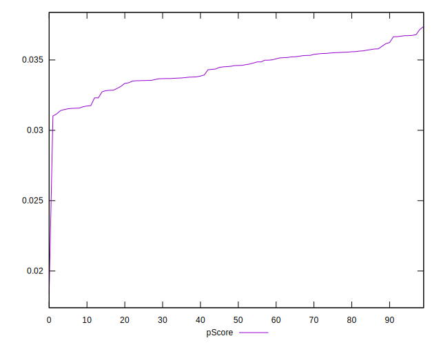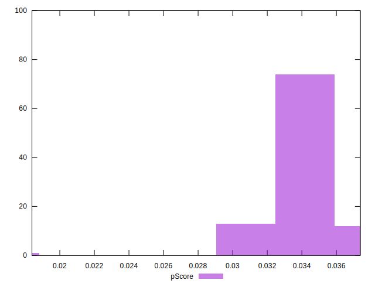
## Score Difference


```yaml
p90min: 0
p90max: 0
p90range: 0
p90mean: 0
median: 0
p90stdev: 0
mad: 0
stdevBySn: 0
lfitCenter: 0
lfitStdev: 0
mfitCenter: 0
mfitStdev: 0
mfitConfidence: 0
p90skewness: .nan
p90eccentricity: .nan
p90discretization: 94
outlandishness: .nan

```


## P Score Difference


```yaml
p90min: -0.004837220718138656
p90max: 0.004860768031610424
p90range: 0.00969798874974908
p90mean: 0.0002466316544412729
median: 0.001628656535444778
p90stdev: 0.0037709909897276567
mad: 0.0029827907281688437
stdevBySn: 0.0037477387970824435
lfitCenter: 0.0004475479182719351
lfitStdev: 0.004020158182890764
mfitCenter: 0.0004475479182719351
mfitStdev: 0.005038521089931561
mfitConfidence: 0.0005038521089931561
p90skewness: -0.2506467131797523
p90eccentricity: 0.9999999999999999
p90discretization: 1
outlandishness: 0.8885663563533588

```

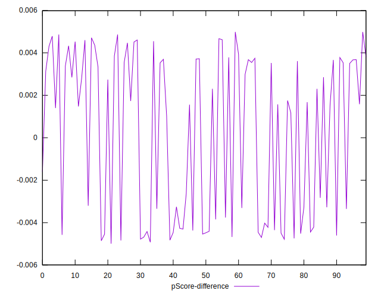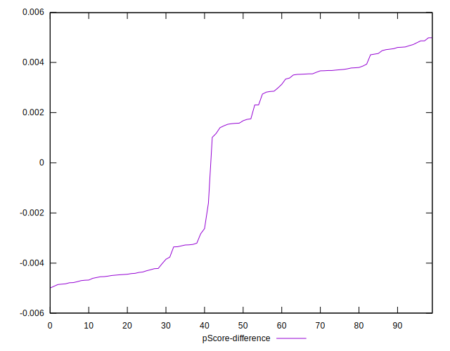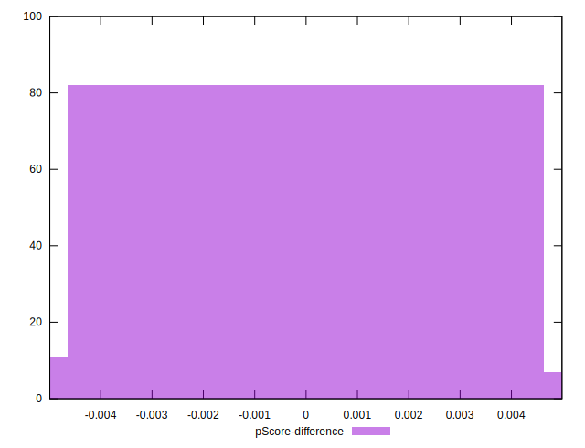