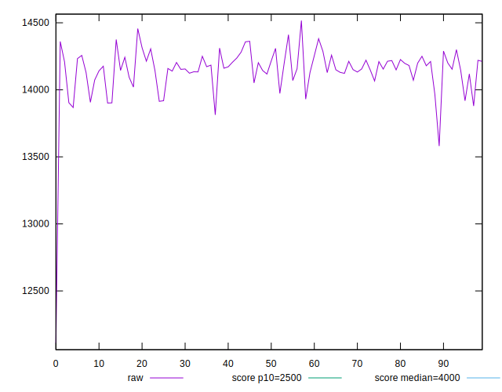
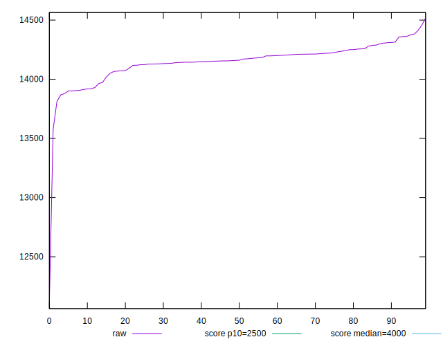
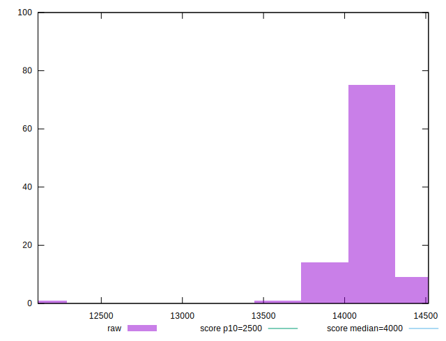
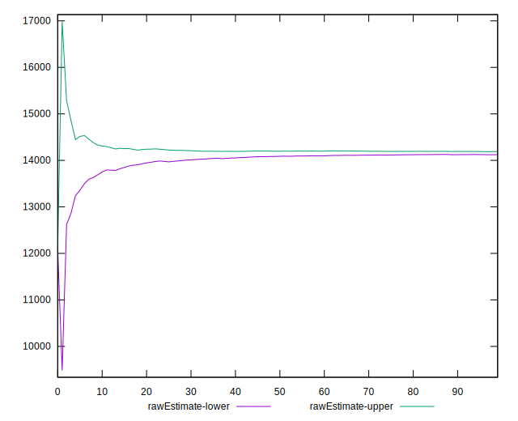
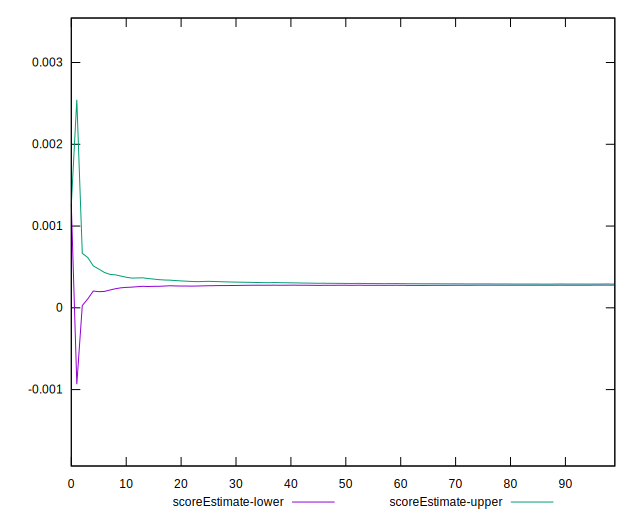
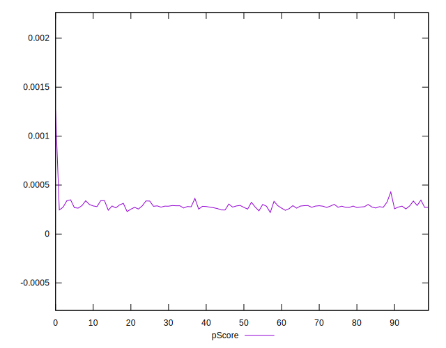
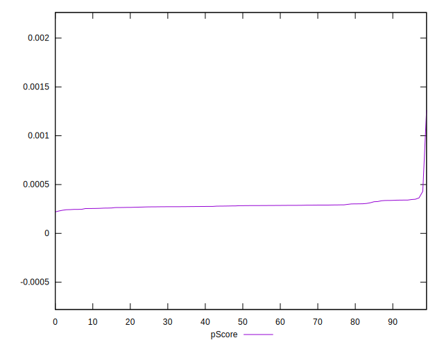
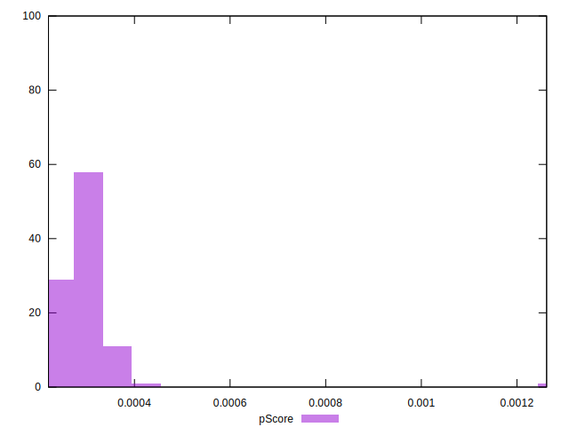
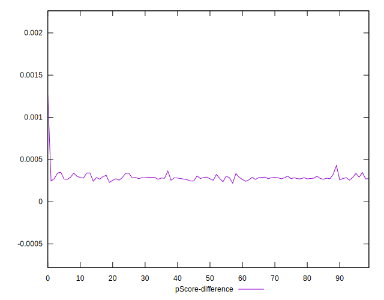
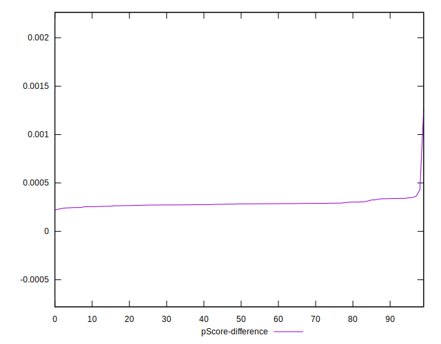

# //largest-contentful-paint/samples/pages+cached

[→ Parent](../..)


## Raw


```yaml
p90min: 13867.941499999999
p90max: 14381.4365
p90range: 513.4950000000008
p90mean: 14157.505231914896
median: 14160.2565
p90stdev: 117.49827953012077
mad: 56.7654999999977
stdevBySn: 98.52743909750474
lfitCenter: 14153.116323660108
lfitStdev: 97.9269813995762
mfitCenter: 14153.116323660108
mfitStdev: 122.73327033622033
mfitConfidence: 12.273327033622033
p90skewness: -0.6955102491917486
p90eccentricity: 0.9999999999999996
p90discretization: 1
outlandishness: 0.9970963575306427

```


## Score


```yaml
p90min: 0
p90max: 0
p90range: 0
p90mean: 0
median: 0
p90stdev: 0
mad: 0
stdevBySn: 0
lfitCenter: 0
lfitStdev: 0
mfitCenter: 0
mfitStdev: 0
mfitConfidence: 0
p90skewness: .nan
p90eccentricity: .nan
p90discretization: 94
outlandishness: .nan

```


## Raw Estimate


## Score Estimate


## P Score


```yaml
p90min: 0.0002422929364059856
p90max: 0.0003494554382691417
p90range: 0.00010716250186315612
p90mean: 0.0002851585836611719
median: 0.0002835522415132463
p90stdev: 0.000024650620296389804
mad: 0.00001123522072096761
stdevBySn: 0.000019737279679884914
lfitCenter: 0.0002885109186674953
lfitStdev: 0.000025090233274111367
mfitCenter: 0.0002885109186674953
mfitStdev: 0.000031445944102629795
mfitConfidence: 0.0000031445944102629794
p90skewness: 0.9266245490202558
p90eccentricity: 0.9999999999999997
p90discretization: 1
outlandishness: 1.0736476412394913

```


## Score Difference


```yaml
p90min: 0
p90max: 0
p90range: 0
p90mean: 0
median: 0
p90stdev: 0
mad: 0
stdevBySn: 0
lfitCenter: 0
lfitStdev: 0
mfitCenter: 0
mfitStdev: 0
mfitConfidence: 0
p90skewness: .nan
p90eccentricity: .nan
p90discretization: 94
outlandishness: .nan

```


## P Score Difference


```yaml
p90min: 0.0002422929364059856
p90max: 0.0003494554382691417
p90range: 0.00010716250186315612
p90mean: 0.0002851585836611719
median: 0.0002835522415132463
p90stdev: 0.000024650620296389804
mad: 0.00001123522072096761
stdevBySn: 0.000019737279679884914
lfitCenter: 0.0002885109186674953
lfitStdev: 0.000025090233274111367
mfitCenter: 0.0002885109186674953
mfitStdev: 0.000031445944102629795
mfitConfidence: 0.0000031445944102629794
p90skewness: 0.9266245490202558
p90eccentricity: 0.9999999999999997
p90discretization: 1
outlandishness: 1.0736476412394913

```

