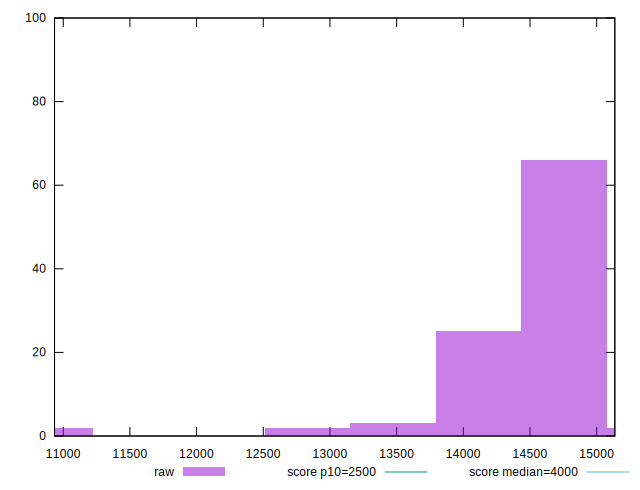

# //largest-contentful-paint/samples/pages

[→ Parent](../..)


## Raw


```yaml
p90min: 12856.6865
p90max: 14672.182
p90range: 1815.495500000001
p90mean: 14394.94053191489
median: 14461.669750000001
p90stdev: 260.7179405022681
mad: 53.11399999999958
stdevBySn: 86.42193788999892
lfitCenter: 14393.180925698254
lfitStdev: 196.71187517394787
mfitCenter: 14393.180925698254
mfitStdev: 246.54177438143165
mfitConfidence: 24.654177438143165
p90skewness: -3.532001177288944
p90eccentricity: 1.0000000000000002
p90discretization: 1
outlandishness: 0.9908261151799928

```


## Score


```yaml
p90min: 0
p90max: 0
p90range: 0
p90mean: 0
median: 0
p90stdev: 0
mad: 0
stdevBySn: 0
lfitCenter: 0
lfitStdev: 0
mfitCenter: 0
mfitStdev: 0
mfitConfidence: 0
p90skewness: .nan
p90eccentricity: .nan
p90discretization: 94
outlandishness: .nan

```


## Raw Estimate


## Score Estimate


## P Score


```yaml
p90min: 0.00019727334441843603
p90max: 0.000727359350522816
p90range: 0.00053008600610438
p90mean: 0.0002454928749625205
median: 0.0002289016155019863
p90stdev: 0.0000672097977979423
mad: 0.000008580962040066753
stdevBySn: 0.00001390151966456442
lfitCenter: 0.0002650797781473701
lfitStdev: 0.00008748981109486593
mfitCenter: 0.0002650797781473701
mfitStdev: 0.00010965221722659469
mfitConfidence: 0.00001096522172265947
p90skewness: 4.937556938676529
p90eccentricity: 1.0000000000000007
p90discretization: 1
outlandishness: 1.521477295044631

```


## Score Difference


```yaml
p90min: 0
p90max: 0
p90range: 0
p90mean: 0
median: 0
p90stdev: 0
mad: 0
stdevBySn: 0
lfitCenter: 0
lfitStdev: 0
mfitCenter: 0
mfitStdev: 0
mfitConfidence: 0
p90skewness: .nan
p90eccentricity: .nan
p90discretization: 94
outlandishness: .nan

```


## P Score Difference


```yaml
p90min: 0.00019727334441843603
p90max: 0.000727359350522816
p90range: 0.00053008600610438
p90mean: 0.0002454928749625205
median: 0.0002289016155019863
p90stdev: 0.0000672097977979423
mad: 0.000008580962040066753
stdevBySn: 0.00001390151966456442
lfitCenter: 0.0002650797781473701
lfitStdev: 0.00008748981109486593
mfitCenter: 0.0002650797781473701
mfitStdev: 0.00010965221722659469
mfitConfidence: 0.00001096522172265947
p90skewness: 4.937556938676529
p90eccentricity: 1.0000000000000007
p90discretization: 1
outlandishness: 1.521477295044631

```

