# //mainthread-work-breakdown/samples/pages+cached+noadtech+nomedia

[→ Parent](../..)


## Raw


```yaml
p90min: 563.6520000000002
p90max: 904.6960000000009
p90range: 341.0440000000008
p90mean: 631.5545957446813
median: 612.2100000000006
p90stdev: 64.9528771163192
mad: 29.584000000000287
stdevBySn: 41.78631880000069
lfitCenter: 628.9269941874438
lfitStdev: 49.54910060579651
mfitCenter: 628.9269941874438
mfitStdev: 62.100588343001036
mfitConfidence: 6.210058834300104
p90skewness: 2.0604754842200697
p90eccentricity: 0.9999999999999999
p90discretization: 1
outlandishness: 1.0326085692335774

```

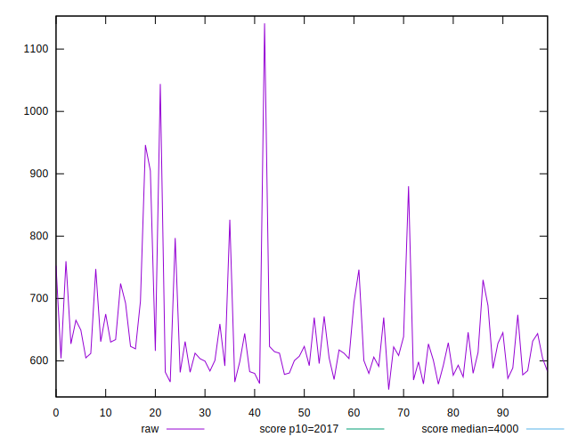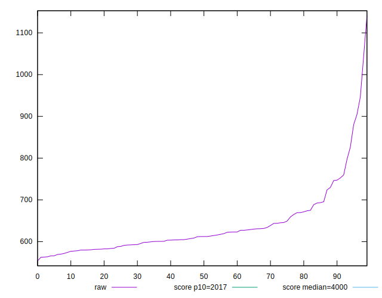
## Score


```yaml
p90min: 1
p90max: 1
p90range: 0
p90mean: 1
median: 1
p90stdev: 0
mad: 0
stdevBySn: 0
lfitCenter: 0.9999056891433512
lfitStdev: 0.0002341727301519186
mfitCenter: 0.9999056891433512
mfitStdev: 0.0002934919935684914
mfitConfidence: 0.000029349199356849144
p90skewness: .nan
p90eccentricity: .nan
p90discretization: 94
outlandishness: 0.9996000399999998

```

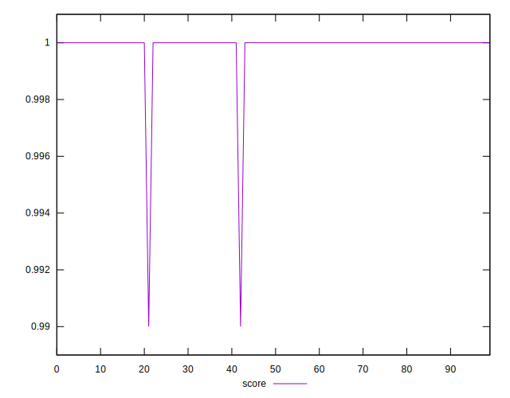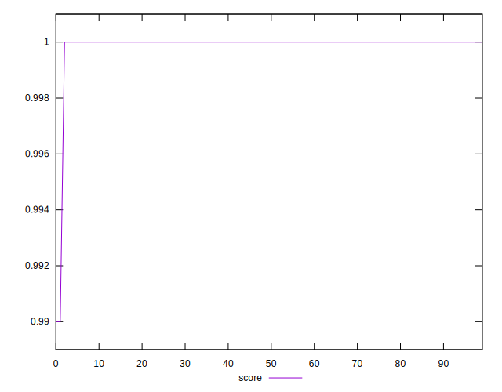
## Raw Estimate

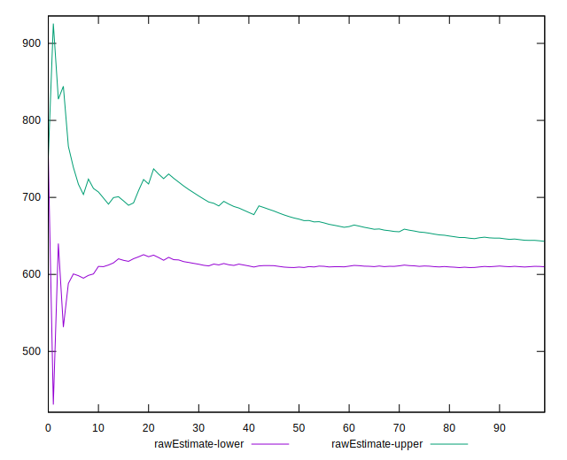
## Score Estimate

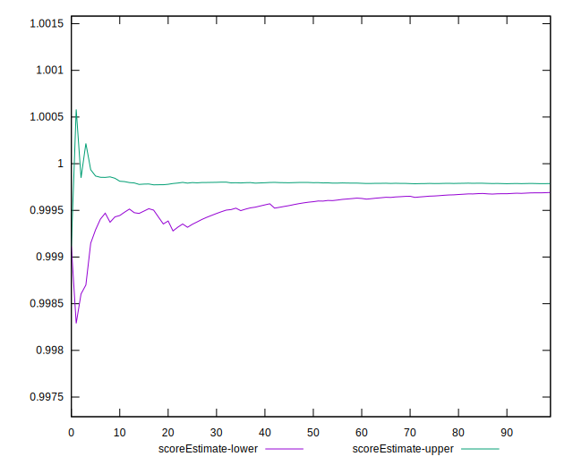
## P Score


```yaml
p90min: 0.9973008132079676
p90max: 0.9998776889202873
p90range: 0.0025768757123196817
p90mean: 0.9996525193886282
median: 0.9997785975611684
p90stdev: 0.00039836239126762304
mad: 0.0000665717790134801
stdevBySn: 0.00009874649790513003
lfitCenter: 0.9996234456823961
lfitStdev: 0.00034740363132885414
mfitCenter: 0.9996234456823961
mfitStdev: 0.00043540588293731884
mfitConfidence: 0.000043540588293731885
p90skewness: -3.9559705633555744
p90eccentricity: 1.0000000000000002
p90discretization: 1
outlandishness: 0.9996566362506486

```

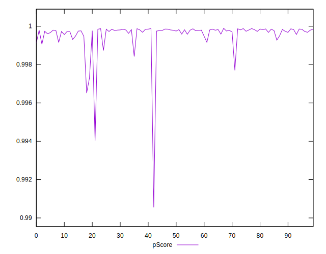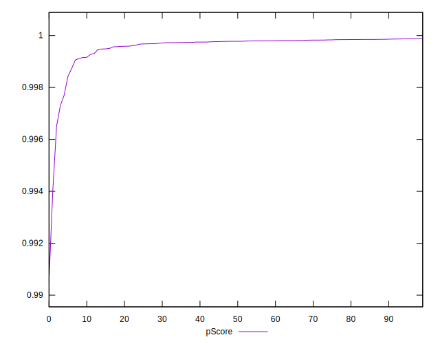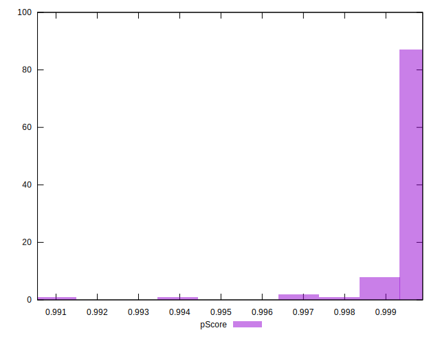
## Score Difference


```yaml
p90min: 0
p90max: 0
p90range: 0
p90mean: 0
median: 0
p90stdev: 0
mad: 0
stdevBySn: 0
lfitCenter: 0
lfitStdev: 0
mfitCenter: 0
mfitStdev: 0
mfitConfidence: 0
p90skewness: .nan
p90eccentricity: .nan
p90discretization: 94
outlandishness: .nan

```


## P Score Difference


```yaml
p90min: -0.0015793640157452105
p90max: -0.00012056178092356706
p90range: 0.0014588022348216434
p90mean: -0.00029687519910345854
median: -0.0002163506079781441
p90stdev: 0.00024051944376084938
mad: 0.0000623589351153031
stdevBySn: 0.00009874649790513003
lfitCenter: -0.00027583230174364954
lfitStdev: 0.00020607942929348814
mfitCenter: -0.00027583230174364954
mfitStdev: 0.0002582822624033333
mfitConfidence: 0.00002582822624033333
p90skewness: -2.9647274766618836
p90eccentricity: 0.9999999999999999
p90discretization: 1
outlandishness: 1.1554564508274987

```

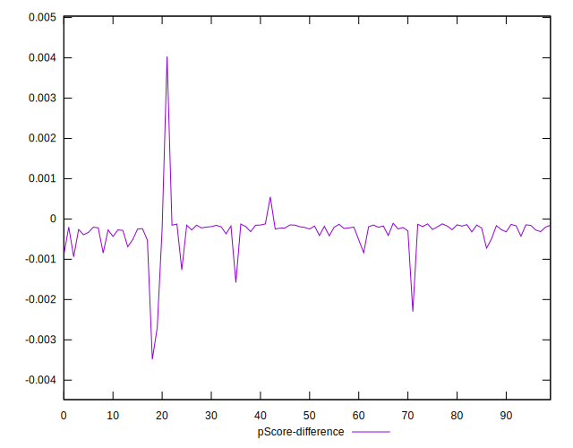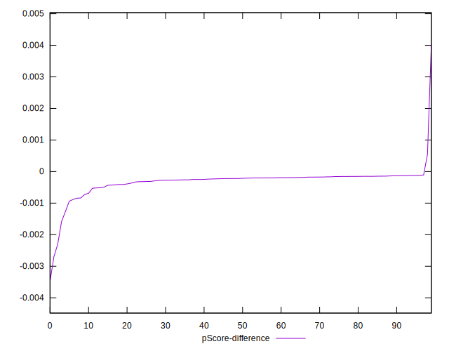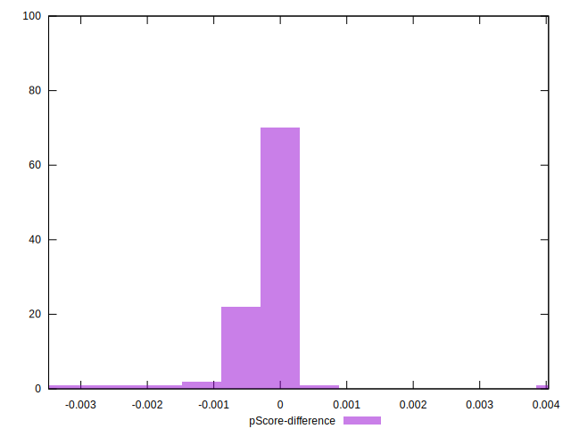