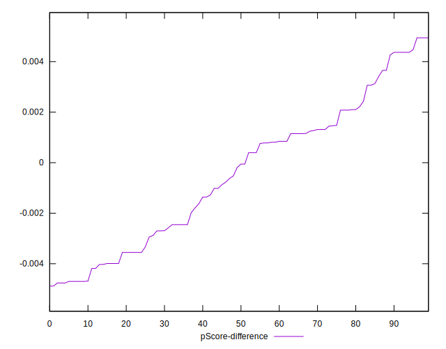
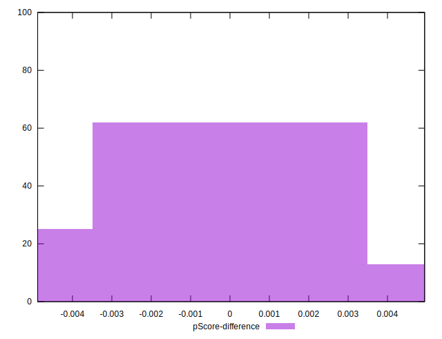

# //max-potential-fid/samples/pages+cached

[→ Parent](../..)


## Raw


```yaml
p90min: 305.9999999999991
p90max: 479
p90range: 173.0000000000009
p90mean: 337.5425531914894
median: 324
p90stdev: 33.3510231090049
mad: 13
stdevBySn: 20.274200000000544
lfitCenter: 337.83795163631936
lfitStdev: 32.574595753044555
mfitCenter: 337.83795163631936
mfitStdev: 40.82620141570926
mfitConfidence: 4.082620141570926
p90skewness: 1.7444749123627201
p90eccentricity: 0.9999999999999994
p90discretization: 1.2876712328767124
outlandishness: 1.0572485285809772

```


## Score


```yaml
p90min: 0.1
p90max: 0.35
p90range: 0.24999999999999997
p90mean: 0.2847872340425531
median: 0.305
p90stdev: 0.056431632961774725
mad: 0.025000000000000022
stdevBySn: 0.04174100000000004
lfitCenter: 0.2886555581118578
lfitStdev: 0.05010035470091687
mfitCenter: 0.2886555581118578
mfitStdev: 0.06279148289436366
mfitConfidence: 0.006279148289436366
p90skewness: -1.108796840151826
p90eccentricity: 0.9999999999999994
p90discretization: 4.476190476190476
outlandishness: 0.9611469513051946

```


## Raw Estimate


## Score Estimate


## P Score


```yaml
p90min: 0.10127397293277118
p90max: 0.3460087474833111
p90range: 0.24473477455053994
p90mean: 0.2844529808820792
median: 0.3057048715016456
p90stdev: 0.055788849321126065
mad: 0.028663489708794954
stdevBySn: 0.04525736844322785
lfitCenter: 0.2879267168521058
lfitStdev: 0.04953041825332252
mfitCenter: 0.2879267168521058
mfitStdev: 0.06207717348650352
mfitConfidence: 0.006207717348650351
p90skewness: -1.1014458791767134
p90eccentricity: 1.0000000000000002
p90discretization: 1.2876712328767124
outlandishness: 0.9604509982359944

```


## Score Difference


```yaml
p90min: 0
p90max: 5.551115123125783e-17
p90range: 5.551115123125783e-17
p90mean: 1.771632486103973e-18
median: 0
p90stdev: 9.757390901081482e-18
mad: 0
stdevBySn: 0
lfitCenter: 1.6579333086029914e-18
lfitStdev: 4.0317019279053714e-18
mfitCenter: 1.6579333086029914e-18
mfitStdev: 5.052989028770492e-18
mfitConfidence: 5.052989028770492e-19
p90skewness: 5.326002287485497
p90eccentricity: 1.0000000000000044
p90discretization: 47
outlandishness: 3.5344000000000007

```


## P Score Difference


```yaml
p90min: -0.004762995021792837
p90max: 0.004942257760970431
p90range: 0.009705252782763268
p90mean: -0.0004591917525901601
median: -0.00012303217303225034
p90stdev: 0.0028350887338224108
mad: 0.00239651404301873
stdevBySn: 0.003415602086663944
lfitCenter: -0.0004351272428882027
lfitStdev: 0.0026012986439630085
mfitCenter: -0.0004351272428882027
mfitStdev: 0.003260244369139075
mfitConfidence: 0.0003260244369139075
p90skewness: 0.08398189217194706
p90eccentricity: 0.9999999999999992
p90discretization: 1.2876712328767124
outlandishness: 0.8715117256259366

```

