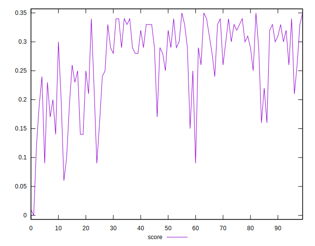

# //max-potential-fid/samples/pages

[→ Parent](../..)


## Raw


```yaml
p90min: 305.9999999999991
p90max: 496
p90range: 190.0000000000009
p90mean: 349.63829787234044
median: 333
p90stdev: 45.68901610723789
mad: 20.00000000000091
stdevBySn: 29.81499999999946
lfitCenter: 350.0971804885977
lfitStdev: 42.44768210529198
mfitCenter: 350.0971804885977
mfitStdev: 53.200280132369
mfitConfidence: 5.3200280132369
p90skewness: 1.5916271794083519
p90eccentricity: 0.9999999999999999
p90discretization: 1.323943661971831
outlandishness: 1.075339845813131

```


## Score


```yaml
p90min: 0.09
p90max: 0.35
p90range: 0.26
p90mean: 0.26659574468085095
median: 0.29
p90stdev: 0.06879747013361666
mad: 0.040000000000000036
stdevBySn: 0.05963000000000006
lfitCenter: 0.271030737397984
lfitStdev: 0.05804701705009702
mfitCenter: 0.271030737397984
mfitStdev: 0.07275114717108579
mfitConfidence: 0.007275114717108578
p90skewness: -0.9872519022110781
p90eccentricity: 0.9999999999999997
p90discretization: 4.086956521739131
outlandishness: 0.9643459442589182

```


## Raw Estimate


## Score Estimate


## P Score


```yaml
p90min: 0.08968880625091713
p90max: 0.3460087474833111
p90range: 0.256319941232394
p90mean: 0.2663736287038148
median: 0.2871150014950539
p90stdev: 0.06812410534320934
mad: 0.041916124610049704
stdevBySn: 0.06463493327618434
lfitCenter: 0.2705945791004161
lfitStdev: 0.05712257824194576
mfitCenter: 0.2705945791004161
mfitStdev: 0.07159253494258087
mfitConfidence: 0.0071592534942580876
p90skewness: -0.9936455569932303
p90eccentricity: 0.9999999999999991
p90discretization: 1.323943661971831
outlandishness: 0.9641744481545202

```


## Score Difference


```yaml
p90min: 0
p90max: 5.551115123125783e-17
p90range: 5.551115123125783e-17
p90mean: 5.905441620346577e-19
median: 0
p90stdev: 5.695001657605475e-18
mad: 0
stdevBySn: 0
lfitCenter: 1.0755152514005351e-18
lfitStdev: 2.6436841970240598e-18
mfitCenter: 1.0755152514005351e-18
mfitStdev: 3.313366782061881e-18
mfitConfidence: 3.313366782061881e-19
p90skewness: 9.539955591519908
p90eccentricity: 0.9999999999999996
p90discretization: 47
outlandishness: 14.137600000000003

```


## P Score Difference


```yaml
p90min: -0.004762995021792837
p90max: 0.004701745187188605
p90range: 0.009464740208981443
p90mean: -0.00025643668715326834
median: -0.0007148670504337484
p90stdev: 0.0028823612015512153
mad: 0.0026159434956812555
stdevBySn: 0.0032977728270139734
lfitCenter: -0.0003089629377078364
lfitStdev: 0.00258805898776416
mfitCenter: -0.0003089629377078364
mfitStdev: 0.003243650920835164
mfitConfidence: 0.0003243650920835164
p90skewness: 0.1326271243780289
p90eccentricity: 1
p90discretization: 1.3055555555555556
outlandishness: 0.8860235296795115

```

