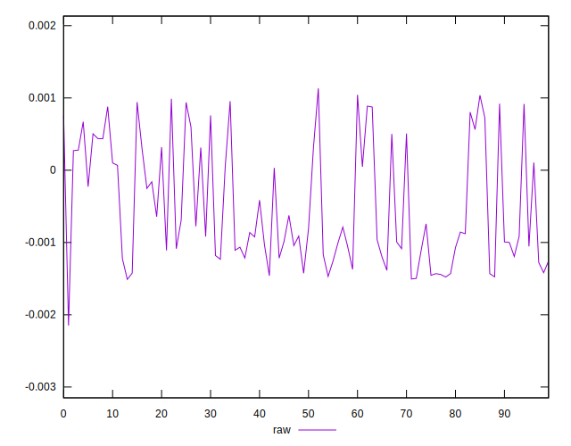
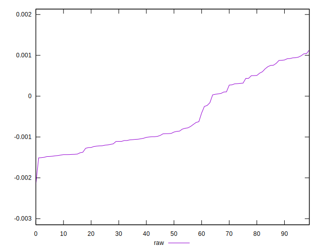
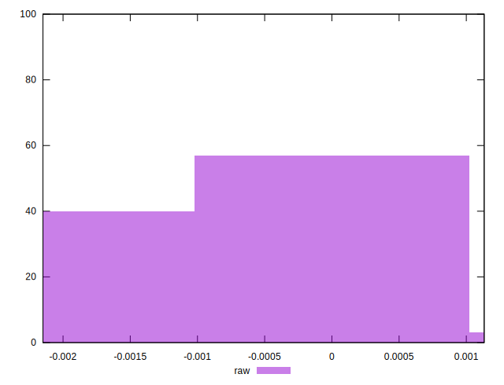

# //meta/pScore-difference/samples/pages+cached+noadtech+nomedia+nocss

[→ Parent](../..)


## Raw


```yaml
p90min: -0.00149714683759535
p90max: 0.0009878934907036647
p90range: 0.0024850403282990147
p90mean: -0.0005043620759364566
median: -0.0008952331837036233
p90stdev: 0.000829182747367038
mad: 0.0005359417471328469
stdevBySn: 0.0007439701831523529
lfitCenter: -0.0005754133296498686
lfitStdev: 0.0007993298558562405
mfitCenter: -0.0005754133296498686
mfitStdev: 0.0010018114097310525
mfitConfidence: 0.00010018114097310525
p90skewness: 0.5203473466296599
p90eccentricity: 1.0000000000000007
p90discretization: 1
outlandishness: 0.9578728386446054

```

