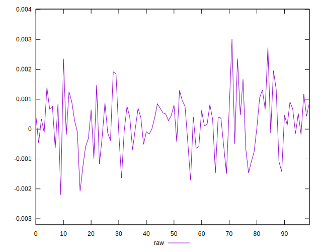
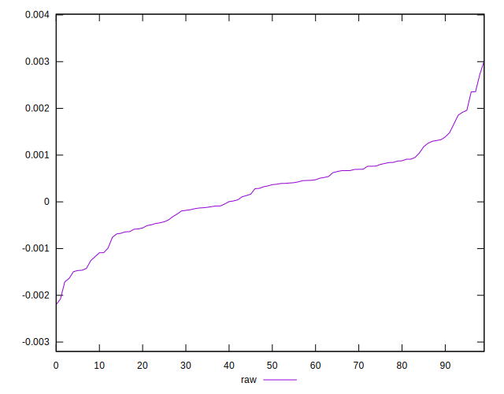
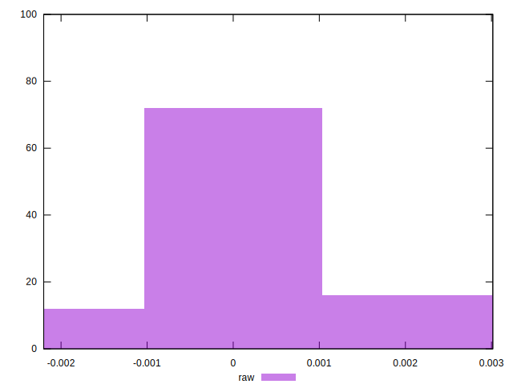

# //meta/pScore-difference/samples/pages+cached

[→ Parent](../..)


## Raw


```yaml
p90min: -0.0016382392390880596
p90max: 0.0023530248617300935
p90range: 0.003991264100818153
p90mean: 0.00021823936416161222
median: 0.0003548041385198347
p90stdev: 0.0008380221992301121
mad: 0.0005309555014577891
stdevBySn: 0.0009552142230562693
lfitCenter: 0.00023813054874269137
lfitStdev: 0.0007060938741531149
mfitCenter: 0.00023813054874269137
mfitStdev: 0.0008849574356384524
mfitConfidence: 0.00008849574356384525
p90skewness: -0.07031440429015302
p90eccentricity: 0.9999999999999999
p90discretization: 1
outlandishness: 1.074980673767811

```

