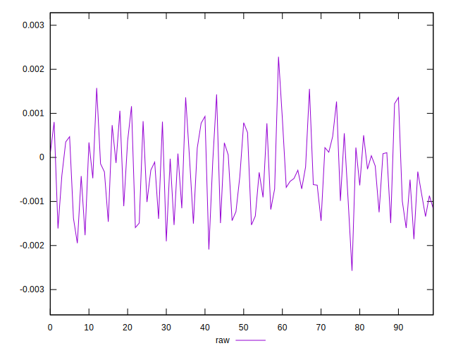
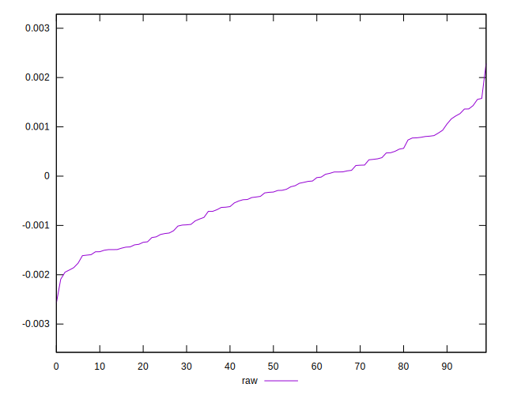

# //meta/pScore-difference/samples/pages

[→ Parent](../..)


## Raw


```yaml
p90min: -0.0019034775198267754
p90max: 0.001430731366981402
p90range: 0.003334208886808177
p90mean: -0.00033487044596360423
median: -0.000325103568376869
p90stdev: 0.0008842561810167463
mad: 0.0007976799615610902
stdevBySn: 0.001038431085272722
lfitCenter: -0.0003377247892882976
lfitStdev: 0.0007693808475840165
mfitCenter: -0.0003377247892882976
mfitStdev: 0.0009642758942271254
mfitConfidence: 0.00009642758942271255
p90skewness: 0.12832443244268008
p90eccentricity: 0.9999999999999996
p90discretization: 1
outlandishness: 0.951932901440902

```

