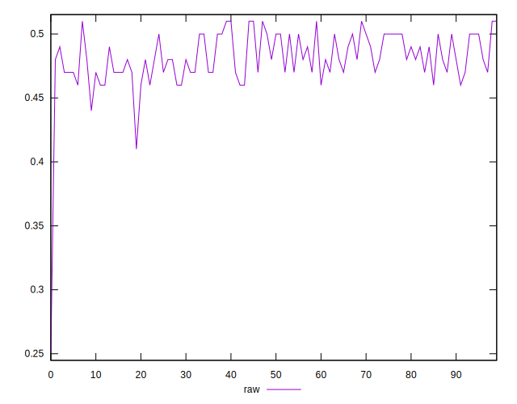
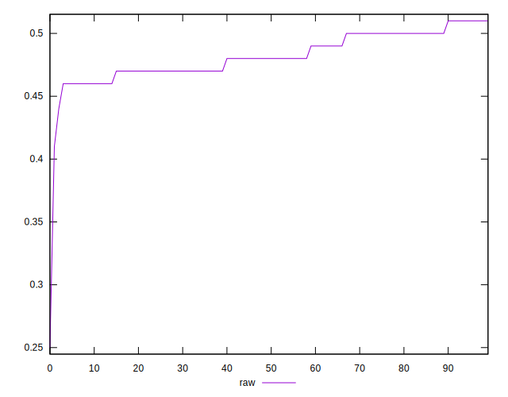
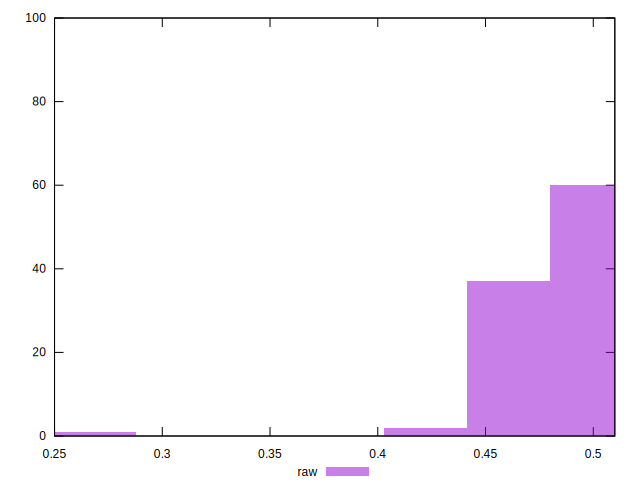

# //meta/score/samples/pages+cached

[→ Parent](../..)


## Raw


```yaml
p90min: 0.46
p90max: 0.51
p90range: 0.04999999999999999
p90mean: 0.4827659574468084
median: 0.48
p90stdev: 0.015601708534313754
mad: 0.010000000000000009
stdevBySn: 0.017889000000000016
lfitCenter: 0.4809924938534979
lfitStdev: 0.015525777915503263
mfitCenter: 0.4809924938534979
mfitStdev: 0.019458676973901166
mfitConfidence: 0.0019458676973901166
p90skewness: 0.19090260791508143
p90eccentricity: 1.0000000000000007
p90discretization: 15.666666666666666
outlandishness: 0.9889859823155367

```

