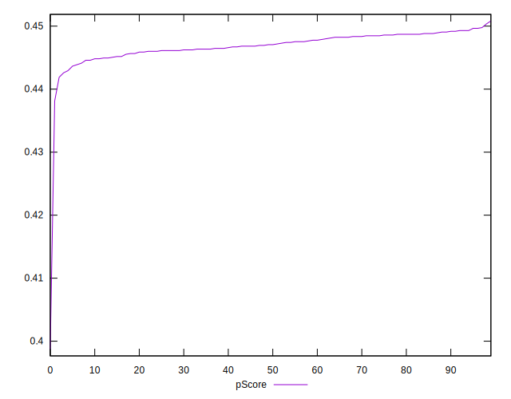

# //render-blocking-resources/samples/pages+cached

[→ Parent](../..)


## Raw


```yaml
p90min: 1178
p90max: 1238
p90range: 60
p90mean: 1199.840425531915
median: 1200
p90stdev: 13.505163072179345
mad: 11
stdevBySn: 16.1001
lfitCenter: 1201.5283904322687
lfitStdev: 14.488761882657489
mfitCenter: 1201.5283904322687
mfitStdev: 18.158970118004902
mfitConfidence: 1.8158970118004902
p90skewness: 0.5162846260101125
p90eccentricity: 0.9999999999999999
p90discretization: 2.186046511627907
outlandishness: 1.0074976204149784

```


## Score


```yaml
p90min: 0.44
p90max: 0.45
p90range: 0.010000000000000009
p90mean: 0.44882978723404293
median: 0.45
p90stdev: 0.0032144563680293913
mad: 0
stdevBySn: 0
lfitCenter: 0.4490326541297923
lfitStdev: 0.002235352530563682
mfitCenter: 0.4490326541297923
mfitStdev: 0.0028015989312585293
mfitConfidence: 0.00028015989312585294
p90skewness: -2.3828522123572093
p90eccentricity: 1.0000000000000016
p90discretization: 47
outlandishness: 0.9971956166870262

```


## Raw Estimate


## Score Estimate


## P Score


```yaml
p90min: 0.4425882352941176
p90max: 0.4496470588235294
p90range: 0.007058823529411784
p90mean: 0.4470775969962454
median: 0.4470588235294118
p90stdev: 0.0015888427143740441
mad: 0.001294117647058779
stdevBySn: 0.001894129411764698
lfitCenter: 0.4468790128903212
lfitStdev: 0.001704560221489133
mfitCenter: 0.4468790128903212
mfitStdev: 0.0021363494256476565
mfitConfidence: 0.00021363494256476564
p90skewness: -0.5162846260099572
p90eccentricity: 0.9999999999999997
p90discretization: 2.186046511627907
outlandishness: 0.9976385610395742

```


## Score Difference


```yaml
p90min: 0
p90max: 0
p90range: 0
p90mean: 0
median: 0
p90stdev: 0
mad: 0
stdevBySn: 0
lfitCenter: 0
lfitStdev: 0
mfitCenter: 0
mfitStdev: 0
mfitConfidence: 0
p90skewness: .nan
p90eccentricity: .nan
p90discretization: 94
outlandishness: .nan

```


## P Score Difference


```yaml
p90min: -0.004470588235294115
p90max: 0.0048235294117647265
p90range: 0.009294117647058842
p90mean: -0.0017571964956195382
median: -0.0018823529411765016
p90stdev: 0.0021489008170529475
mad: 0.0012352941176470567
stdevBySn: 0.0020344352941176706
lfitCenter: -0.0018563485630451657
lfitStdev: 0.0015551848684335378
mfitCenter: -0.0018563485630451657
mfitStdev: 0.001949135183708202
mfitConfidence: 0.00019491351837082018
p90skewness: 1.4438059198436208
p90eccentricity: 1
p90discretization: 2.1363636363636362
outlandishness: 0.8823417587925426

```

