# //render-blocking-resources/samples/pages

[→ Parent](../..)


## Raw


```yaml
p90min: 1349
p90max: 1549
p90range: 200
p90mean: 1460.968085106383
median: 1492
p90stdev: 68.61245655276834
mad: 35
stdevBySn: 50.685500000000005
lfitCenter: 1468.1242678616125
lfitStdev: 67.24851710411349
mfitCenter: 1468.1242678616125
mfitStdev: 84.28351728489832
mfitConfidence: 8.428351728489833
p90skewness: -0.545324438004029
p90eccentricity: 1
p90discretization: 1.3823529411764706
outlandishness: 1.0007693843016694

```

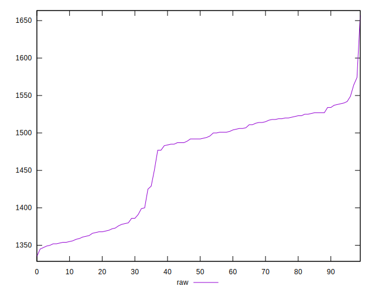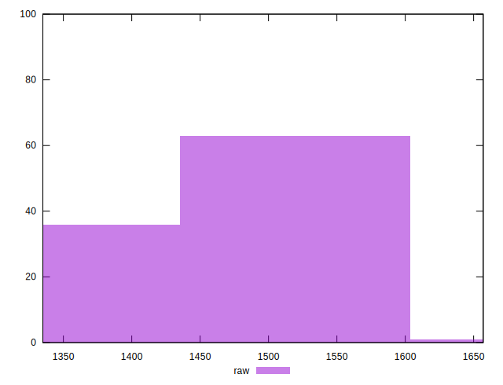
## Score


```yaml
p90min: 0.41
p90max: 0.43
p90range: 0.020000000000000018
p90mean: 0.4165957446808506
median: 0.41
p90stdev: 0.0090569347462948
mad: 0
stdevBySn: 0
lfitCenter: 0.4150497852390228
lfitStdev: 0.009361655958946734
mfitCenter: 0.4150497852390228
mfitStdev: 0.011733095773838178
mfitConfidence: 0.0011733095773838178
p90skewness: 0.7224971979314982
p90eccentricity: 0.9999999999999992
p90discretization: 31.333333333333332
outlandishness: 0.9990604863523151

```

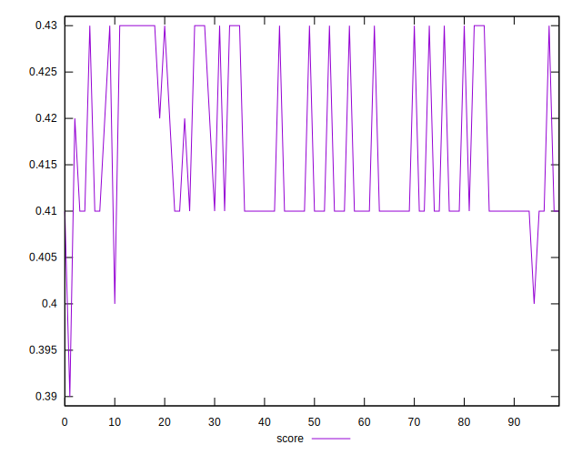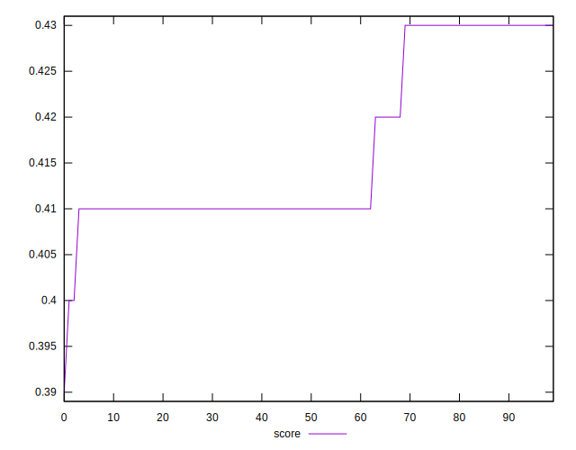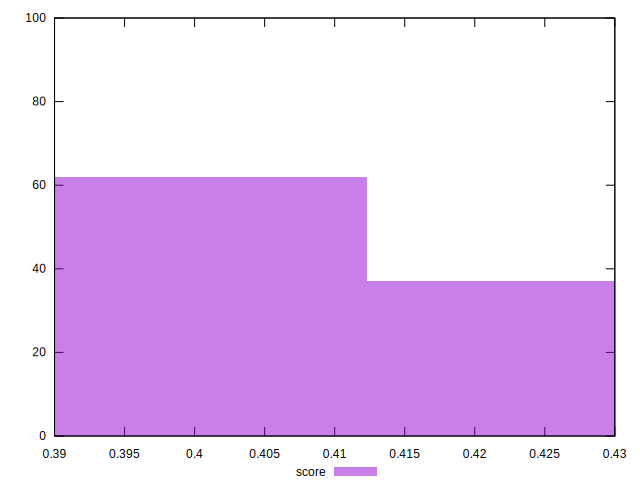
## Raw Estimate

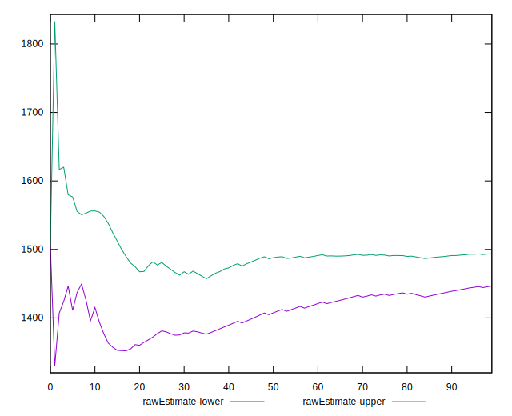
## Score Estimate

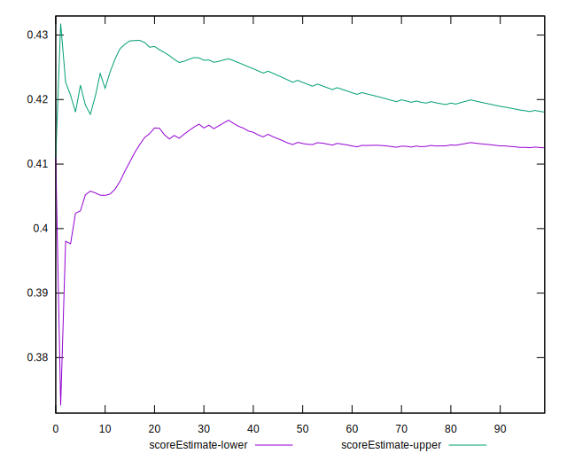
## P Score


```yaml
p90min: 0.406
p90max: 0.4295294117647059
p90range: 0.023529411764705854
p90mean: 0.41635669586983726
median: 0.41270588235294114
p90stdev: 0.008072053712090393
mad: 0.004117647058823504
stdevBySn: 0.005963000000000006
lfitCenter: 0.4155147920162811
lfitStdev: 0.007911590247542882
mfitCenter: 0.4155147920162811
mfitStdev: 0.009915707915870538
mfitConfidence: 0.000991570791587054
p90skewness: 0.5453244380041081
p90eccentricity: 0.9999999999999997
p90discretization: 1.3823529411764706
outlandishness: 0.9996824723270632

```

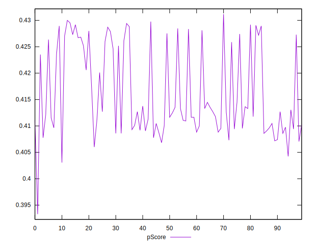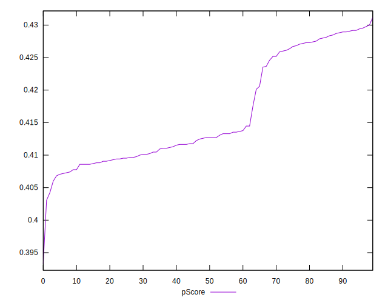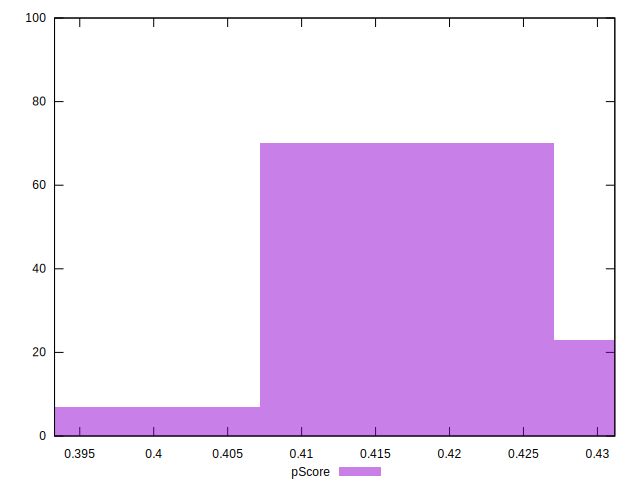
## Score Difference


```yaml
p90min: 0
p90max: 5.551115123125783e-17
p90range: 5.551115123125783e-17
p90mean: 3.3661017235975493e-17
median: 5.551115123125783e-17
p90stdev: 2.7120061523226158e-17
mad: 0
stdevBySn: 0
lfitCenter: 3.670310945914065e-17
lfitStdev: 3.1171387933306115e-17
mfitCenter: 3.670310945914065e-17
mfitStdev: 3.906754121586977e-17
mfitConfidence: 3.906754121586977e-18
p90skewness: -0.43550355630934257
p90eccentricity: 1.0000000000000016
p90discretization: 47
outlandishness: 0.9790581717451521

```


## P Score Difference


```yaml
p90min: -0.0040000000000000036
p90max: 0.004235294117647004
p90range: 0.008235294117647007
p90mean: -0.00011389236545680921
median: -0.00047058823529411153
p90stdev: 0.002196451404266702
mad: 0.001882352941176474
stdevBySn: 0.0025956588235293947
lfitCenter: -0.00019033470235374427
lfitStdev: 0.0018789684579934283
mfitCenter: -0.00019033470235374427
mfitStdev: 0.002354937734342708
mfitConfidence: 0.0002354937734342708
p90skewness: 0.2363320050344438
p90eccentricity: 1.0000000000000002
p90discretization: 1.6491228070175439
outlandishness: 0.922866368796024

```

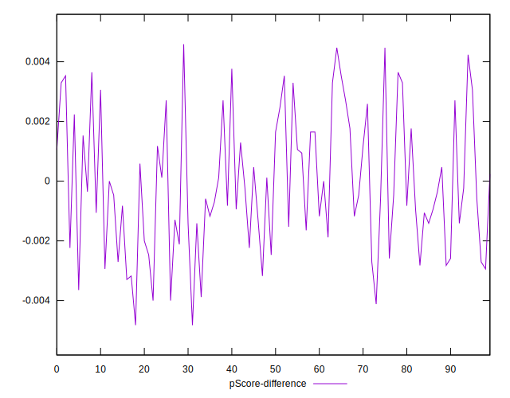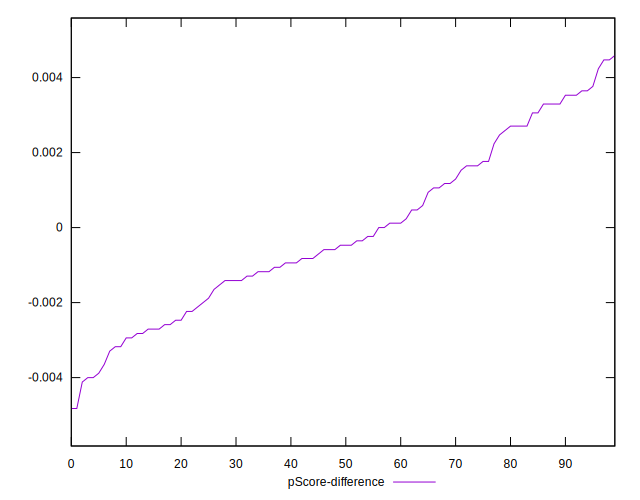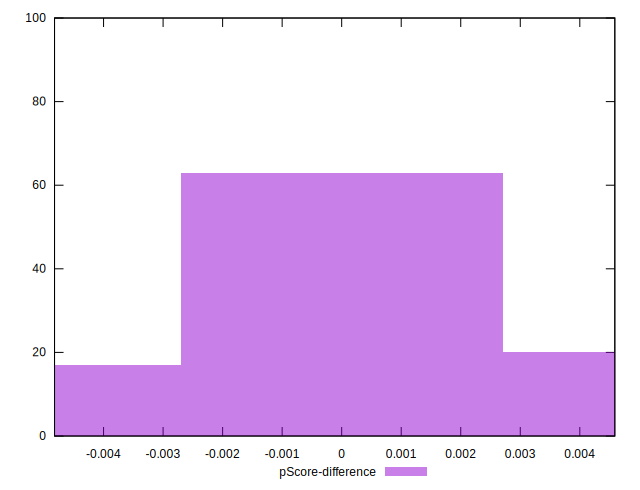