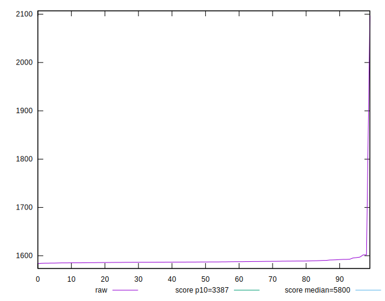
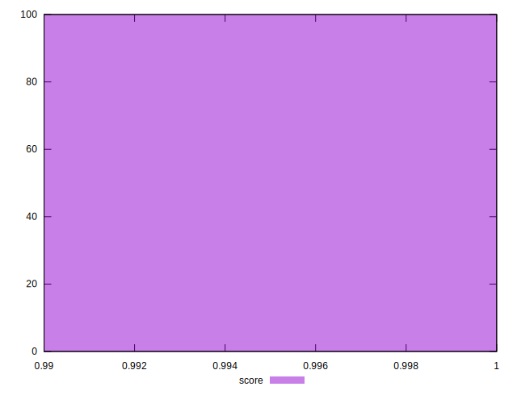

# //speed-index/samples/pages+cached+noadtech+nomedia+nocss

[→ Parent](../..)


## Raw


```yaml
p90min: 1584.5865
p90max: 1597.1285
p90range: 12.542000000000144
p90mean: 1587.7772436170208
median: 1587.124275
p90stdev: 2.3802522319658768
mad: 1.2351999999999634
stdevBySn: 1.8363803875000468
lfitCenter: 1590.0092337496508
lfitStdev: 6.651070297290367
mfitCenter: 1590.0092337496508
mfitStdev: 8.33588044026114
mfitConfidence: 0.8335880440261141
p90skewness: 1.6965765202132694
p90eccentricity: 1
p90discretization: 1
outlandishness: 1.0066445521526242

```


## Score


```yaml
p90min: 1
p90max: 1
p90range: 0
p90mean: 1
median: 1
p90stdev: 0
mad: 0
stdevBySn: 0
lfitCenter: 0.9999534639864746
lfitStdev: 0.00011610565185013966
mfitCenter: 0.9999534639864746
mfitStdev: 0.00014551685503243686
mfitConfidence: 0.000014551685503243686
p90skewness: .nan
p90eccentricity: .nan
p90discretization: 94
outlandishness: 0.9998000100000003

```


## Raw Estimate


## Score Estimate


## P Score


```yaml
p90min: 0.9989386611792923
p90max: 0.9990035567296741
p90range: 0.00006489555038180495
p90mean: 0.9989872956922972
median: 0.9989906865574083
p90stdev: 0.000012264026236831035
mad: 0.000006296327888732911
stdevBySn: 0.000009381986950740384
lfitCenter: 0.9989570031658551
lfitStdev: 0.00007892122975543405
mfitCenter: 0.9989570031658551
mfitStdev: 0.00009891309308634078
mfitConfidence: 0.000009891309308634079
p90skewness: -1.7329936382390854
p90eccentricity: 1
p90discretization: 1
outlandishness: 0.9998647808610474

```


## Score Difference


```yaml
p90min: 0
p90max: 0
p90range: 0
p90mean: 0
median: 0
p90stdev: 0
mad: 0
stdevBySn: 0
lfitCenter: 0
lfitStdev: 0
mfitCenter: 0
mfitStdev: 0
mfitConfidence: 0
p90skewness: .nan
p90eccentricity: .nan
p90discretization: 94
outlandishness: .nan

```


## P Score Difference


```yaml
p90min: -0.0010561981667603915
p90max: -0.000996414258103262
p90range: 0.00005978390865712946
p90mean: -0.001012013620867187
median: -0.0010091220661048173
p90stdev: 0.000011295547624360678
mad: 0.000006257726921143902
stdevBySn: 0.000009381986950740384
lfitCenter: -0.0009962747233615654
lfitStdev: 0.0000388256683071898
mfitCenter: -0.0009962747233615654
mfitStdev: 0.00004866075902908787
mfitConfidence: 0.0000048660759029087875
p90skewness: -1.5206758072580568
p90eccentricity: 0.9999999999999996
p90discretization: 1
outlandishness: 0.9382075884649513

```

