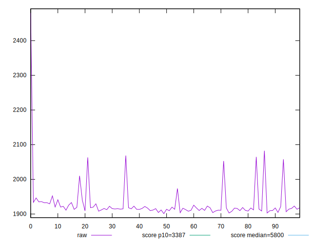
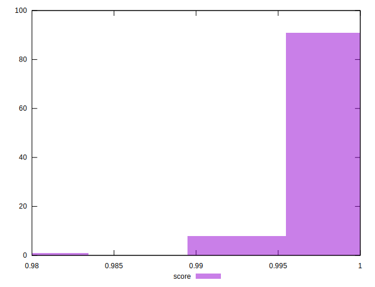
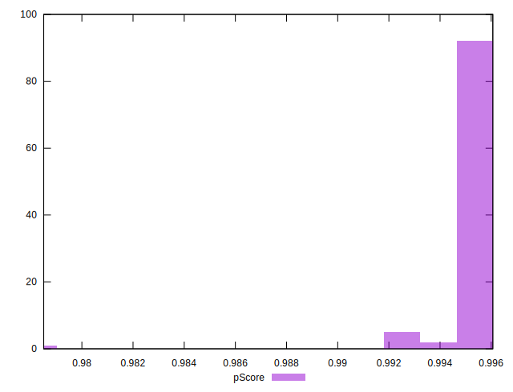

# //speed-index/samples/pages+cached+noadtech+nomedia

[→ Parent](../..)


## Raw


```yaml
p90min: 1903.8154999999997
p90max: 2064.81205
p90range: 160.9965500000003
p90mean: 1925.0974776595745
median: 1916.0898249999998
p90stdev: 31.792728698374358
mad: 5.648899999999571
stdevBySn: 8.382442527500048
lfitCenter: 1924.8768837469274
lfitStdev: 21.541423228720777
mfitCenter: 1924.8768837469274
mfitStdev: 26.998170297618966
mfitConfidence: 2.6998170297618964
p90skewness: 3.4460613806712628
p90eccentricity: 1.0000000000000002
p90discretization: 1
outlandishness: 1.0082012726597396

```


## Score


```yaml
p90min: 0.99
p90max: 1
p90range: 0.010000000000000009
p90mean: 0.9993617021276595
median: 1
p90stdev: 0.0024444947432076757
mad: 0
stdevBySn: 0
lfitCenter: 0.9994862968379354
lfitStdev: 0.0012275074928705743
mfitCenter: 0.9994862968379354
mfitStdev: 0.0015384524960234526
mfitConfidence: 0.00015384524960234525
p90skewness: -3.5685919470917162
p90eccentricity: 0.9999999999999987
p90discretization: 47
outlandishness: 0.999276264697967

```


## Raw Estimate


## Score Estimate


## P Score


```yaml
p90min: 0.99306549753917
p90max: 0.9960232855946517
p90range: 0.002957788055481747
p90mean: 0.9956770708255128
median: 0.9958391373857393
p90stdev: 0.000577879437103279
mad: 0.00008622103439515083
stdevBySn: 0.00012817519000709067
lfitCenter: 0.9956462561006068
lfitStdev: 0.0004553229283964968
mfitCenter: 0.9956462561006068
mfitStdev: 0.0005706626637774477
mfitConfidence: 0.00005706626637774477
p90skewness: -3.627630708897492
p90eccentricity: 1.0000000000000002
p90discretization: 1
outlandishness: 0.9995626402969211

```


## Score Difference


```yaml
p90min: 0
p90max: 0
p90range: 0
p90mean: 0
median: 0
p90stdev: 0
mad: 0
stdevBySn: 0
lfitCenter: 0
lfitStdev: 0
mfitCenter: 0
mfitStdev: 0
mfitConfidence: 0
p90skewness: .nan
p90eccentricity: .nan
p90discretization: 94
outlandishness: .nan

```


## P Score Difference


```yaml
p90min: -0.004542258369905294
p90max: 0.003220503676685138
p90range: 0.007762762046590432
p90mean: -0.003750524719593681
median: -0.004132243468081165
p90stdev: 0.0016294725112782774
mad: 0.00007293341146413779
stdevBySn: 0.00012817519000709067
lfitCenter: -0.003830633820087614
lfitStdev: 0.0007753292165575511
mfitCenter: -0.003830633820087614
mfitStdev: 0.0009717310691631269
mfitConfidence: 0.00009717310691631269
p90skewness: 3.8091631797100987
p90eccentricity: 1.0000000000000002
p90discretization: 1
outlandishness: 0.891232738014788

```

