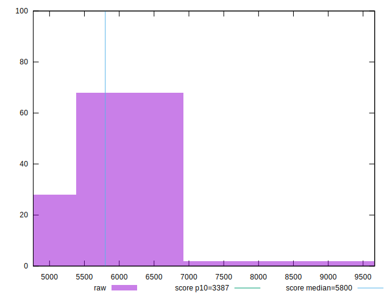
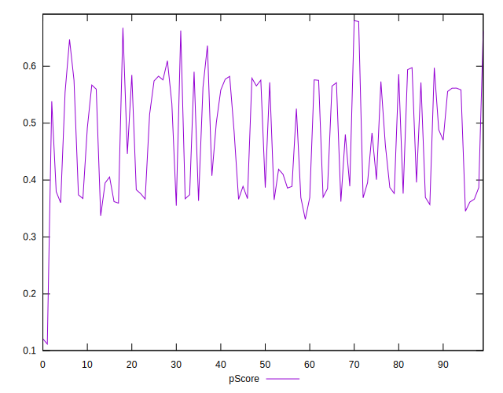

# //speed-index/samples/pages

[→ Parent](../..)


## Raw


```yaml
p90min: 4862.984752888895
p90max: 6919.787264506685
p90range: 2056.8025116177896
p90mean: 6011.264772998813
median: 6012.847820033223
p90stdev: 624.7668751661531
mad: 640.7051933913417
stdevBySn: 822.4966471274361
lfitCenter: 6047.512882014295
lfitStdev: 696.7278667301915
mfitCenter: 6047.512882014295
mfitStdev: 873.2188861132888
mfitConfidence: 87.32188861132889
p90skewness: -0.14090770609790254
p90eccentricity: 1.0000000000000002
p90discretization: 1
outlandishness: 1.0147496960779898

```


## Score


```yaml
p90min: 0.34
p90max: 0.66
p90range: 0.32
p90mean: 0.4728723404255321
median: 0.46499999999999997
p90stdev: 0.09810570005807055
mad: 0.09500000000000008
stdevBySn: 0.13118600000000014
lfitCenter: 0.46813866501514123
lfitStdev: 0.10617382359736187
mfitCenter: 0.46813866501514123
mfitStdev: 0.13306915426131552
mfitConfidence: 0.013306915426131553
p90skewness: 0.20528418443833088
p90eccentricity: 1.0000000000000009
p90discretization: 3.357142857142857
outlandishness: 0.9895706426932848

```


## Raw Estimate


## Score Estimate


## P Score


```yaml
p90min: 0.3370356929391177
p90max: 0.6626844760027197
p90range: 0.325648783063602
p90mean: 0.4719244803586863
median: 0.46579864171376756
p90stdev: 0.09850386376129006
mad: 0.0983228835989379
stdevBySn: 0.13541389835263543
lfitCenter: 0.4672850702858325
lfitStdev: 0.10686721717354006
mfitCenter: 0.4672850702858325
mfitStdev: 0.13393819423393788
mfitConfidence: 0.013393819423393788
p90skewness: 0.20143657740651047
p90eccentricity: 0.9999999999999999
p90discretization: 1
outlandishness: 0.9897907682613233

```


## Score Difference


```yaml
p90min: 0
p90max: 1.1102230246251565e-16
p90range: 1.1102230246251565e-16
p90mean: 8.858162430519866e-18
median: 0
p90stdev: 2.7222740779366525e-17
mad: 0
stdevBySn: 0
lfitCenter: 6.240890295219284e-18
lfitStdev: 1.4525374246809557e-17
mfitCenter: 6.240890295219284e-18
mfitStdev: 1.8204856911643405e-17
mfitConfidence: 1.8204856911643406e-18
p90skewness: 3.0484599206497407
p90eccentricity: 0.9999999999999997
p90discretization: 31.333333333333332
outlandishness: 1.7318559999999996

```


## P Score Difference


```yaml
p90min: -0.004866597272274675
p90max: 0.004610138767184635
p90range: 0.00947673603945931
p90mean: -0.0009429274446506409
median: -0.001051327612822367
p90stdev: 0.0027287197158152223
mad: 0.0025515274265801025
stdevBySn: 0.0034893863736384584
lfitCenter: -0.0010050210434914004
lfitStdev: 0.002440236057910659
mfitCenter: -0.0010050210434914004
mfitStdev: 0.003058382352843949
mfitConfidence: 0.0003058382352843949
p90skewness: 0.3022893110757305
p90eccentricity: 1.0000000000000004
p90discretization: 1
outlandishness: 0.8922764699613167

```

