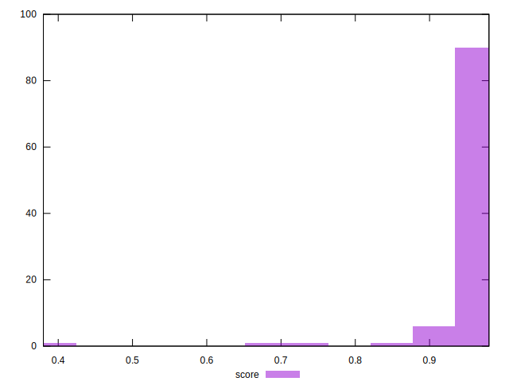
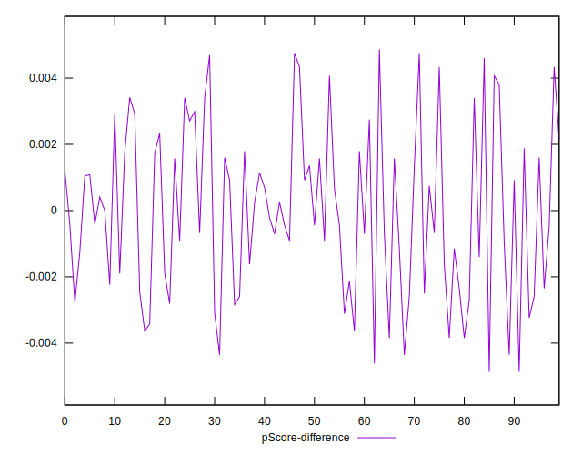

# //total-blocking-time/samples/pages+cached

[→ Parent](../..)


## Raw


```yaml
p90min: 180.5
p90max: 331.5
p90range: 151
p90mean: 209.71808510638297
median: 200.50000000000045
p90stdev: 29.254073958026552
mad: 14.499999999999545
stdevBySn: 21.914024999999732
lfitCenter: 210.42943855013166
lfitStdev: 27.29718793995873
mfitCenter: 210.42943855013166
mfitStdev: 34.21195158853397
mfitConfidence: 3.421195158853397
p90skewness: 1.7454684374575613
p90eccentricity: 0.9999999999999992
p90discretization: 1.205128205128205
outlandishness: 1.0831198984797266

```


## Score


```yaml
p90min: 0.85
p90max: 0.98
p90range: 0.13
p90mean: 0.9636170212765951
median: 0.97
p90stdev: 0.02301022269718429
mad: 0.010000000000000009
stdevBySn: 0.011926000000000011
lfitCenter: 0.9616606390610274
lfitStdev: 0.02300656798120669
mfitCenter: 0.9616606390610274
mfitStdev: 0.02883445693097093
mfitConfidence: 0.002883445693097093
p90skewness: -2.426170513272325
p90eccentricity: 0.9999999999999994
p90discretization: 9.4
outlandishness: 0.9789068548454525

```


## Raw Estimate


## Score Estimate


## P Score


```yaml
p90min: 0.8487418407401004
p90max: 0.9815771610720299
p90range: 0.13283532033192946
p90mean: 0.9635140680852731
median: 0.971600426742256
p90stdev: 0.022857778803829068
mad: 0.007839925527054037
stdevBySn: 0.011117131374351314
lfitCenter: 0.9617177977248239
lfitStdev: 0.02291188004557668
mfitCenter: 0.9617177977248239
mfitStdev: 0.028715783202493204
mfitConfidence: 0.0028715783202493206
p90skewness: -2.517457463780279
p90eccentricity: 1.0000000000000004
p90discretization: 1.205128205128205
outlandishness: 0.9790501837278122

```


## Score Difference


```yaml
p90min: 0
p90max: 1.1102230246251565e-16
p90range: 1.1102230246251565e-16
p90mean: 1.299197156476247e-17
median: 0
p90stdev: 3.568763471439183e-17
mad: 0
stdevBySn: 0
lfitCenter: 8.673082431196366e-18
lfitStdev: 2.004184579420307e-17
mfitCenter: 8.673082431196366e-18
mfitStdev: 2.511872869704744e-17
mfitConfidence: 2.511872869704744e-18
p90skewness: 2.3828522123573888
p90eccentricity: 1.0000000000000027
p90discretization: 47
outlandishness: 1.4312859504132236

```


## P Score Difference


```yaml
p90min: -0.004358887757601071
p90max: 0.004691391558088509
p90range: 0.00905027931568958
p90mean: -0.00003434666531362109
median: -0.0004115744011272682
p90stdev: 0.0024518571441137266
mad: 0.0020645113252528713
stdevBySn: 0.0028411386426149886
lfitCenter: -0.000060122709518394597
lfitStdev: 0.002148285710535502
mfitCenter: -0.000060122709518394597
mfitStdev: 0.002692476854716304
mfitConfidence: 0.0002692476854716304
p90skewness: 0.11125158130751303
p90eccentricity: 1.0000000000000007
p90discretization: 1.205128205128205
outlandishness: 0.8720682232636918

```

