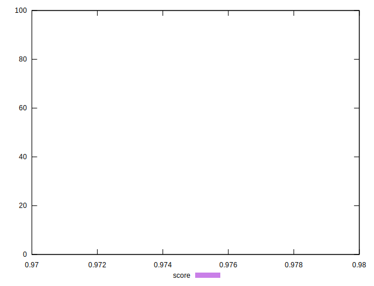

# //total-byte-weight/samples/pages+cached

[→ Parent](../..)


## Raw


```yaml
p90min: 2200792
p90max: 2200796
p90range: 4
p90mean: 2200794.914893617
median: 2200795
p90stdev: 0.7808829490852149
mad: 0
stdevBySn: 0
lfitCenter: 2200878.6466056714
lfitStdev: 207.91452564516965
mfitCenter: 2200878.6466056714
mfitStdev: 260.58221460654613
mfitConfidence: 26.058221460654615
p90skewness: -1.05692266904761
p90eccentricity: 1.0000000000000007
p90discretization: 18.8
outlandishness: 1.0001614528238147

```


## Score


```yaml
p90min: 0.98
p90max: 0.98
p90range: 0
p90mean: 0.9800000000000002
median: 0.98
p90stdev: 2.220446049250313e-16
mad: 0
stdevBySn: 0
lfitCenter: 0.979905689143351
lfitStdev: 0.00023417273015219158
mfitCenter: 0.979905689143351
mfitStdev: 0.00029349199356883354
mfitConfidence: 0.000029349199356883354
p90skewness: -1
p90eccentricity: 1
p90discretization: 94
outlandishness: 0.9995918783840071

```


## Raw Estimate


## Score Estimate


## P Score


```yaml
p90min: 0
p90max: 0
p90range: 0
p90mean: 0
median: 0
p90stdev: 0
mad: 0
stdevBySn: 0
lfitCenter: 0
lfitStdev: 0
mfitCenter: 0
mfitStdev: 0
mfitConfidence: 0
p90skewness: .nan
p90eccentricity: .nan
p90discretization: 94
outlandishness: .nan

```


## Score Difference


```yaml
p90min: -0.98
p90max: -0.98
p90range: 0
p90mean: -0.9800000000000002
median: -0.98
p90stdev: 2.220446049250313e-16
mad: 0
stdevBySn: 0
lfitCenter: -0.979905689143351
lfitStdev: 0.0002341727301521917
mfitCenter: -0.979905689143351
mfitStdev: 0.0002934919935688337
mfitConfidence: 0.00002934919935688337
p90skewness: 1
p90eccentricity: 1
p90discretization: 94
outlandishness: 0.9995918783840071

```


## P Score Difference


```yaml
p90min: -0.98
p90max: -0.98
p90range: 0
p90mean: -0.9800000000000002
median: -0.98
p90stdev: 2.220446049250313e-16
mad: 0
stdevBySn: 0
lfitCenter: -0.979905689143351
lfitStdev: 0.0002341727301521917
mfitCenter: -0.979905689143351
mfitStdev: 0.0002934919935688337
mfitConfidence: 0.00002934919935688337
p90skewness: 1
p90eccentricity: 1
p90discretization: 94
outlandishness: 0.9995918783840071

```

