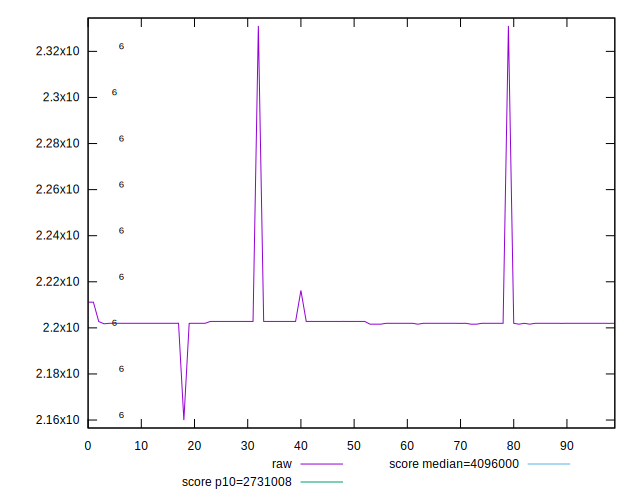
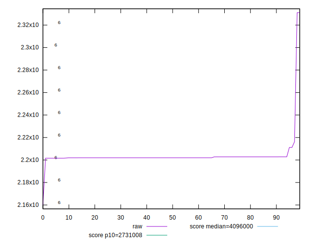
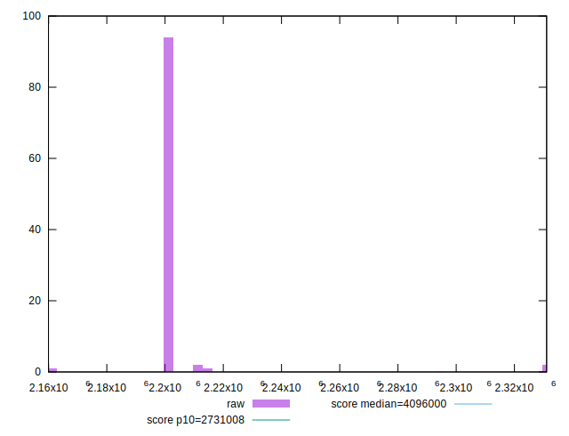
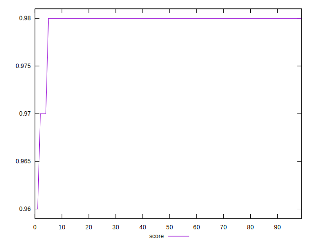
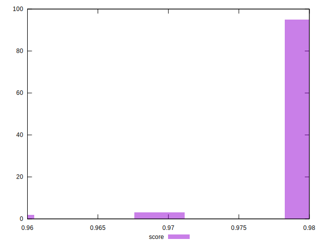
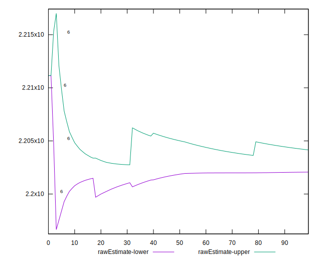
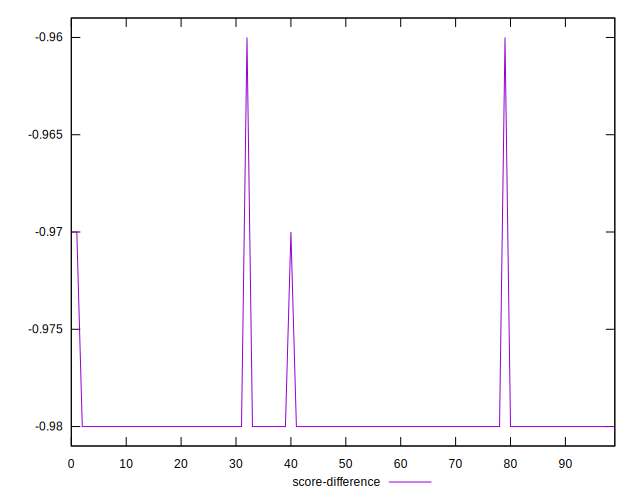
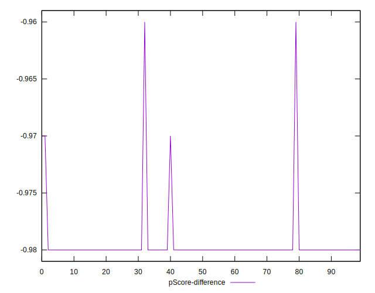
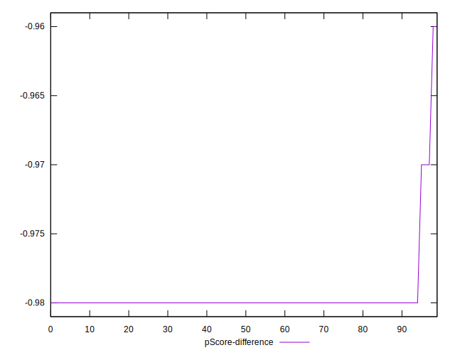
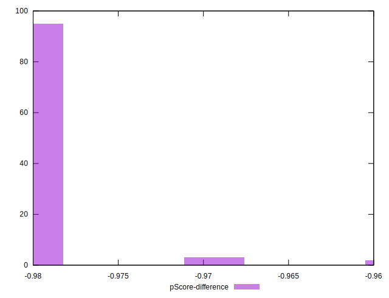

# //total-byte-weight/samples/pages

[→ Parent](../..)


## Raw


```yaml
p90min: 2201597
p90max: 2211156
p90range: 9559
p90mean: 2202396.1276595746
median: 2201976
p90stdev: 1353.3992997464188
mad: 6
stdevBySn: 13.1186
lfitCenter: 2203336.0101815984
lfitStdev: 3378.1692016771995
mfitCenter: 2203336.0101815984
mfitStdev: 4233.907222966189
mfitConfidence: 423.3907222966189
p90skewness: 5.7370608319075105
p90eccentricity: 1
p90discretization: 2.764705882352941
outlandishness: 1.002063691954387

```


## Score


```yaml
p90min: 0.97
p90max: 0.98
p90range: 0.010000000000000009
p90mean: 0.9797872340425534
median: 0.98
p90stdev: 0.0014430489325798458
mad: 0
stdevBySn: 0
lfitCenter: 0.9796601905362397
lfitStdev: 0.0008308650282858546
mfitCenter: 0.9796601905362397
mfitStdev: 0.00104133488719954
mfitConfidence: 0.000104133488719954
p90skewness: -6.634888026970641
p90eccentricity: 1.0000000000000044
p90discretization: 47
outlandishness: 0.9990056761745781

```


## Raw Estimate


## Score Estimate


## P Score


```yaml
p90min: 0
p90max: 0
p90range: 0
p90mean: 0
median: 0
p90stdev: 0
mad: 0
stdevBySn: 0
lfitCenter: 0
lfitStdev: 0
mfitCenter: 0
mfitStdev: 0
mfitConfidence: 0
p90skewness: .nan
p90eccentricity: .nan
p90discretization: 94
outlandishness: .nan

```


## Score Difference


```yaml
p90min: -0.98
p90max: -0.97
p90range: 0.010000000000000009
p90mean: -0.9797872340425534
median: -0.98
p90stdev: 0.001443048932579845
mad: 0
stdevBySn: 0
lfitCenter: -0.9796601905362399
lfitStdev: 0.0008308650282855894
mfitCenter: -0.9796601905362399
mfitStdev: 0.0010413348871992076
mfitConfidence: 0.00010413348871992076
p90skewness: 6.634888026970875
p90eccentricity: 1.0000000000000027
p90discretization: 47
outlandishness: 0.9990056761745781

```


## P Score Difference


```yaml
p90min: -0.98
p90max: -0.97
p90range: 0.010000000000000009
p90mean: -0.9797872340425534
median: -0.98
p90stdev: 0.001443048932579845
mad: 0
stdevBySn: 0
lfitCenter: -0.9796601905362399
lfitStdev: 0.0008308650282855894
mfitCenter: -0.9796601905362399
mfitStdev: 0.0010413348871992076
mfitConfidence: 0.00010413348871992076
p90skewness: 6.634888026970875
p90eccentricity: 1.0000000000000027
p90discretization: 47
outlandishness: 0.9990056761745781

```

