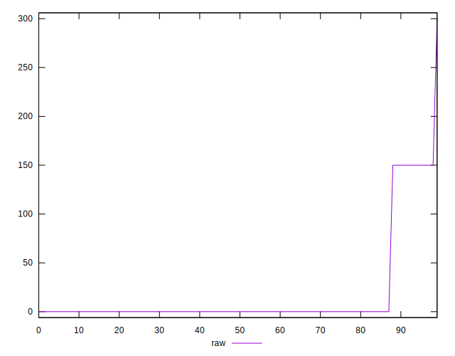

# //unminified-javascript/samples/pages+cached+noadtech

[→ Parent](../..)


## Raw


```yaml
p90min: 0
p90max: 150
p90range: 150
p90mean: 14.361702127659575
median: 0
p90stdev: 44.13611708278512
mad: 0
stdevBySn: 0
lfitCenter: 10.45206794870437
lfitStdev: 24.4957813869344
mfitCenter: 10.45206794870437
mfitStdev: 30.700909147727337
mfitConfidence: 3.0700909147727335
p90skewness: 2.747785799036311
p90eccentricity: 1.0000000000000007
p90discretization: 47
outlandishness: 1.8435604938271604

```


## Score


```yaml
p90min: 0.88
p90max: 1
p90range: 0.12
p90mean: 0.9885106382978726
median: 1
p90stdev: 0.03530889366622808
mad: 0
stdevBySn: 0
lfitCenter: 0.991591809627511
lfitStdev: 0.01970568831307183
mfitCenter: 0.991591809627511
mfitStdev: 0.02469741777315735
mfitConfidence: 0.002469741777315735
p90skewness: -2.7477857990362966
p90eccentricity: 0.9999999999999976
p90discretization: 47
outlandishness: 0.9914989877424069

```


## Raw Estimate


## Score Estimate


## P Score


```yaml
p90min: 0.875
p90max: 1
p90range: 0.125
p90mean: 0.988031914893617
median: 1
p90stdev: 0.03678009756898761
mad: 0
stdevBySn: 0
lfitCenter: 0.9912899433760799
lfitStdev: 0.020413151155778443
mfitCenter: 0.9912899433760799
mfitStdev: 0.025584090956439164
mfitConfidence: 0.0025584090956439166
p90skewness: -2.7477857990362957
p90eccentricity: 0.9999999999999996
p90discretization: 47
outlandishness: 0.9913512177361069

```


## Score Difference


```yaml
p90min: 0
p90max: 0
p90range: 0
p90mean: 0
median: 0
p90stdev: 0
mad: 0
stdevBySn: 0
lfitCenter: 0
lfitStdev: 0
mfitCenter: 0
mfitStdev: 0
mfitConfidence: 0
p90skewness: .nan
p90eccentricity: .nan
p90discretization: 94
outlandishness: .nan

```


## P Score Difference


```yaml
p90min: -0.0050000000000000044
p90max: 0
p90range: 0.0050000000000000044
p90mean: -0.0004255319148936174
median: 0
p90stdev: 0.0013951996860217032
mad: 0
stdevBySn: 0
lfitCenter: -0.00029376014964590456
lfitStdev: 0.0006930855875739917
mfitCenter: -0.00029376014964590456
mfitStdev: 0.0008686539661501805
mfitConfidence: 0.00008686539661501805
p90skewness: -2.9737221214858005
p90eccentricity: 0.9999999999999967
p90discretization: 47
outlandishness: 1.67055625

```

