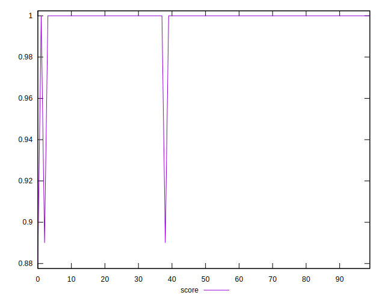
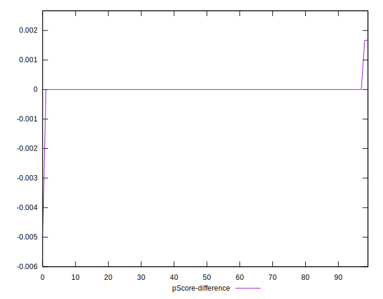

# //unminified-javascript/samples/pages

[→ Parent](../..)


## Raw


```yaml
p90min: 0
p90max: 0
p90range: 0
p90mean: 0
median: 0
p90stdev: 0
mad: 0
stdevBySn: 0
lfitCenter: 1.9568403570295816
lfitStdev: 4.834748936797995
mfitCenter: 1.9568403570295816
mfitStdev: 6.059459198957296
mfitConfidence: 0.6059459198957297
p90skewness: .nan
p90eccentricity: .nan
p90discretization: 94
outlandishness: .inf

```


## Score


```yaml
p90min: 1
p90max: 1
p90range: 0
p90mean: 1
median: 1
p90stdev: 0
mad: 0
stdevBySn: 0
lfitCenter: 0.9983764292457233
lfitStdev: 0.004011342545066201
mfitCenter: 0.9983764292457233
mfitStdev: 0.005027472326405465
mfitConfidence: 0.0005027472326405465
p90skewness: .nan
p90eccentricity: .nan
p90discretization: 94
outlandishness: 0.9932115599999999

```


## Raw Estimate


## Score Estimate


## P Score


```yaml
p90min: 1
p90max: 1
p90range: 0
p90mean: 1
median: 1
p90stdev: 0
mad: 0
stdevBySn: 0
lfitCenter: 0.9983692997024755
lfitStdev: 0.004028957447331531
mfitCenter: 0.9983692997024755
mfitStdev: 0.005049549332464248
mfitConfidence: 0.0005049549332464249
p90skewness: .nan
p90eccentricity: .nan
p90discretization: 94
outlandishness: 0.9931783402777776

```


## Score Difference


```yaml
p90min: 0
p90max: 0
p90range: 0
p90mean: 0
median: 0
p90stdev: 0
mad: 0
stdevBySn: 0
lfitCenter: 0
lfitStdev: 0
mfitCenter: 0
mfitStdev: 0
mfitConfidence: 0
p90skewness: .nan
p90eccentricity: .nan
p90discretization: 94
outlandishness: .nan

```


## P Score Difference


```yaml
p90min: 0
p90max: 0
p90range: 0
p90mean: 0
median: 0
p90stdev: 0
mad: 0
stdevBySn: 0
lfitCenter: -0.000007549530654604443
lfitStdev: 0.00005823617957133439
mfitCenter: -0.000007549530654604443
mfitStdev: 0.00007298822723344137
mfitConfidence: 0.0000072988227233441375
p90skewness: .nan
p90eccentricity: .nan
p90discretization: 94
outlandishness: .inf

```

