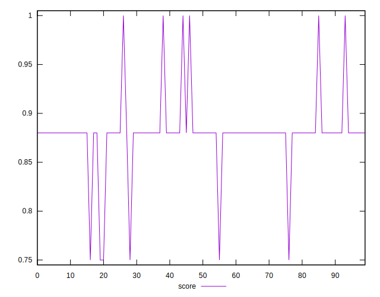
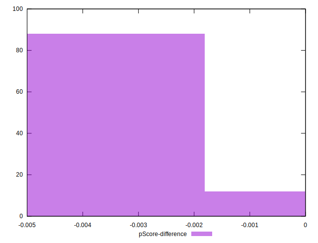

# //unused-css-rules/samples/pages+cached+noadtech

[→ Parent](../..)


## Raw


```yaml
p90min: 0
p90max: 300
p90range: 300
p90mean: 150
median: 150
p90stdev: 37.89683644799335
mad: 0
stdevBySn: 0
lfitCenter: 150.00000000000006
lfitStdev: 11.229696432520939
mfitCenter: 150.00000000000006
mfitStdev: 14.074337310802127
mfitConfidence: 1.4074337310802127
p90skewness: 0
p90eccentricity: 1
p90discretization: 31.333333333333332
outlandishness: 1

```


## Score


```yaml
p90min: 0.75
p90max: 1
p90range: 0.25
p90mean: 0.8796808510638298
median: 0.88
p90stdev: 0.03160434011602375
mad: 0
stdevBySn: 0
lfitCenter: 0.8797013332867667
lfitStdev: 0.009710043998024175
mfitCenter: 0.8797013332867667
mfitStdev: 0.012169735428924926
mfitConfidence: 0.0012169735428924926
p90skewness: -0.4438654358430131
p90eccentricity: 1.000000000000001
p90discretization: 31.333333333333332
outlandishness: 0.9993615724826299

```


## Raw Estimate


## Score Estimate


## P Score


```yaml
p90min: 0.75
p90max: 1
p90range: 0.25
p90mean: 0.875
median: 0.875
p90stdev: 0.03158069703999446
mad: 0
stdevBySn: 0
lfitCenter: 0.8750000000000003
lfitStdev: 0.009358080360434444
mfitCenter: 0.8750000000000003
mfitStdev: 0.011728614425668851
mfitConfidence: 0.0011728614425668851
p90skewness: -1.5117930548087238e-16
p90eccentricity: 1.0000000000000002
p90discretization: 31.333333333333332
outlandishness: 1

```


## Score Difference


```yaml
p90min: 0
p90max: 0
p90range: 0
p90mean: 0
median: 0
p90stdev: 0
mad: 0
stdevBySn: 0
lfitCenter: 0
lfitStdev: 0
mfitCenter: 0
mfitStdev: 0
mfitConfidence: 0
p90skewness: .nan
p90eccentricity: .nan
p90discretization: 94
outlandishness: .nan

```


## P Score Difference


```yaml
p90min: -0.0050000000000000044
p90max: 0
p90range: 0.0050000000000000044
p90mean: -0.004521276595744685
median: -0.0050000000000000044
p90stdev: 0.0014712039027595053
mad: 0
stdevBySn: 0
lfitCenter: -0.004674865741805935
lfitStdev: 0.0007619944444689798
mfitCenter: -0.004674865741805935
mfitStdev: 0.0009550184107698234
mfitConfidence: 0.00009550184107698235
p90skewness: 2.7477857990363095
p90eccentricity: 1.0000000000000007
p90discretization: 47
outlandishness: 0.9470724429065744

```

